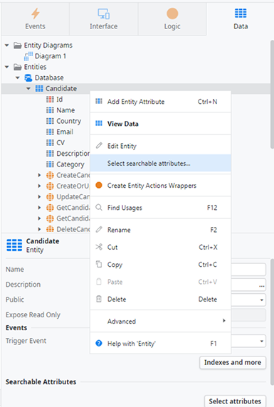
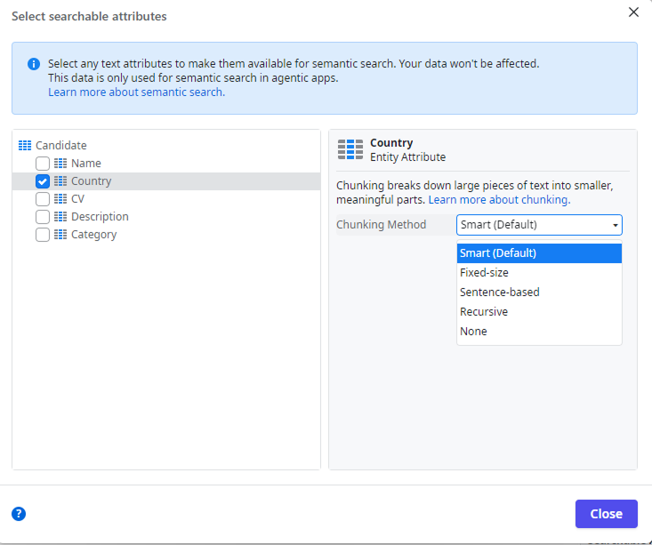
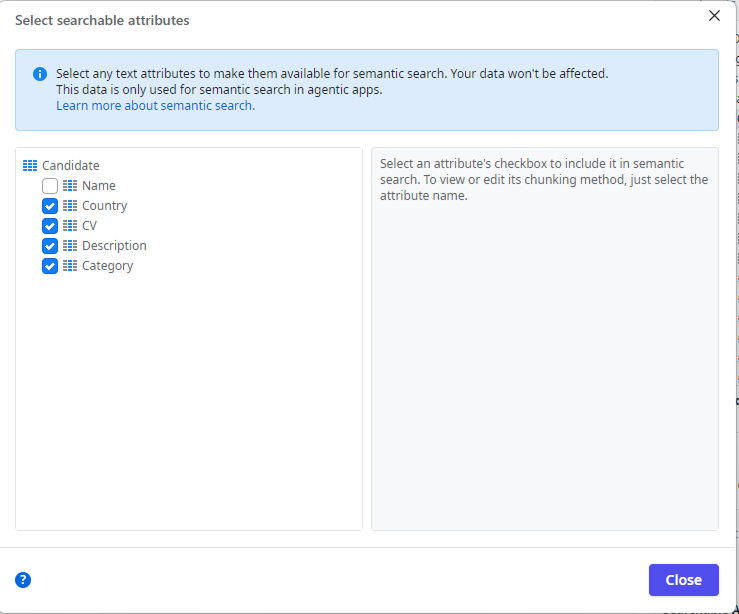
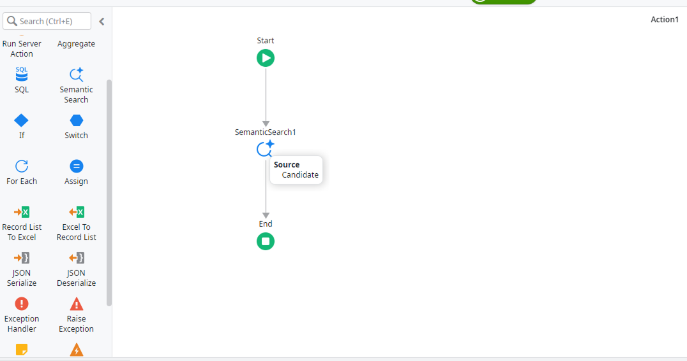
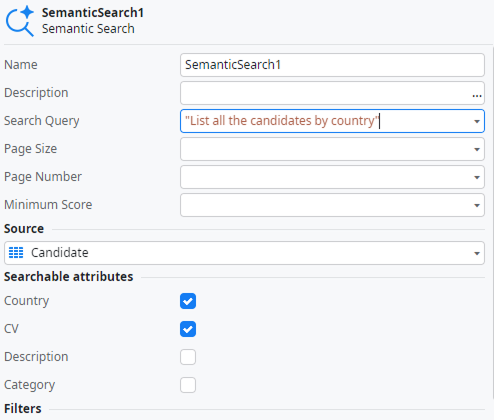

# Use semantic search

Semantic search is in Beta. For more information about Beta features, refer to [OutSystems product releases](https://success.outsystems.com/support/release_notes/outsystems_product_releases/#beta). If you want to try this new capability contact your OutSystems account team.

For you to use ODC semantic search built-in mechanism, you need to:

1. Have an existing data model with entities with text attributes.
1. Your entities must have an entity identifier. Learn more about [Entity Identifiers](../../../building-apps/data/modeling/entity.md#primary-key).

## Make your entities searchable

To make your entities searchable, do the following:

1. In the ODC Studio **Data** tab, right-click on the entity you want to add semantic search to and select **Select searchable attributes...**.

    
1. Select the attributes and the chunking type for each.

    
1. Your entity and selected attributes can be used in a semantic search.

    

## Add a semantic search to your app

To add a semantic search to your app:

1. In a server action, drag the **Semantic Search** element from the toolbox to your flow.

    
1. In the semantic search properties, make sure to:
    1. Write a Search Query to be used by the semantic search to perform the search.
    1. Select the source. This will require to select an entity that you've made searchable before.
    1. Check all the searchable attributes that you want to use on your search

    

The output of a semantic search is a List that holds a structure in it, with the search result.
