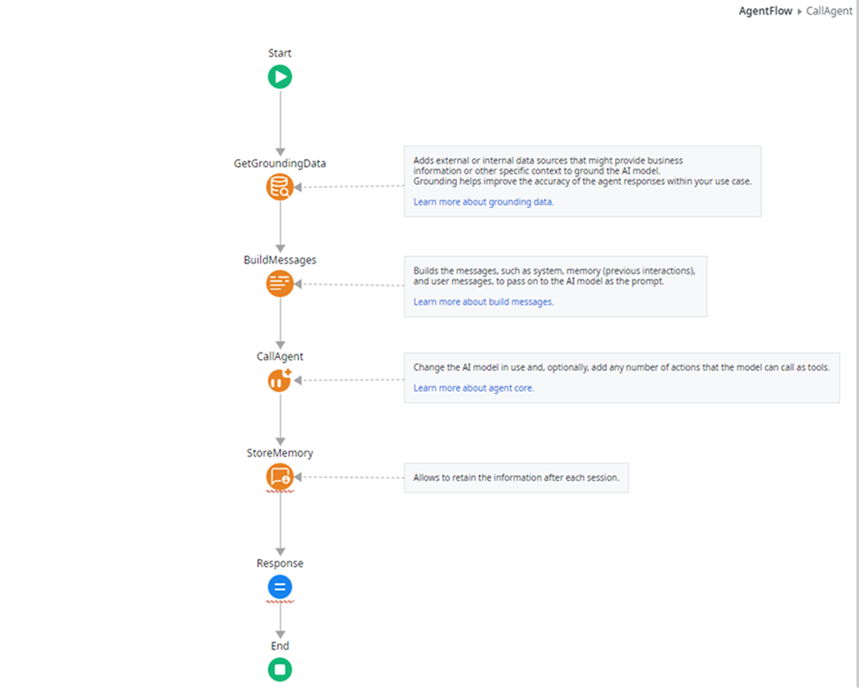
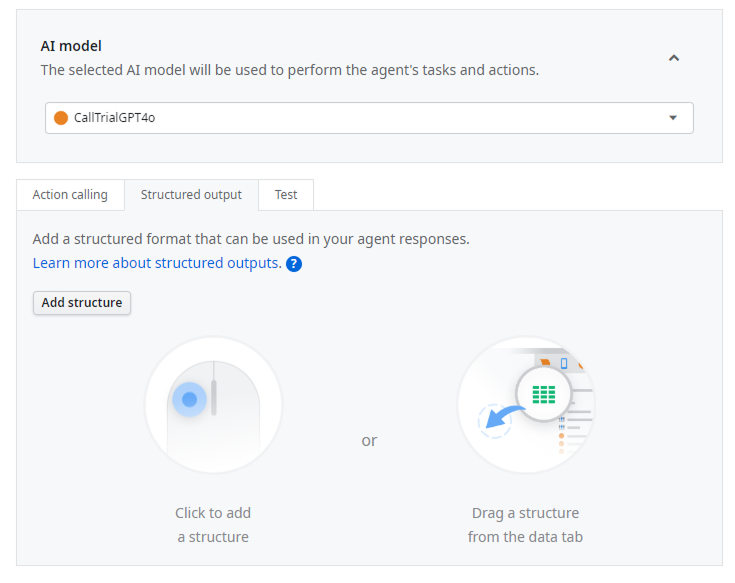
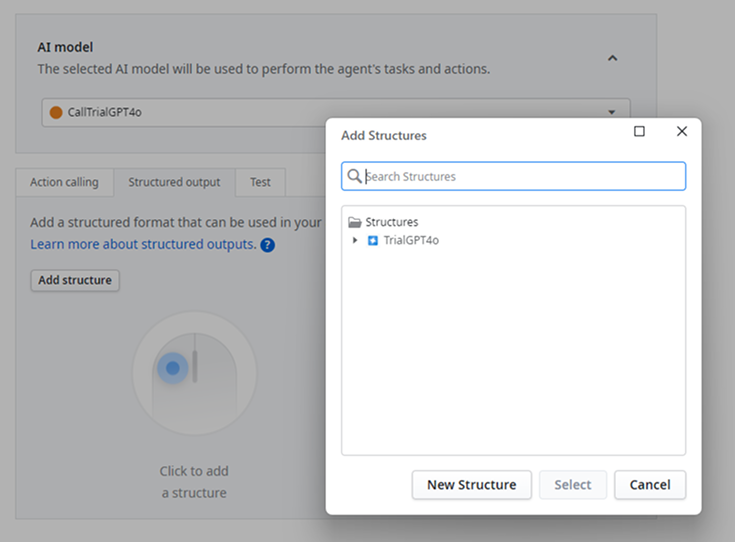
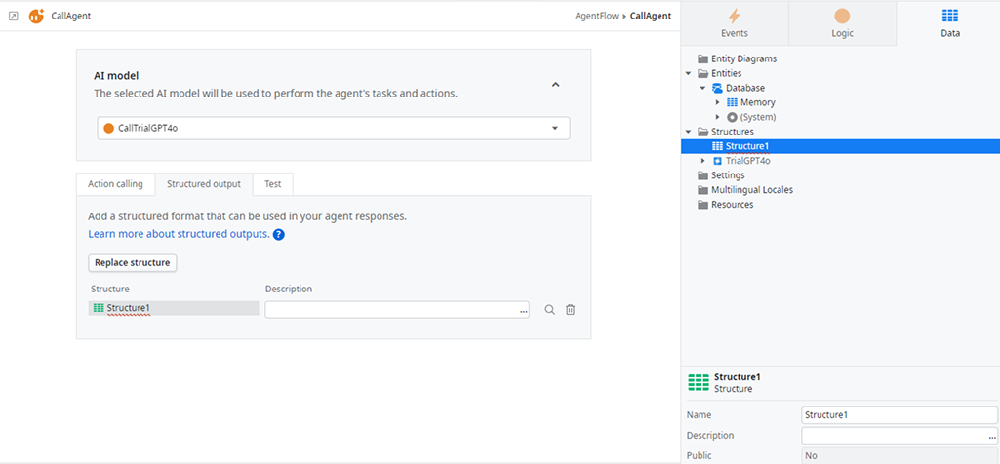
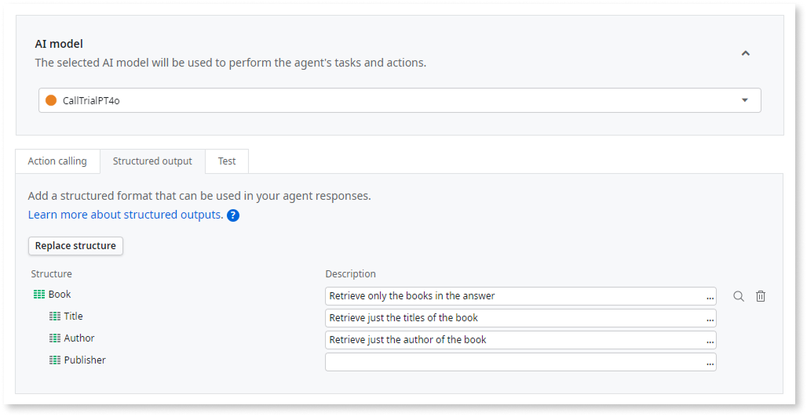
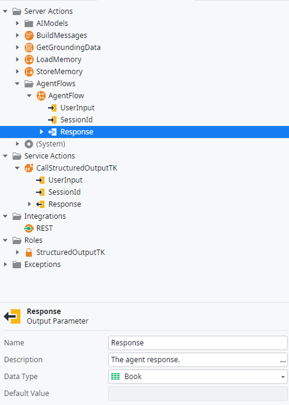

# Structured output

In ODC you can have the responses of your agents in a predetermined structured output. This is especially important for use cases where you want to have a more structured response, instead of free text.

To do this you need to use the Structured Output option in your CallAgent.

Action calling and structured output can't be used on the same Agent call. If you want to use action calling and structure output, you must do action calling on an Agent call and then do the Structure output on another Agent call.

## Using structured output

To use a structured output approach in your Agentic app do the following:

1. In your AgentFlow, double click your Call Agent action.

    

1. In the Call Agent, select the **Structured output** tab.

    

1. To add a structure click **Add structure**.

    

1. You can create a new structure by clicking New Structure, or add one by selecting your desired from the displayed structure list and clicking Select. Note that if you create a new structure you have to go to ODC Studio Data tab and add your structure elements. They'll be immediately reflected on your Structured output window.

    

1. In every field of the structure you can add a Description that helps the AI model provide the response in the most accurate way for your structure.

    

1. Finally change the call agent **Response** parameter type a structure.

    

## Changing your AgentFlow logic to accommodate for a structured output

If you are using structured output on your agentic app, you have to adapt the response of your agent call to be able to receive a structure as output.

To do it:

1. In your AgentFlow, change the Response output parameter to the structure type you created.

1. For storing model answers in the Store Memory node, best practice is to first serialize the structured output. Use the resulting serialized data as the item to store, not the raw structured output itself. This approach is also crucial for passing the responses correctly within a Workflow.

1. If you use the serialization, you then need to deserialize into a structure on your consumer app.
