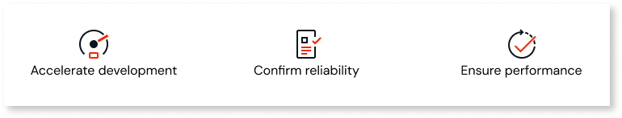
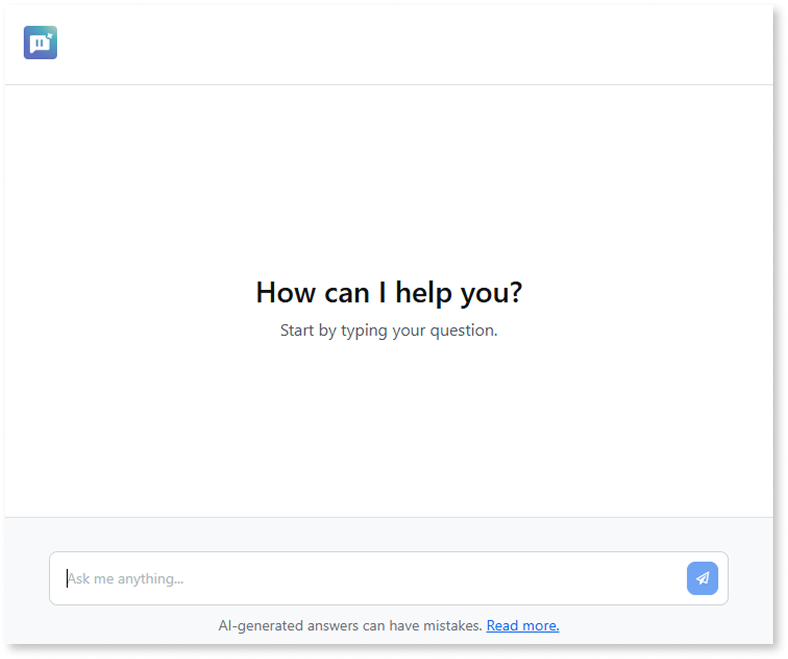
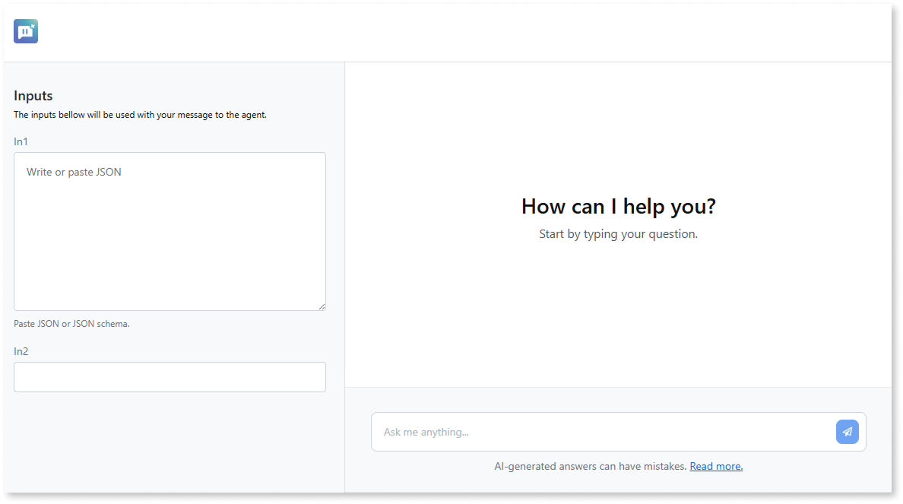

# Test agentic apps

Testing your [agentic app](agentic-apps.md) in OutSystems Developer Cloud (ODC) is a key part of the development lifecycle. ODC Studio streamlines this process by automatically generating a test app. With this app, you can validate your agentic app's behavior, see how it responds to prompts, and verify its functionality. This removes the need to manually create and deploy a separate app just for testing. Keep in mind that this test app is for validation only. To use your agentic app's capabilities, you must build a consumer app that integrates its logic.

Adopting a testing practice has direct advantages:

* **Accelerate development:** Quickly see how the agentic app performs, which speeds up development and iteration.

* **Confirm reliability:** Validate your agentic app's behavior directly in ODC Studio before deploying it to production.

* **Ensure performance:** Ensure the agentic app provides consistent, accurate, and relevant responses across various scenarios.

## Test your agentic app

This section guides you through the options for testing your agentic app in ODC. After you publish your agentic app, click the **Test agent** button in ODC Studio. This gives you two ways to validate its functionality: using a test app or using one of your own apps.

### Test app

ODC creates a test app. This generated app is a regular app, and as such, follow the same security best practices as you would for any other app. However, take note that the generated app screen is anonymous, meaning the user doesn't need to be logged in to use it.

This option is ideal for:

* Quickly validating an agent app's responses and logic.

* Simple to medium-complexity testing scenarios.

* Testing without needing to build a separate user interface first.

This test app is a shortcut for rapid validation, not for simulating complex, real-world use cases. For the generation to succeed, your service action must follow specific naming conventions. For more information about test app requirements, refer to [Test app prerequisites](#prerequisites).

### Use your own app

If another app in the same stage already consumes your agent app's service action, you can use that app as your test environment. Use this approach for:

* Simulating real-world user interactions and complex scenarios.

* End-to-end testing within your existing app's context.

When using your own app, the service action parameters don't need to follow any specific naming convention.

#### Data safety in testing

Testing occurs within the development environment. ODC Studio doesn't connect to production environments or production data.

## Test app prerequisites {#prerequisites}

* Ensure you have a configured and published agentic app in your ODC app.

* The exposed service action must include the following parameters for the test app to generate successfully. The names and data types must be an exact match.

|                   |             |         |
| ----------------- | ----------- | --------- |
| Type of Parameter | Name        | Data type |
| Input             | SessionId   | Text      |
| Input             | UserInput   | Text      |
| Output            | Response    | Text      |

You can include more parameters in your service action as needed.

## Choose a service action to test

After you select which app to use for testing, ODC determines which public service action to connect to.

* **If your agentic app has one public service action**: The selected app launches in a new browser tab, ready to test that action.

* **If your agentic app has multiple public service actions**: A dialog appears in ODC Studio prompting you to choose one. After your selection, the selected app launches in a new browser tab.

## Test your changes

ODC streamlines the process of testing iterative changes to your agentic app. If you already have a test running in a browser tab, you can quickly validate your updates.

1. Modify your agentic app in ODC Studio and publish the changes.

1. After publishing, click the **Test agent** button again.

Instead of repeating the initial setup, ODC sends you directly to the running app. The app is automatically refreshed with the latest changes, bypassing the selection dialogs and allowing you to test your modifications immediately.

## Understand the test app

The user interface of the test app changes depending on the input parameters of the service action you test. The app displays one of two views: a simple chat interface or a chat with structured inputs.

### Chat interface

If your service action has no input parameters beyond the required **SessionId** and **UserInput**, the app shows a chat window. Use this interface to type prompts and directly test your agent app's conversational abilities.

### Chat with structured inputs

If your service action includes input parameters, the test app displays an inputs panel next to the chat window. You define these by adding Input Parameters to your service action in ODC Studio. The test panel renders these inputs based on their Data Type:

* Simple data types (like Text, Integer, or Boolean) appear as standard input fields.

* Complex data types (like a structure) appear as a JSON text area, allowing you to paste in test data. To use a structure, you must first define it in your app.

To run your test, first fill in the fields in the panel, and then send your prompt through the chat. This layout helps you test complex scenarios by simulating how the agent responds to specific data inputs, including edge cases and potential errors.

