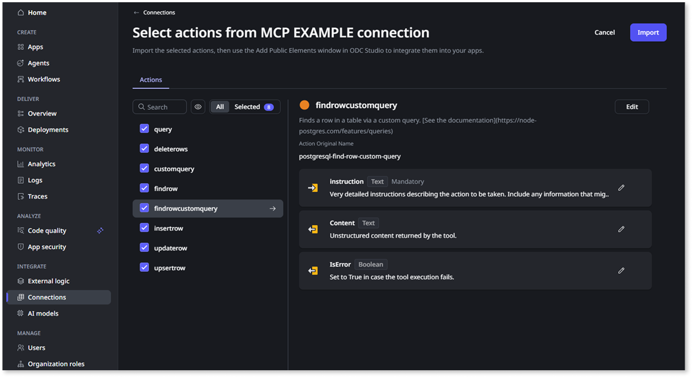

# Use MCP servers

MCP server integration is available through the Early Access Program. [Apply for the Early Access Program](https://www.outsystems.com/low-code-platform/agentic-ai-workbench/eap-agent-workbench/).

Use Model Context Protocol (MCP) servers to extend AI agents in OutSystems Developer Cloud (ODC) with external systems. Tools exposed by an MCP server become server actions that agents can call. ODC Portal accelerates setup by discovering connection details from the server URL.

MCP standardizes how agents call external capabilities. LLMs can't reach real-time or protected enterprise data on their own; bespoke integrations create inconsistency and maintenance overhead. MCP defines a common contract (purpose, inputs, outputs) so an agent can call any compliant tool without custom glue.

With this shared protocol you add capabilities once and reuse them across apps and agents. Imported MCP tools (server actions) can support scenarios like credit scoring, document verification, or compliance validation.

Key benefits:

* **Enterprise integration**: Connect agents to business systems and services.
* **Standardized protocol**: Use consistent authentication and communication patterns.
* **Real-time operations**: Access current data and perform live operations.
* **Secure access**: Maintain controlled, authenticated access to external resources.

## Terminology

In the MCP domain, a capability is a "tool". When you import an MCP tool through a connection in ODC Portal, it appears in ODC Studio as a server action. In an agent configuration you select those server actions as tools. In this document:

* MCP tool or tool: the capability exposed by the MCP server.
* Server action: the OutSystems artifact created from an imported MCP tool.

## Use MCP capabilities

Custom MCP servers let you connect to any system that supports the protocol. At a high level: create a connection in ODC Portal, import selected tools, then reference them in ODC Studio and agent configurations.

### Create a connection

In ODC Portal you can create a connection to an MCP server.

### Connection discovery

Create or edit a connection (Integrate > Connections > Create connection > MCP server).

When you enter the server URL, the portal tries to discover and fill remaining details. If discovery fails, enter them manually.

For OAuth, provide client ID, client secret, authorization URL, token URL, and scope, then finish the OAuth flow. For an API key, provide the key value, header name (often Authorization or X-API-Key), and any prefix (such as Bearer or ApiKey).

Test the connection to confirm authentication and that the MCP server returns available tools.

### Import tools

Select **Import** in the connection list to bring tools (server actions) into ODC. Select only the tools you need. Optionally rename them. They then appear in ODC Studio as server actions.

### Add dependencies

In ODC Studio, open the agentic app and add the MCP tools (server actions) as dependencies. They keep the names assigned during import.

You can add MCP tools as dependencies in any ODC app.

### Use tools in an agent

In the **Call Agent** element, add tools (server actions), configure parameters, map values, and handle errors.

## Sample use cases

Examples of how MCP servers connect AI agents to external systems:

| Area | Use Cases |
| --- | --- |
| **Financial services** | Connect to credit bureaus for real-time score retrieval, access compliance databases for anti-money laundering (AML) checks, and integrate with employment verification services. |
| **Customer onboarding** | Integrate with government databases for identity confirmation (KYC), connect to screening services for fraud prevention, access risk scoring platforms, and automate account creation through core system APIs. |
| **Supply chain** | Validate suppliers by connecting to business registry databases, monitor compliance with regulatory databases, track inventory with third-party logistics systems, and verify product quality with certification databases. |
| **HR automation** | Integrate with screening services for background checks, connect to professional certification databases to assess skills, and access regulatory databases to verify employment eligibility. |

## Related resources

For more information about AI agents and ODC capabilities:

* [Create an AI agent in ODC Studio](../create-agent.md)
* [Agentic apps in ODC](../agentic-apps.md)
* [Consumer app](../consumer-app.md)

For external resources:

* [Model Context Protocol specification](https://modelcontextprotocol.io/)
