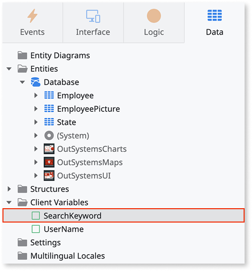
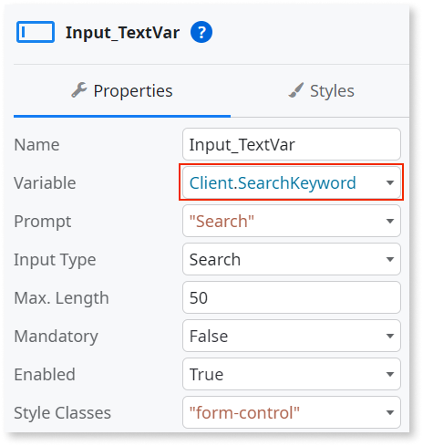
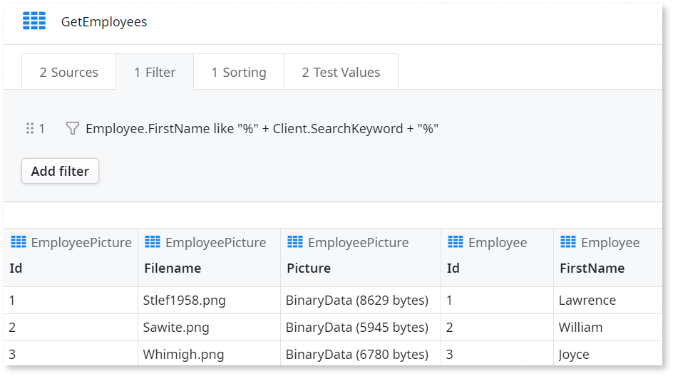

# Client Variable

In Mobile and Reactive Web apps, use Client Variables to store data client-side in a key-value format. For example, use these variables to store configurations and app context data.

Client Variables can only store [basic data types](../data/data-types.md) and [entity identifiers](../data/modeling/entity.md#primary-key). The one exception is **Binary** data, which is a basic data type, but can't be stored in client variables.
The amount of data you have available for all Client Variables across an environment depends on the browser.

Client Variables reset to their default values when the user signs out of the app or when the platform signs out the user automatically. However, don't use Client Variables to store sensitive or confidential information.

## How to use

This example shows how to use a Client Variable to keep the value of a Search widget. The value of the Client Variable is then used to filter an Aggregate. This value is kept if you change to another screen or close the browser.

1. On the **Data** tab, right-click **Client Variables** and select **Add Client Variable**.

1. Enter a name for the variable, for example `SearchKeyword`.

    

1. Select the Input widget.

1. On the **Properties** tab, in the **Variable** field, enter `Client.SearchKeyword`.

    

1. Double-click the aggregate on the Elements tree.

1. On the **Filter** tab, click **Add filter**.

1. Insert the filter condition. 

    ```
    Employee.FirstName like "%" + Client.SearchKeyword + "%"
    ```

1. To save the filter, click **Close**.

     

After you follow these steps and publish your application, you can test the functionality of the filter in your browser. The text inserted in the Input of the Search widget is stored in the defined Client Variable and is then used to filter the aggregate. When you change to another screen or close your browser, the value is kept and the filter still applies according to that value. 

## Properties

<table markdown="1">
<thead>
<tr>
<th>Name</th>
<th>Description</th>
<th>Mandatory</th>
<th>Default value</th>
<th>Observations</th>
</tr>
</thead>
<tbody>
<tr>
<td title="Name">Name</td>
<td>Identifies an element in the scope where it is defined, like a screen or action.</td>
<td>Yes</td>
<td></td>
<td></td>
</tr>
<tr>
<td title="Description">Description</td>
<td>Text that documents the element.</td>
<td></td>
<td></td>
<td>Useful for documentation purpose.<br/>The maximum size of this property is 2000 characters.</td>
</tr>
<tr>
<td title="Data Type">Data Type</td>
<td>The variable data type.</td>
<td>Yes</td>
<td></td>
<td></td>
</tr>
<tr>
<td title="Default Value">Default Value</td>
<td>Initial value of this element. If undefined, the default value of the data type is used.</td>
<td></td>
<td></td>
<td>The default value of a client variable must be a literal.</td>
</tr>
</tbody>
</table>
