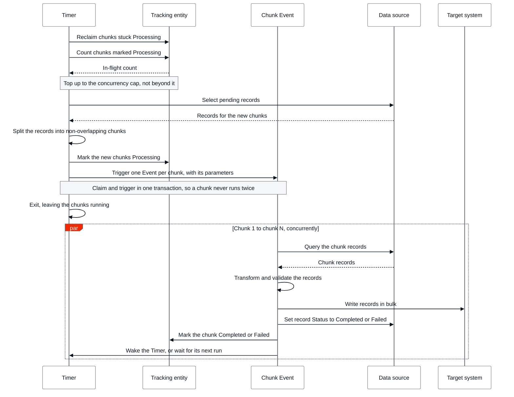

# Parallel batch integration

Parallel processing is one of two approaches to [batch integration](intro.md), where several chunks run at the same time. It offers higher throughput for large datasets, at the cost of more complexity. If you haven't chosen between sequential and parallel processing yet, refer to [Choosing a processing approach](intro.md#choosing-a-processing-approach).

Before you start, set up the **control columns** that make a run resumable, as described in [Tracking integration progress](intro.md#tracking-integration-progress). Parallel processing also needs a separate entity that tracks the state of each chunk as a whole, covered in [Coordinating concurrent chunks](#coordinating-concurrent-chunks).

The following diagram shows one Timer run of the cycle described in this section, for a single chunk. The Timer tops the in-flight chunks up to the concurrency cap, each Event processes its own chunk independently, and the tracking entity records each chunk's state. Every in-flight chunk runs this same lifecycle at the same time, up to the cap. The Timer repeats the run until no pending records remain and no chunks are still Processing.

Parallel processing runs the same read, process, and write logic as sequential processing, but runs several chunks at the same time instead of one chunk at a time. Each chunk goes through the following lifecycle:

1. **Claim a chunk**: A Timer selects up to one chunk size of pending records, selected by their **Status** control column, and marks the chunk `Processing` in the tracking entity in the same transaction that triggers its Event, as described in [Coordinating concurrent chunks](#coordinating-concurrent-chunks).
1. **Trigger the chunk's Event**: Pass the chunk's identifying parameters, for example a partition key or record range, as Event input parameters. Events accept only primitive parameters, so pass a key or an ID range that identifies the chunk, not a list of record identifiers.
1. **Process the chunk**: Inside the Event, query the chunk's records, process them, and write them to the target entities in bulk, for example using the **CreateOrUpdateSome** action.
1. **Update control columns**: Set **Status** to `Completed` for the records that succeeded, or to `Failed` for the records that didn't, as described in [Error handling](#error-handling).
1. **Mark the chunk's outcome**: Mark the chunk `Completed` in the tracking entity, or `Failed` if the Event didn't finish successfully, freeing its slot for a new chunk, as described in [Error handling](#error-handling).

Claiming a chunk before triggering its Event, and marking its outcome when the Event finishes, is what lets a Timer repeat this cycle safely to keep concurrency at the cap, as described in [Triggering chunks with Timers and Events](#triggering-chunks-with-timers-and-events). Throughput isn't free: triggering more concurrent chunks than the source or target system can absorb causes contention, and can make the run slower rather than faster. What makes the processing parallel is that chunks start within a short interval of each other and their Events run concurrently, rather than each chunk waiting for the previous one's write to finish.

## Partitioning records into chunks

Before triggering any Events, split the pending records into chunks that don't overlap, so that no two chunks, and therefore no two concurrent Events, process the same record. Base the split on a **partition key** already in your data model, such as a tenant, region, or category, or on a **record range** derived from an ordered column, such as an ID range.

Size chunks evenly. The run isn't done until every chunk finishes, so a chunk that's disproportionately larger than the rest becomes the long pole that determines how long the whole run takes, even if every other chunk completed quickly. An uneven chunk is also more likely to run into the Event execution time limit described in [Triggering chunks with Timers and Events](#triggering-chunks-with-timers-and-events).

## Coordinating concurrent chunks

The per-record control columns from [Tracking integration progress](intro.md#tracking-integration-progress) track individual records, but they can't tell you whether an entire chunk, running as its own concurrent Event, has finished. Sequential processing never needs that answer, since only one chunk is ever in flight and you're either waiting on it or you're not. Parallel processing does need it, because several chunks run at once with unpredictable finish order.

Track the state of each chunk in a dedicated tracking entity to answer that question. Store at least the chunk's identifying parameters, such as its partition key or record range, its state, for example `Processing`, `Completed`, or `Failed`, and when that state last changed.

Claim a chunk before triggering its Event: mark the chunk `Processing` in the same transaction that triggers the Event, so a chunk, and its Event, is never triggered more than once. Splitting the run into non-overlapping chunks isn't enough on its own. It guarantees two chunks don't cover the same records, but it doesn't stop the same chunk from being picked up twice; claiming it first is what prevents that.

Use the tracking entity to cap how many chunks run at the same time, instead of triggering every chunk at once. Set that cap with the platform's own limits in mind. ODC limits how many events an app runs concurrently, regardless of how many containers back the app, so a self-imposed cap above that limit adds no protection, it just duplicates a limit the platform already enforces. Refer to the [event limits](../../../../getting-started/system-requirements.md#events) for the current value. When a chunk's Event finishes, mark it `Completed`, or `Failed` if it didn't succeed, freeing its slot. As chunks complete, claim and trigger enough new chunks to keep concurrency at the cap, as described in [Triggering chunks with Timers and Events](#triggering-chunks-with-timers-and-events).

## Triggering chunks with Timers and Events

A [Timer](../../../timers/intro.md) drives parallel processing, but instead of processing a chunk itself the way a sequential Timer does, it keeps the number of in-flight chunks topped up to the concurrency cap. Each time the Timer runs, it checks how many chunks are still running and triggers enough new ones to refill the freed capacity.

1. When the Timer runs, count the chunks still marked `Processing` in the tracking entity.
1. If that count is below the concurrency cap, create enough new chunks from the remaining pending records to bring the in-flight count back up to the cap, and mark each one `Processing` in the tracking entity.
1. Trigger one Event per new chunk, then let the Timer exit.
1. Run the check again, until no pending records remain and no chunks are still `Processing`.

Set the check's cadence through the Timer's schedule, in one of two ways: give the Timer a recurrent schedule at design time or in ODC Portal, so it runs at a regular interval; or trigger the [**Wake** action](../../../timers/timer-create-run.md#wake-timer) from each Event as it finishes, refilling a freed slot at once. Because **Wake** forces an immediate run and leaves the schedule unchanged, pair the event-driven approach with a recurrent schedule as a backstop, so a run recovers if an Event is dropped before it can wake the Timer.

Two platform limits bound how you size chunks and set the concurrency cap. Refer to the [event limits](../../../../getting-started/system-requirements.md#events) for their current values:

* ODC limits how many events an app runs concurrently, regardless of how many containers back the app. Setting the concurrency cap above this limit doesn't increase throughput, it just queues the excess chunks behind the platform's own limit.
* Each event handler has a maximum execution duration, with no way to pause and resume mid-Event the way a Timer can pause between chunks in sequential processing. A chunk that takes longer to process than this limit fails with an exception, so chunk size is the only safeguard against it: size chunks to comfortably fit within the limit.

## Error handling

A run touches many records, so treat failure as a per-record event, not a whole-run event. Catch errors around each record's processing and write, rather than letting one bad record, for example one with unexpected data or a downstream validation error, abort the surrounding chunk.

When a record fails, update its control columns instead of retrying it immediately in place:

1. Increment its **RetryCount**.
1. If **RetryCount** is below your retry limit, set **Status** back to `Pending` so a later chunk includes it again.
1. If **RetryCount** reaches the limit, set **Status** to `Failed` and stop retrying it automatically. Route `Failed` records to a separate list or notification for manual review, as covered in [Best practices](#best-practices), rather than leaving them silently unprocessed.

Isolate failures at the chunk level too, not just at the record level. An Event that fails must mark its chunk `Failed` in the tracking entity rather than leaving it `Processing` indefinitely, otherwise the Timer keeps counting that chunk as in-flight and never reuses its slot, throttling the run and eventually stalling it once every slot is held by a chunk that never completes. A failed chunk's records return to `Pending` for a later chunk to pick up, and the failure doesn't affect the other chunks already running, since each Event runs independently.

ODC Events add a layer of retry beneath the per-chunk handling above. If an event handler fails or times out, the platform redelivers the event, up to 10 times with an increasing backoff between attempts, before dropping it. Refer to the [event properties](../../../events/events-properties.md) for the exact retry schedule. Events are decoupled from the app that triggers them, so the Timer is never notified when an event is finally dropped: unlike the caught failure above, a dropped event never runs the logic that would mark its chunk `Failed`, leaving it stuck `Processing`. Guard against this by having the Timer treat any chunk that has stayed `Processing` beyond a threshold as failed, using the tracking entity's last-changed timestamp, and return its records to `Pending` for a later chunk to pick up.

## Best practices

Apply the following practices to a parallel run:

* **Size chunks to fit the Event execution limit**

    Per-record cost varies, so a chunk size that fits comfortably within the limit in one run can exceed it in another. Parallel processing has no mid-Event checkpoint, so chunk size is the safeguard: size chunks to comfortably fit the Event execution duration described in [Triggering chunks with Timers and Events](#triggering-chunks-with-timers-and-events).

* **Design for idempotency**

    A chunk can be reprocessed after a retried Event or a manual rerun. Design the write to the target system so that applying it more than once produces the same result, for example with an upsert instead of a plain insert, or by checking a record's **Status** control column before writing to it. Without idempotency, a retry can create duplicate records or apply the same change twice.

* **Monitor and alert on run health**

    Track how long each run takes, how many records remain `Pending`, and how many are stuck in `Processing` or accumulating in `Failed`. Alert when a run stops making progress or when the failed count keeps growing, so a stuck integration doesn't go unnoticed until the data it depends on is stale. Refer to [Monitor assets with ODC Analytics](../../../../monitor-and-troubleshoot/app-health.md) for the underlying monitoring capabilities.

* **Schedule around peak hours**

    Running an integration during peak hours competes with live user traffic for database and application resources, which can slow down the interactive requests it was meant to stay out of. Schedule runs for off-peak hours, and revisit the schedule as usage patterns or data volume change.

## Related resources

* [Batch integration](intro.md)
* [Sequential batch integration](sequential.md)
* [Best practices for data management](../intro.md)
