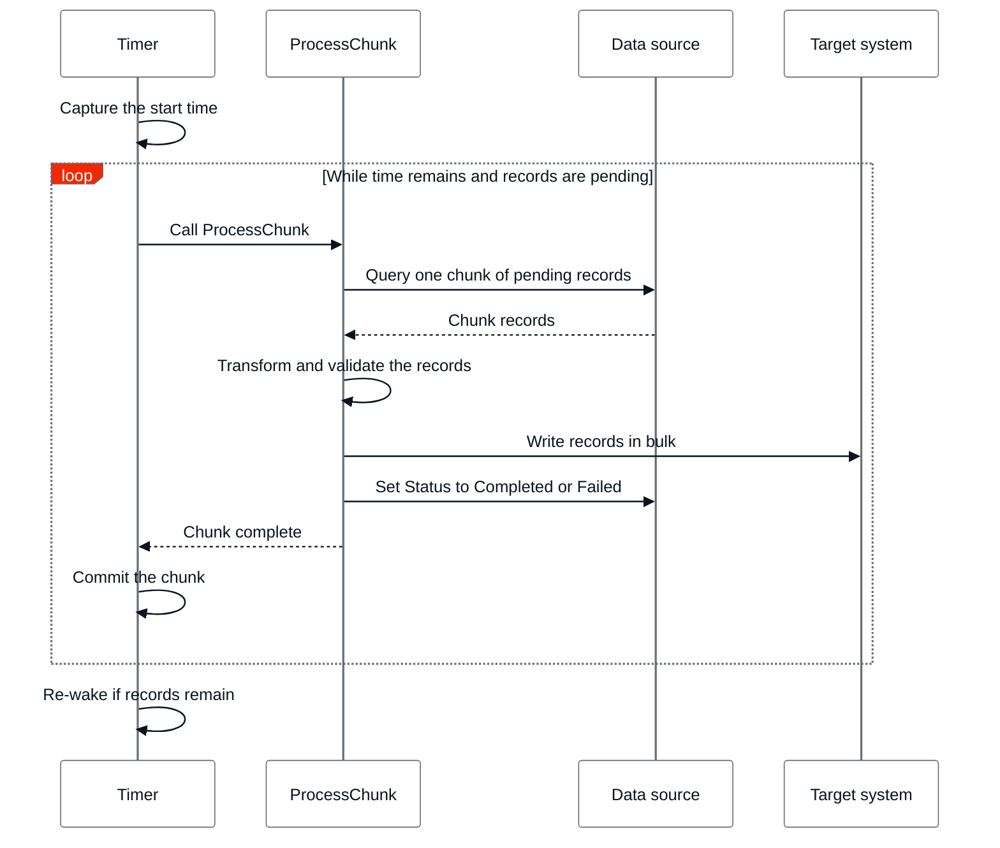

# Sequential batch integration

Sequential processing is one of two approaches to [batch integration](intro.md), where chunks run one after another. It's simpler to build, test, and resume, and it's the right default for most volumes. If you haven't chosen between sequential and parallel processing yet, refer to [Choosing a processing approach](intro.md#choosing-a-processing-approach).

Before you start, set up the **control columns** that make a run resumable, as described in [Tracking integration progress](intro.md#tracking-integration-progress).

The following diagram shows the whole cycle described in this section, from the Timer starting a chunk through **ProcessChunk** completing it and the Timer starting the next one. The Timer repeats the loop while its execution window lasts, and [re-wakes](../../../timers/timer-create-run.md#wake-timer) itself when records are still pending, as described in [Transaction and timeout management](#transaction-and-timeout-management).

In sequential processing, a single Timer calls a **ProcessChunk** action once per chunk, in a loop. Each call to **ProcessChunk** runs as follows:

1. **Read a chunk**: Query the source for up to one chunk size of pending records, selected by their **Status** control column.
1. **Process the chunk**: Apply any transformation or validation the target system requires.
1. **Write the chunk**: Write the processed records to the target entities in bulk, for example using the **CreateOrUpdateSome** action to insert or update matching records in a single call.
1. **Update control columns**: Set **Status** to `Completed` for the records that succeeded, or to `Failed` for the records that didn't, as described in [Error handling](#error-handling).

The Timer starts the next chunk only after the current call finishes, so at any point only one chunk's read or write is in flight. That's what makes the processing sequential. Repeat the loop until no pending records remain, subject to the transaction and timeout handling in [Transaction and timeout management](#transaction-and-timeout-management).

## Sizing chunks and using bulk operations

Define the chunk size as a Setting, so you can tune it without redeploying the app. A larger chunk size processes more records per iteration, which reduces the number of iterations the run needs, but it also increases the memory and lock footprint of each transaction. Start with a moderate size and adjust it based on observed run duration and resource use, rather than guessing upfront.

Try to process and write each chunk's records in bulk rather than one at a time, using built-in bulk actions such as **CreateOrUpdateSome**, or custom bulk `INSERT`, `UPDATE`, or `DELETE` statements, instead of looping through records individually. Row-by-row processing multiplies database round-trips and transaction overhead across every record, undermining the efficiency the chunk size is meant to provide.

## Transaction and timeout management

A [Timer](../../../timers/intro.md) has a limited execution window, so a sequential run is built to make steady, durable progress and to pick up where it left off if that window runs out.

Commit each chunk as its own transaction. After a chunk's records are processed and their [control columns](intro.md#tracking-integration-progress) updated, commit before starting the next chunk. Committing per chunk keeps completed work durable, releases database locks, and limits the loss from an interruption to the chunk in progress rather than the whole run.

Don't rely on the chunk size to keep the run inside the Timer's execution window, because the cost of each record varies. Guard the loop with a time-based check instead:

1. Capture the start time when the Timer begins.
1. Before processing another chunk, compare the elapsed time against the timeout, for example `DiffMinutes(StartTime, CurrTime()) < 15` for a default timeout of 20 minutes. The margin leaves room to finish the current chunk and commit.
1. Process the next chunk only while time remains. When the elapsed time approaches the timeout, stop the loop and commit.

When the loop stops with records still pending, [re-wake the Timer](../../../timers/timer-create-run.md#wake-timer) so a fresh execution resumes the run. Because each chunk is committed and pending records are identified by their control columns, the next execution continues from the first unprocessed record without repeating completed work.

This pattern processes volumes far larger than a single Timer execution, one execution window at a time.

## Error handling

A run touches many records, so treat failure as a per-record event, not a whole-run event. Catch errors around each record's processing and write, rather than letting one bad record, for example one with unexpected data or a downstream validation error, abort the surrounding chunk.

When a record fails, update its control columns instead of retrying it immediately in place:

1. Increment its **RetryCount**.
1. If **RetryCount** is below your retry limit, set **Status** back to `Pending` so a later chunk includes it again.
1. If **RetryCount** reaches the limit, set **Status** to `Failed` and stop retrying it automatically. Route `Failed` records to a separate list or notification for manual review, as covered in [Best practices](#best-practices), rather than leaving them silently unprocessed.

Isolate failures at the chunk level too, not just at the record level. A chunk's bulk write shouldn't abort the entire run on its own failure: catch the exception, leave the chunk's records `Pending` since nothing committed, and let the next Timer wake retry the chunk.

## Best practices

Apply the following practices to a sequential run:

* **Keep chunk size moderate**

    Per-record cost varies, so a chunk size that fits comfortably within the timeout in one run can exceed it in another. Sequential processing doesn't defend its timeout with chunk size: it relies on the time-based checkpoint in [Transaction and timeout management](#transaction-and-timeout-management), which can stop between chunks regardless of size. Even so, a moderate chunk size commits promptly and releases its locks sooner.

* **Design for idempotency**

    A chunk can be reprocessed after an interrupted Timer or a manual rerun. Design the write to the target system so that applying it more than once produces the same result, for example with an upsert instead of a plain insert, or by checking a record's **Status** control column before writing to it. Without idempotency, a retry can create duplicate records or apply the same change twice.

* **Monitor and alert on run health**

    Track how long each run takes, how many records remain `Pending`, and how many are accumulating in `Failed`. Alert when a run stops making progress or when the failed count keeps growing, so a stuck integration doesn't go unnoticed until the data it depends on is stale. Refer to [Monitor assets with ODC Analytics](../../../../monitor-and-troubleshoot/app-health.md) for the underlying monitoring capabilities.

* **Schedule around peak hours**

    Running an integration during peak hours competes with live user traffic for database and application resources, which can slow down the interactive requests it was meant to stay out of. Schedule runs for off-peak hours, and revisit the schedule as usage patterns or data volume change.

## Related resources

* [Batch integration](intro.md)
* [Parallel batch integration](parallel.md)
* [Best practices for data management](../intro.md)
