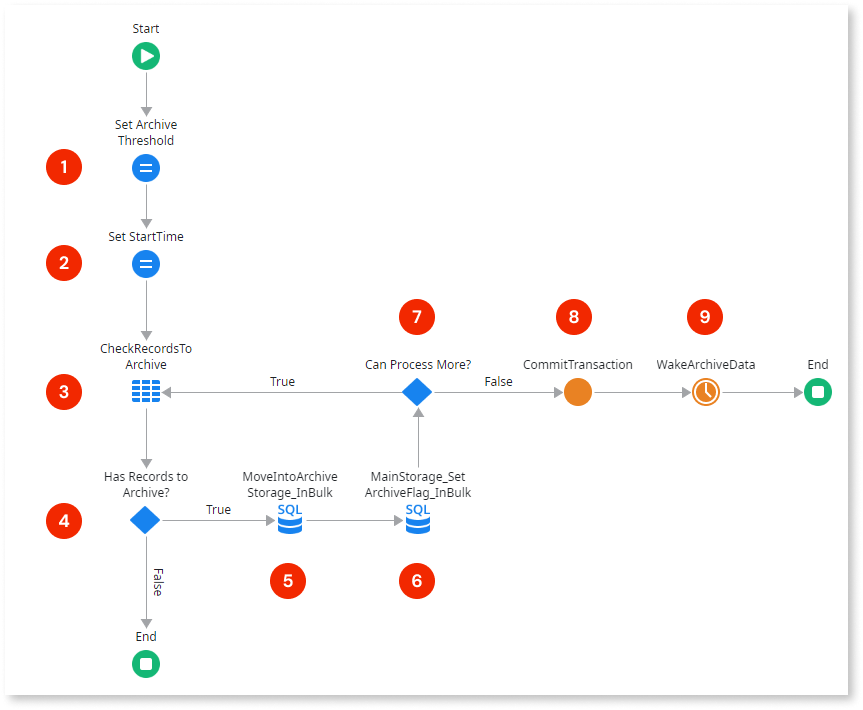

# Data archiving best practice

Data archiving is the process of identifying and moving data from the **primary storage** into an **archive storage**, for long term storage. Archived data consists of data that's no longer relevant for daily operations but that's still important to the organization and may be needed for future reference, or data that must be retained for regulatory compliance.

Data archiving is an important [data management practice](./intro.md#data-purging-archiving) when dealing with a large volume of application data. Reducing the amount of active data allows the application to respond faster, helping to prevent performance issues.

This article describes a best practice for implementing data archiving using OutSystems.

## Archive location

The implementation below focuses on how to achieve an archiving strategy using OutSystems. You will create [new entities](../modeling/entity.md) in your OutSystems apps to store the archived data.

Depending on your enterprise architecture, if you need to archive data using an external solution, such as data lakes or cloud storage services, you can [integrate with your external data source](../../../integration-with-systems/external-databases/intro.md) and adapt the described archiving implementation to your case.

## Preparing your data

To ensure the data model includes the necessary information to implement the archive algorithm, it's recommended to add **control columns** to your entities that define when records should be archived.

For example, an archive condition might specify archiving records with update timestamps older than a certain number of days (specified using a [Setting](../../../manage-platform-app-lifecycle/configuration-management.md#managing-settings)), or archiving records marked by a specific boolean control column.

Here are some examples of possible control columns. You can define any other that apply to your use case:

* **LastUpdatedOn** (Date Time): Tracks the last time the record was updated. Used to archive records based on a timestamp (defined using a Setting, for example).

* **IsActive** (Boolean): Marks the record as active or inactive. The decision if inactive records should be archived or not must be discussed with your business.

* **IsArchived** (Boolean): Marks the records that were already archived. These records can be purged from the primary storage later.

* **IsDraft** (Boolean): Useful for draft scenarios, such as having data not yet finalized. This flag avoids the archiving of incomplete data.

To keep the overall query performance as the app’s data grows, index the added control columns.

## Implementing the archive mechanism

In this section, you can find two examples of data archiving implementation, based on the need to have the archived records readily available or not:

* **Light archiving:** Archived data can be searched and displayed along with non-archived data.

* **Historical archiving:** Archived data isn't accessible and serves for auditing or historical purposes only.

### Light archiving

Consider this approach if you need the archived data to be **searchable** in the secondary storage, and eventually **recovered into the primary storage**.

This section details a light archiving architecture and mechanism that minimizes the impact on the main applications and processes.

**Step 1. Create an archive storage that mirrors the primary storage**

Identify and prepare the **primary storage** data:

1. Identify the entities that store the data you want to archive. These entities will form your **primary storage**.

1. Add an **IsArchived** attribute to each of the **primary storage** entities.

1. Add an index on the **IsArchived** attribute.

1. Make sure the detail entities have the [appropriate delete rules](../modeling/relationship/relationships.md#referential-integrity).

Mirror the **primary storage** entities in the **archive storage** side, in a way that is simple to map and update:

1. Copy the **primary storage** entities.

1. Set the **Is AutoNumber** property of entity identifiers to `No`.

1. Remove the original indexes and the **IsArchived** attribute.

1. Set the **Delete Rule** property of foreign keys to `Ignore`.

1. Add new indexes based on your archiving search criteria.

**Step 2. Implement the archiving process logic to store the main data into the archive storage**

This logic implements all the archiving logic, such as:

* The archiving criteria business rules.

* The regular archiving process to mirror the data in the **primary storage** entities into the archive storage.

* Restoring archived data by reference

You can use [Settings](../../../manage-platform-app-lifecycle/configuration-management.md#managing-settings) for simple configuration, such as the archiving frequency and thresholds, and [update them in runtime using the ODC Portal](../../../manage-platform-app-lifecycle/configuration-management.md#managing-settings). In case your archiving mechanism requires more complex configurations, you should implement a dedicated back-office app.

**Step 3. Create a Timer to asynchronously run the archiving process**

Create a [Timer](../../timers/intro.md) that runs your archiving logic implemented in Step 2.

The following is an example of the archiving process logic:

1. **Set Archive Threshold** - Sets the number of records to archive by iteration. This threshold can be defined using a Site Property, so it can be adjusted without redeploying the module.

1. **Set StartTime** - Sets a local variable with the current time when the execution starts.

1. **CheckRecordsToArchive** - Validates if there are records left to archive, according to the conditions defined using the control columns.

1. **Has Records to Archive?** - Validates the output of the previous query and executes the archive branch if there are records to archive.

1. **MoveIntoArchiveStorage_InBulk** - Executes a bulk `INSERT INTO SELECT` statement from the primary storage to the archive storage, combined with a clause to limit the amount of archived records (using the Archive Threshold set in **1**). It implements the archive condition.

1. **MainStorage_SetArchivedFlag_InBulk** - Executes a bulk `UPDATE` to set the **IsArchived** flag of the records archived in the previous step.

1. **Can Process More?** - Validates if the current execution duration is approaching the Timer’s timeout (using an expression like `DiffMinutes(StartTime, CurrTime()) < 15`, for a default timeout of 20 minutes). If there’s still time, it continues checking for more records to archive. This approach helps prevent the Timer from timing out and having to repeat work.

1. **CommitTransaction** - Commits the transaction to make all changes permanent in the database.

1. **WakeArchiveData** - Re-wakes the Timer to check if there are still records to archive.

Make sure the Timer:

* Is scheduled to run in off-peak hours.
* Is resilient to failure.
* Avoids repeated work.

**Step 4. Purge the archived data from the primary storage**

Delete the data that's already archived from the primary storage. Use an independent log execution Timer, with its own schedule and running in off-peak hours.

For further information, see the [best practices for data purging](./data-purging.md).

**Step 5. Create UI that enables end users to search and restore data**

If needed, create UI where the end user can interact with the archived data:

* Search data directly in the archive storage entities.
* Restore archived data back to the primary storage.

Due to the volume of data, the archive storage is less performant than the primary storage. To manage the end user expectations in terms of response time, implement a toggle that the end user must explicitly set before interacting with the archived data.

### Historical archiving

You should consider this approach when the data is archived due to historical or legal requirements and data is only needed on rare occasions.

**Step 1. Create a centralized component to serve as an archive across your organization's app portfolio**

This component is used as a centralized, general-purpose archiving storage across your organization's app portfolio.

The archived records are stored in a flat structured entity which combines the attributes of several **main storage** entities. Use metadata attributes (tags) to support searching and retrieval on dedicated screens. Below is a proposed specification for this model:

This solution eliminates the need to design and maintain a separate archive repository for each entity. However, it's important to consider that with this approach, all archived data is stored in a single set of entities. Over time, these entities may grow significantly, which could create performance bottlenecks, particularly when performing audits. To mitigate this, you can reduce maintenance complexity by creating a separate clone of the archive component for each group of related business applications.

**Step 2. In each OutSystems app, implement the archiving process using the centralized archive**

Each business app is responsible for moving its records into the centralized archive. The archiving criteria can vary from application to application (inactive records, last update timestamp, creation date, etc).

Note that whenever a record is added to the archive, it must be purged from the original location in the same transaction scope, to prevent data loss.

## Common pitfall scenarios

### Incorrect archive policy

Archiving data with the incorrect periodicity leads to unnecessary data in the primary storage, affecting the primary storage overall performance.

Also, it’s common to have the same archive policy applied to all Entities, when they have different data growth patterns.

Make sure to discuss the business requirements and determine the more effective archive policies, considering different archiving policies according to each Entity’s lifecycle.

### Lack of indexes on the archive storage

The archive storage contains a higher volume of information and is consulted less often than the primary storage. It’s commonly accepted by end users that queries over the archive take longer to retrieve information, so the development team tends to not optimize the archive Entities.

However, lack of optimization, such as proper indexes, may cause the end user experience to deteriorate over time and eventually renders the end user unable to retrieve any information due to timeouts.

Always keep the archive storage optimized to return information as fast as possible.

### Archiving without purging

If you have no purging strategy on the archive storage the data will grow and the archive storage will become slower.

When the archived data is no longer required, you should purge it. [See more details about data purging.](./data-purging.md)

### Incorrect archiving schedule

The archiving process(es) should run during off-peak hours to minimize the impact over requests provided to end users.
