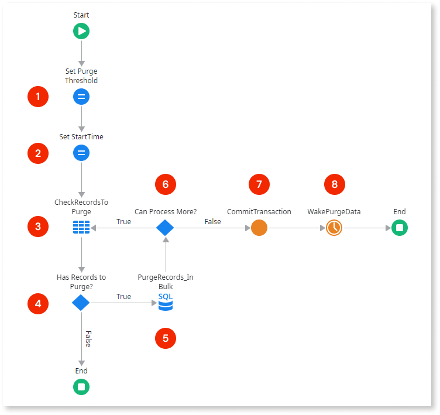

# Data purging best practice

Data purging is a mechanism that permanently deletes inactive or obsolete records from the database. It should be considered for entities with an evident high-growth rate, which can quickly achieve considerable volumes of data.

Data purging is an important [data management practice](intro.md#data-purging-archiving) when dealing with a large volume of application data. Reducing the amount of active data allows the application to respond faster, helping to prevent performance issues.

This article describes a best practice for implementing data purging in your OutSystems apps. Make sure your purging strategies are aligned with existing business and legal requirements.

Although this article focuses on purging data from the database’s entities, you can consider a similar approach for other types of storage, such as file systems, or e-mails.

## Preparing your data

To ensure the data model includes the necessary information to implement the purge algorithm, it's recommended to add **control columns** to your entities that define when records should be purged.

For example, a purge condition might specify purging records with update timestamps older than a certain number of days (specified using a [Setting](../../../manage-platform-app-lifecycle/configuration-management.md#managing-settings)), or purging records marked by a specific boolean control column.

Here are some examples of possible control columns. You can define any other that apply to your use case:

* **LastUpdatedOn** (Date Time): Tracks the last time the record was updated. Used to purge records based on a timestamp (defined using a Setting, for example).
 
* **IsActive** (Boolean): Marks the record as active or inactive. Inactive records can be purged later on.

* **IsDeleted** (Boolean): Marks the record for later deletion (soft-delete). The record can be effectively deleted (purged) or restored later.

* **IsDraft** (Boolean): Useful for draft scenarios, such as having data not yet finalized. This flag helps to identify data to purge, such as drafts created a long time ago with no recent updates.

To keep the overall query performance as the app’s data grows, index the added control columns.

## Implementing the purge mechanism

You can set up a purging process by using a [Timer](../../timers/intro.md) that asynchronously deletes records from a given entity, based on the purge condition. For performance reasons, and to prevent timeouts, the purge should be executed in chunks using bulk operations.

The following is an example of the purge process logic:

1. **Set Purge Threshold** - Sets the number of records to purge by iteration. This threshold can be defined using a Site Property, so it can be adjusted without redeploying the module.

1. **Set StartTime** - Sets a local variable with the current time when the execution starts.

1. **CheckRecordsToPurge** - Validates if there are records left to purge, according to the conditions defined using the control columns.

1. **Has Records to Purge?** - Validates the output of the previous query and executes the purge branch if there are records to purge.

1. **PurgeRecords_InBulk** - Executes a bulk `DELETE` statement, combined with a clause to limit the amount of purged records (using the Purge Threshold set in step 1). It implements the purge condition.

1. **Can Process More?** - Validates if the current execution duration is approaching the Timer’s timeout (using an expression like `DiffMinutes(StartTime, CurrTime()) < 15`, for a default timeout of 20 minutes). If there’s still time, it continues checking for more records to purge. This approach helps prevent the Timer from timing out and having to repeat work.

1. **CommitTransaction** - Commits the transaction to make all changes permanent in the database.

1. **WakePurgeData** - Re-wakes the Timer to check if there are still records to purge.

The whole system may require multiple Timers to purge data from different entities. Each Timer will have its purge condition, aligned with the use case associated with that Entity.

## Common pitfall scenarios

### No referential integrity strategy

When implementing your data purging mechanism, you have to consider the [referential integrity (Delete Rule)](../modeling/relationship/relationships.md#referential-integrity) defined for the relationships between the Entities in your model, as it directly impacts the sequence of your deletion flow.

During the design phase of your Entities model, make sure you correctly set the **Delete Rule** for the several relationships, as described below, taking the data purging requirement into consideration. Otherwise, you might end up with a complex and hard to maintain purging implementation.

The `Protect` approach
:   If you keep the `Protect` default value for the **Delete Rule** of all the Entities relationships in your model, the result is having a more complex data purging flow or getting a database exception when trying to delete records following the wrong deletion order.

The cascade delete approach
:   Having the **Delete Rule** set to `Delete` - cascade delete behavior - is the scenario that most benefits the purging implementation, as it ensures that when you delete the main record, all the related records are automatically deleted. Therefore, for a simpler data purging implementation, you should design your Entities model to use the cascade delete rule as much as possible. On the other side, make sure to respect the expected system behavior in each use case.

The `Ignore` approach
:   Having the **Delete Rule** set to `Ignore` will allow you to delete a record from the main Entity and keep all the related records. While this approach facilitates your data purging flow, use it carefully, as it might lead to an inconsistent data model. If you need to keep only the related records for compliance purposes, bear in mind that you will never be able to retrieve and show the detailed information of the main record.

### Lack of transient data purging

All transient data must be purged periodically. You should discuss these purging mechanisms for each project, as soon as the business concepts and master data are identified.

Examples of transient data that might require purging:

* **Users that are no longer active** - If you delete users, be careful how to handle the related data. If you consider setting the **Delete Rule** to `Ignore`, instead of `Delete`, you will never be able to retrieve and show the user's detailed information.

* **Users that started the online registration process but never concluded it** - In this case, you may want to keep the users as prospects during a certain amount of time before being purged. The purge may take place after synchronizing relevant metrics with external sources.

### Incorrect purging schedule

The purging process(es) should run during off-peak hours to minimize the impact over requests provided to end users.
