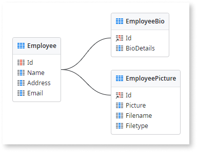

# Best practices for data management

The following are recommended best practices for handling and modeling data in OutSystems that help you design efficient and scalable apps.

## Index your entities { #index-entities }

When querying your entities is taking too long, creating entity [indexes](../modeling/entity.md#indexes) can significantly improve the overall query speed.

### Recommendations

* Create entity indexes for the most commonly used attributes, for example, attributes used in filters, sorting, and join expressions of your aggregates or SQL queries.

* Create composite indexes when you have aggregates or SQL queries with multiple attribute filters. Ensure the attribute order in the index matches the order used in the aggregates or SQL queries.

* Prioritize indexing attributes with a wide range of unique values, such as dates or small texts, to achieve better performance. Indexing attributes with low variability, such as boolean attributes, has less impact on performance. 

* Limit the number of indexes, as too many indexes can slow down inserts and updates. Prioritize indexes that support critical queries, and [monitor the app performance](../../../monitor-and-troubleshoot/app-health.md) regularly to ensure those indexes balance read and write performance according to the app needs.

* Remove unnecessary indexes when your app's query and data access patterns change.

### Benefits

Creating the right indexes on entities significantly **improves the performance of your aggregates and SQL queries** with filters, sorting, or join conditions, leading to faster app's data retrieval.

## Isolate large text and binary data in separate entities { #isolate-binary-data }

Fetching and updating entities with large text or binary data attributes can be heavy operations. Having these types of attributes in entities that are frequently fetched and updated can compromise overall performance.

### Recommendations

* Keep the length of text attributes to the minimum possible value. If you need a text attribute with a length greater than 2000, isolate it in a separate entity.

* Isolate binary data attributes in a separate entity.

### Benefits

Isolating large text and binary data in separate entities reduces the load on the master entity. Particularly if the large text and binary data attributes are rarely accessed, this practice results in **faster fetches and updates** over the master entity.

## Implement data purging and archiving strategies when dealing with a large volume of data { #data-purging-archiving }

When dealing with a large volume of application data, the high growth of data may lead to application performance deterioration over time.

### Recommendations

If you expect your application to handle a large volume of data, consider the implementation of [data purging](data-purging.md) and [data archiving](data-archiving.md) mechanisms:

* **Data purging:** Mechanism that permanently deletes inactive or obsolete records from the database. Consider it for entities with an evident high-growth rate, which can quickly achieve considerable volumes of data.

* **Data archiving:** Mechanism that stores data that's no longer relevant for daily operations in a separate location, while still retaining it for future reference or regulatory compliance, as it remains important to the organization.

The following criteria can help you determine if these mechanisms are necessary for your application:

* Forecast the growth of your data during the design phase, based on business knowledge and existing metrics. If you don’t have enough information, take a conservative approach and consider the high growth of the data.

* [Monitor the application performance](../../../monitor-and-troubleshoot/app-health.md) to identify long response times for specific requests involving entities that may be good candidates for archiving.

### Benefits

Implementing purging and archiving strategies improves **runtime performance** and prevents scenarios of application performance deterioration. Since the volume of active data is reduced, queries take less time to execute and the application reacts faster.
