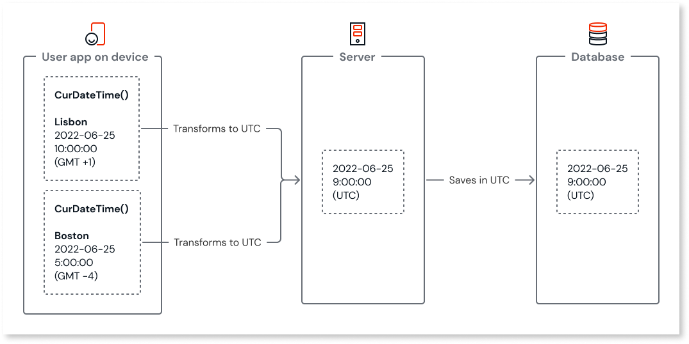

# Data types and conversions

This page describes the data types available in OutSystems, their default values and constraints.

OutSystems does not use the concept of the NULL value, except for the Entity Identifier data type. Therefore, each data type has an associated default value that is assigned at creation.

You can convert data into another data type using built-in functions. To learn more, refer to [data type conversions](convert-data-types.md).

## Basic data types

| Type | Default Value | Example | Comment |
| --- | --- | --- | --- |
| Binary Data | Byte array with no elements | n/a | |
| Boolean | `false` | `true` or `false` | |
| Currency | `0.0` | `545870.025` | See Decimal type. |
| Date | `#1900-01-01#` | `#1988-08-28#` | The  supported range is [#1900-01-01#, #3000-12-31#] |
| Time | `#00:00:00#` | `#12:20:56#` | Minimum value: `#00:00:00#`    Maximum value: `#23:59:59#` |
| Date Time | `#1900-01-01 00:00:00#` | `#1988-08-28 23:59:59#` | The supported range is `[#1900-01-01 00:00:00#, #3000-12-31 23:59:59#]`  The date time is always in UTC. Refer to the [additional notes](#date-time-notes) for more information. |
| Integer | `0` | `2147483600` | Minimum value: -2^31^, which is `-2147483648`.  Maximum value: 2^31^-1, which is `2147483647`. |
| Long Integer | `0` | `5645245584135987412` | Minimum value: -2^63^ Maximum value: 2^63^-1 |
| Decimal | `0.0` | `-158121.025`  `4000.0` | Integer and decimal parts must be separated by a period.   Minimum value: -2^96^   Maximum value: 2^96^-1  The maximum number of digits in the decimal part is 8. |
| Email | `""` (empty string) | `"user@example.com"` | |
| Phone Number | `""` (empty string) | `"1-800-555-0000"` | |
| Text | `""` (empty string) | `"Hello, world!"` | |
| &lt;Entity&gt; Identifier | When an Entity is created, the &lt;Entity&gt; identifier data type is created for the identifier attribute. | | |

### Date and time notes {#date-time-notes}

In ODC there are three different data types for date and time:

* Date: Represents a specific calendar date.
* Time: Represents a specific time of day.
* DateTime: Represents both a date and a time.

The Date and Time data types are stored and displayed exactly as defined by the user.

For DateTime, the data is stored in UTC but displayed using the device's time zone. For example:

* If a user opens the app on their computer in Boston, MA (UTC-4), they see the time as 5:00 am.
* If the same app is opened on a computer in Lisbon, Portugal (UTC+1), the time is shown as 10:00 am.

This adjustment accounts for Daylight Saving Time (DST). For instance, if a user saves a DateTime value in the database as April 18, 2022, 5:00 am in Boston, MA, it will consistently display as:

* April 18, 2022, 5:00 am in Boston, MA.
* April 18, 2022, 10:00 am in Lisbon, Portugal.

When built-in functions are called, the server returns the data to the devices. The DateTime displays on both devices in the local time.

The following guidelines provide additional details on handling date and time data:

* Client-side calls: Return the device's local DateTime.
* Server-side calls: Return the current DateTime in UTC.
* SQL query calls: Return the current DateTime in UTC.
* DateTime types: Stored and calculated in the UTC time zone, with no adjustments for Daylight Saving Time (DST).
* Displaying DateTime: Displayed in the device's time zone, including adjustments for DST.
* Date and Time types: Stored in the database and displayed exactly as entered, without any conversions.

## Compound data types

| Type | Comments |
| --- | --- |
| `<Entity>` or `<Structure>` | When an Entity or Structure is created, a data type is also created with all the attributes of that Entity or Structure. For example, when the Customer entity is created, the Customer data type is created. To create a variable of this data type, simply set its **Data Type** property to `Customer`. To access an attribute of the variable, use the following syntax: `.`, for example `MyCustomerVar.Name`. |
| Object | OutSystems supports the Object data type to allow to reuse your own .NET classes. The default value is NullObject(). |
| Record | A Record is a data type that's composed of a fixed number of attributes, each one with its own data type. Use a Record to define a compound data type that is used for a single variable. If you need to define more than one variable with the same compound data type, use a Structure instead. Some use cases for using the Record data type are: • You need to return the result of an Aggregate on a User Action. In this case, you can define the user action output parameter using the record data type. • You need a user action that returns compound information, but don't want to define a new Structure. |

To learn more about compound data types, refer to [Use structures and records to create compound data types](structure-create-use.md).
  
## Collection data types

| Type | Comments |
| --- | --- |
| List | A List is a sequence of elements of the same data type, either basic or compound. Elements can be inserted, fetched, and removed from a List. |
