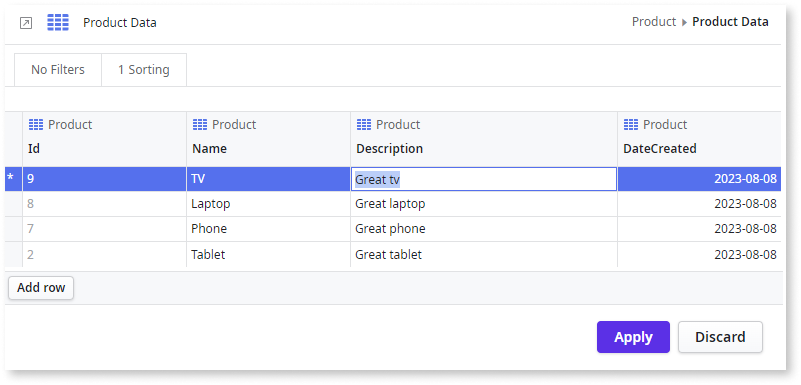
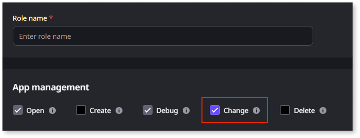
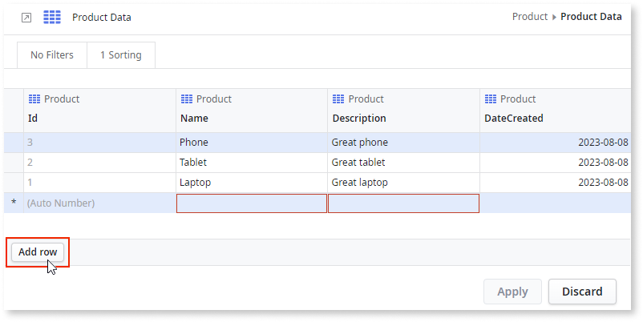
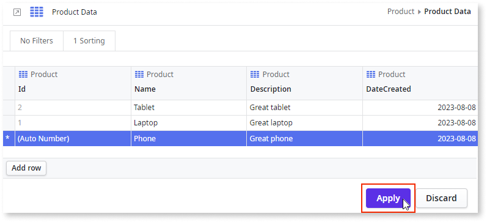
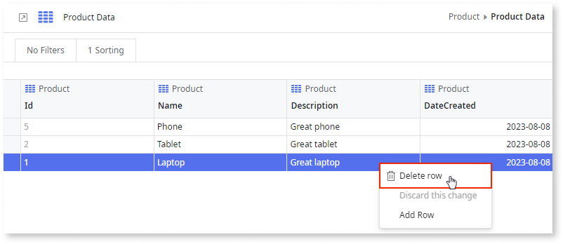
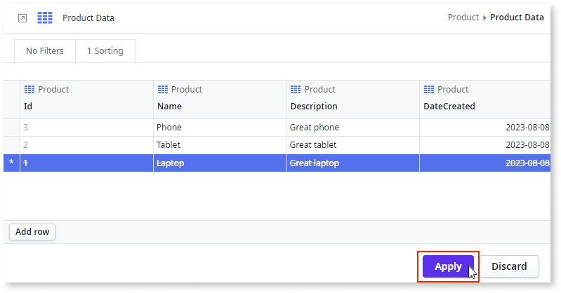
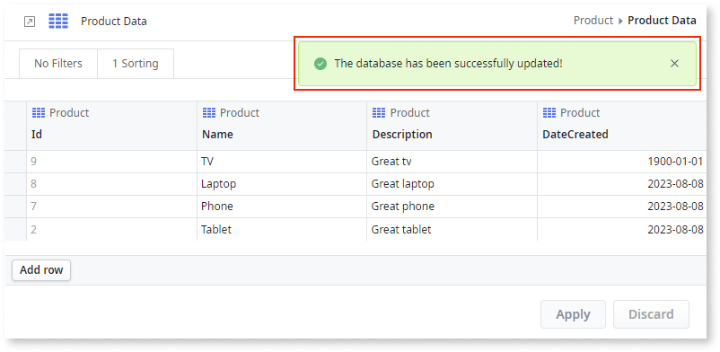
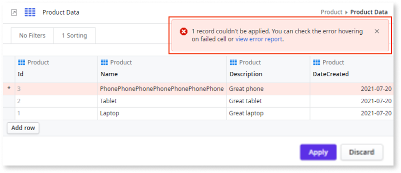
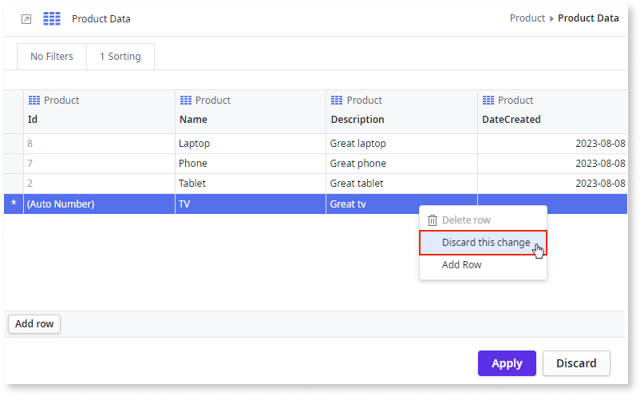
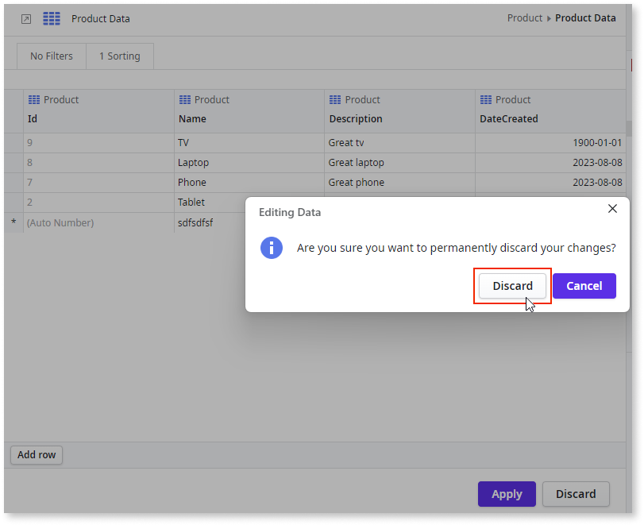

# Edit data in ODC Studio 

After you create [entities to persist data](../data/modeling/entity-create.md), you can edit your app's data without leaving ODC Studio.

In ODC Studio, you can edit entity data in the development stage. The [entities](../data/modeling/entity.md) must meet the following criteria:

* Entities must have an identifier attribute.

* Entities must be from the server side only. This does not include static, local or external entities.

    * Static entities are entities that have hard coded values and don’t change dynamically as server entities.
    * Local entities are local storage entities available in mobile apps only.
    * External entities can be added through a connection from an external database, for example, Salesforce, SAP, and SQL Server. These entities are read-only. 

Adding, removing, and changing entity records during app development, allows you to:

* Test your app with real and meaningful data to ensure your app works correctly once it reaches production.

* Prepare your demos with valid data to show your stakeholders real use cases and enable them to give you meaningful feedback.

## How to edit an entity’s data in ODC Studio

By design, foreign keys to referenced entities are not validated so care must be taken when setting the foreign key values manually. OutSystems recommend you use the suggested values from the dropdown list.

Additionally, foreign key cells for the User entity don't show values or suggestions in ODC Studio. The workaround for this is to open the User entity inside the (System) database folder, find the relevant ID and copy it.

**Prerequisites**

You must have the App management **Change** permission for the app

Learn how to [add a record or row](#add-a-record-or-row), [delete a record or row](#delete-a-record-or-row), and [modify a record's attribute](#modify-a-records-attribute) in ODC Studio.

### Add a record or row

To add a record or row, follow these steps:

1. In the app where the entity exists, go to the **Data** tab, and right-click the entity to **View or Edit Data**.

    

    **Note**: Even though it seems like you're editing data in a spreadsheet, you're actually preparing changes to data in a relational database. Rows represent entity records, and cells represent attributes.

 1. Click **Add row**.

    

    **Note:** If any cell has a red outline, it means that those fields are mandatory and you must fill them in. To understand each issue, hover over the highlighted cell. You can make more than one change to the entity at a time. Once you've finished your changes, click **Apply**.

1. You can make more than one change to the entity at a time. Once you've finished your changes, click [Apply](#apply-changes).

    

## Delete a record or row

To delete a record or row, follow these steps:
 
1. In the app where the entity exists, go to the **Data** tab, and right-click the entity to **View or Edit Data**.

    

1. Right-click the row you want to delete, and select **Delete row**.

    

1. You can delete more than one row at a time. Once you've  finished your changes, click **Apply**.

    

## Modify a record's attribute

To modify a record's attribute or cell, follow these steps:

1. In the app where the entity exists, go to the **Data** tab, and double-click the entity to **View or Edit Data**.

    

1. Double-click inside the cell you want to change.

1. Depending on the data type of the cell, set the data in one of the following ways:

    * For a **Text** or **Phone** cell, enter a text string, for example, text or +1 555 565 3730.
    * For an **Email** cell, enter a text string with at least two characters separated by a @, for example, fran.wilson@example.com.
    * For an **Integer** or a **Long Integer** cell, enter an integer, for example, 10.
    * For a **Decimal** or a **Currency** cell, enter a decimal, for example, 10.8.
    * For a **Date** cell, enter a date using the YYYY-MM-DD format, for example, 1988-08-28.
    * For a **Time** cell, enter a time using the HH:MM:SS format, for example, 23:59:59.
    * For a **Date Time** cell, enter a time using the YYYY-MM-DD HH:MM:SS format, for example, 1988-08-28 23:59:59.
    * For a **Boolean** cell, select either True or False.
    * For a **Binary** cell, select and upload a file.
    * For an entity identifier cell, select a value from the dropdown.
    * For a static entity identifier cell, select a value from the dropdown.

1. You can make more than one change at a time. Once you've finished your changes, click **Apply**.

## Apply changes

Once you've finished your changes, confirm that you want to change the data by clicking **Apply**. 

**Note**: You can’t apply your changes if a cell has errors.

After applying your changes to the database, one of the following messages is displayed:

* If all changes are successful, a success message displays.

    

* If some changes fail, an error message displays and the problem cells are highlighted. To understand the cause of the errors, hover over the cell. Additionally, you can generate a text file with all of the errors by clicking **view error report**.

    

## Discard changes

You can permanently discard changes in one of the following ways:

* To discard changes to a specific row, right-click the row and select **Discard this change**.

    

* To discard all of your changes, click **Discard** and then confirm that want to permanently discard your changes.

    
