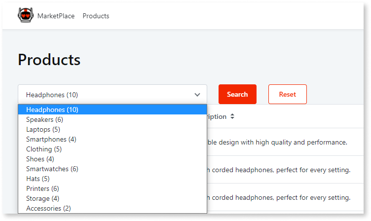
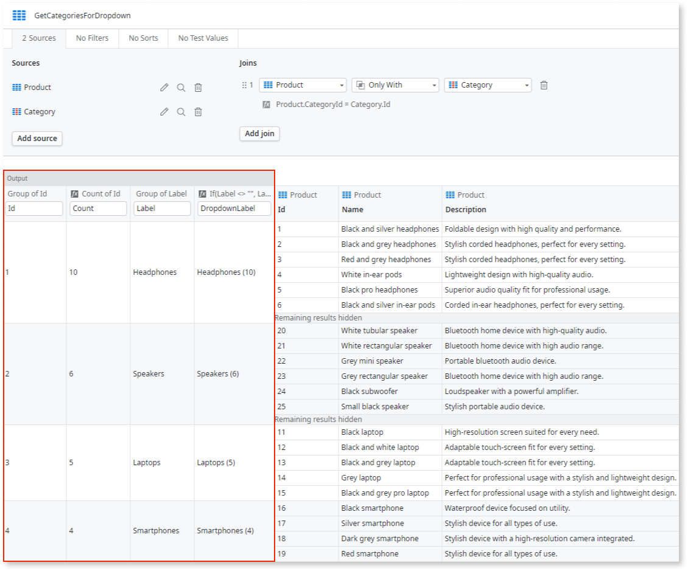

# Create a Calculated Attribute in an Aggregate

There are situations when the data fetched from the database isn't enough and you need to add more information to each record, namely based on the values returned. You can add new attributes to the records that an Aggregate returns, based on the value of the other attributes. You create the attribute by describing it to Mentor Studio and validating the result, or manually in ODC Studio.

## Create a calculated attribute with Mentor Studio

Add a calculated attribute by describing it in terms of the attributes that the aggregate returns in Mentor Studio, and validate its values before you publish.

In your prompt, name the aggregate, the new attribute, and the formula in terms of the attributes that the aggregate already returns. For example, "In the GetProducts aggregate, group by Category.Id and Category.Label and count Product.Id. Add a calculated attribute named DropdownLabel that shows the label followed by the count in parentheses, or Not categorized followed by the count when the label is empty."

For more prompt examples, refer to the logic section of [Prompts for Mentor Studio](../../../agentic-development/mentor-studio/prompts.md#logic).

For the requirements and the steps to prompt Mentor Studio and review the change, refer to [Modify an app with AI in ODC Studio](../../../agentic-development/mentor-studio/modify-app.md) and [Review and accept the plan](../../../agentic-development/mentor-studio/how-it-works.md#accept-plan).

### Validate the calculated attribute

The platform guarantees that the model is valid, and you decide whether the aggregate returns the correct data for your requirement. In ODC Studio, check the following:

* The aggregate has a new attribute with the name that you described.
* The formula refers only to attributes that the aggregate returns, such as the grouped `Label` and the `Count`.
* The formula returns the intended value for every case in your description, including an empty value.
* The aggregate groups and counts the way you described. In the example, the count is the number of products for each category.

## Create a calculated attribute manually in ODC Studio

To add a calculated attribute yourself, do the following in ODC Studio:

1. In the Aggregate, click **New Attribute** to add a new attribute to the Aggregate and name it.
1. Open the attribute menu and select **Edit formula...**
1. Define the expression to calculate the value.

### Example

StoreApp, a Web App to check the products in a store, has a screen to list products.

In this screen, you want to address the following requirement: the end-user can filter the listed products by category, by selecting an available category from a Dropdown. In each entry of the Dropdown, the app displays the number of products that have that specific category along with the category name.

To calculate this data and add it to each entry of the Dropdown, do the following:

1. As this is a Web App, right-click the screen and select the option **Fetch Data from Database** to add an Aggregate to the screen.

1. Add the `Product` entity to the Aggregate.

1. In the Aggregate, do the following:

    1. Click **Add source** and add the `Category` entity to the Aggregate, choosing products `Only With` category for the join rule.

    1. Group by `Category.Id`.

    1. Count by `Product.Id` to have the number of products per category.

    1. Group by `Category.Label` to get the label of each category.

    1. Open the last grouped column menu and add a new attribute. Name it `DropdownLabel`.

    1. Assign the following expression to the created column:

        `If ( Label <> "", Label + " (" + Count + ")" , "Not categorized" + " (" + Count + ")" )`

        `Label` and `Count` variables are two of the previously grouped columns.

    

1. Go to the screen and add a Dropdown. Set the Dropdown values to be the returning list of the Aggregate using the `DropdownLabel` attribute as the options text.

## Related resources

The following resource describes what the platform guarantees and what you check in a Mentor Studio proposal.

* For what the platform guarantees and what you validate, refer to [Platform guarantees and AI interpretation](../../../agentic-development/odc-ai-and-platform.md).
