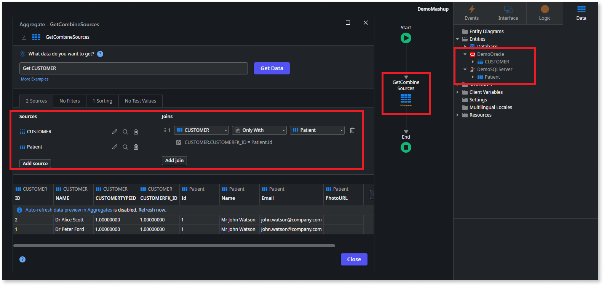

# Combine data from different sources using data mashup

When you integrate your app with different external data sources using [OutSystems Data Fabric](../../../integration-with-systems/external-databases/intro.md), you can use **data mashup** in an [aggregate](aggregate.md) to fetch combined data from those sources.

Some benefits of data mashup are:

* Simplified process: You can drag and drop data from different sources, creating custom logic to combine data. This helps you save time and effort.
* Improved data analysis: You can leverage data from various databases to gain deeper insights and make better business decisions.
* Increased flexibility: You get greater flexibility in data analysis and reporting.

To mash up data from different external data sources, Administrators must [create a connection](../../../integration-with-systems/external-databases/create-connection-external-data.md) for each external source in ODC Portal and select the entities to use in your app. Then, in ODC Studio, you can create an [aggregate](aggregate.md) to combine those entities from the different external sources, and also with your OutSystems [entities](../modeling/entity.md).

To better understand queries in data mashup, refer to [Writing better queries in data mashup](queries.md).

## Related resources

* [Data mashup transactions](transactions-data-mashup.md)

* [Troubleshooting aggregates that use data mashup](data-mashup-errors.md)

* [Integrate with External Databases (ODC)](https://learn.outsystems.com/training/journeys/integrate-external-databases-odc-2644) online course
