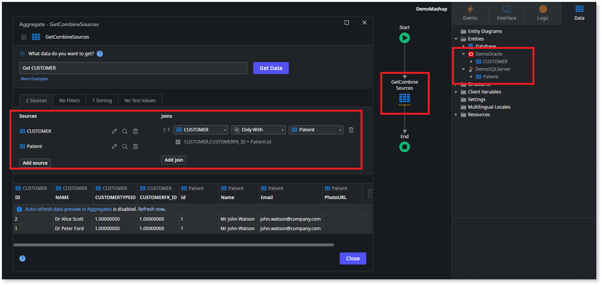

# Combine data from different sources using data mashup

When you integrate your app with external data sources using [OutSystems Data Fabric](../../../integration-with-systems/external-databases/intro.md), you can use **data mashup** in an [aggregate](aggregate.md) or [SQL node](sql/use-sql.md) to fetch combined data from multiple sources. For example, you can mash up your OutSystems [entities](../modeling/entity.md) with an external data source, or mash up two distinct external data sources.

You combine sources by describing the data you need to Mentor Studio and validating the result, or manually in ODC Studio.

## Create a data mashup with Mentor Studio

Combine sources by describing the data you need from each one in Mentor Studio, and validate the aggregate sources and joins before you publish.

In your prompt, name the aggregate, the sources to combine, and the join between them. For example, "In the GetOrdersWithCustomers aggregate, add the external Customer entity as a source with a With or Without join to Order on CustomerId."

For more prompt examples, refer to the logic section of [Prompts for Mentor Studio](../../../agentic-development/mentor-studio/prompts.md#logic).

For the requirements and the steps to prompt Mentor Studio and review the change, refer to [Modify an app with AI in ODC Studio](../../../agentic-development/mentor-studio/modify-app.md) and [Review and accept the plan](../../../agentic-development/mentor-studio/how-it-works.md#accept-plan).

### Validate the data mashup

The platform guarantees that the model is valid, and you decide whether the aggregate returns the correct data for your requirement. In ODC Studio, check the following:

* Each source that you described is in the aggregate, and the sources from the external data source appear as external entities.
* The join type matches your requirement. In OutSystems, Only With is an inner join, With or Without is a left join, and With is a full join. In mashup queries, use With or Without instead of Only With. For more information, refer to [Writing better queries in data mashup](queries.md).
* The join condition is a full or partial equi-join, with equality between the attributes of the two sources. Literals and dynamic parameters are in a filter and not in the join condition.
* The aggregate selects only the attributes the mashup uses, and excludes binary data and large text attributes.
* The aggregate returns the combined records that you expect. Test Query and runtime results can differ, so also confirm the result in the published app. For more information, refer to [understand Test Query results](test-query-runtime.md).

## Create a data mashup manually in ODC Studio

To combine data from different sources yourself, add the entities from each source to an aggregate and select the join type between them. For the steps, refer to [Query data using aggregates](aggregate.md#how-to-add-more-data-sources-to-an-aggregate).

## Benefits of data mashup

Some benefits of data mashup are:

* Simplified process: You can drag and drop data from different sources, creating custom logic to combine data. This helps you save time and effort.
* Improved data analysis: You can leverage data from various databases to gain deeper insights and make better business decisions.
* Increased flexibility: You get greater flexibility in data analysis and reporting.

To better understand queries in data mashup, refer to [Writing better queries in data mashup](queries.md).

## Related resources

* For what the platform guarantees and what you validate, refer to [Platform guarantees and AI interpretation](../../../agentic-development/odc-ai-and-platform.md).
* [Data mashup transactions](transactions-data-mashup.md)

* [Troubleshooting aggregates that use data mashup](data-mashup-errors.md)

* [Integrate with External Databases (ODC)](https://learn.outsystems.com/training/journeys/integrate-external-databases-odc-2644) online course
