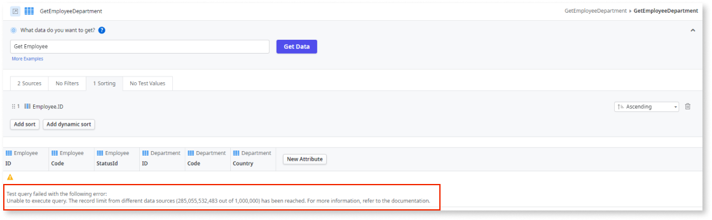

# Troubleshooting aggregates that use multiple sources of data

Errors may occur when executing aggregates with multiple sources and if the execution plan consumes too much memory. Queries that use data from different sources may require a large amount of memory and CPU to process the required data, depending on the query complexity, logic, and data volume. 

The **consumption cost** of an aggregate is calculated based on the memory that the model predicts. The memory the model predicts is based on the total number of records in each of the aggregate entities. The **record limit** of the consumption cost is fixed (1,000,000) and can't be configured. This record limit is the same for all aggregates, regardless of the data source. The **records** represent the number of records fetched from the entities in the query generated by the aggregate, not the total number of records in those entities.

If the record limit of an aggregate is exceeded, an error is thrown. 

## Error message

``Unable to execute query. The record limit from different sources (X,XXX,XXX out of 1,000,000) has been reached.``

## Cause

Join and sort operations typically add complexity to queries and increase the memory required to process the data. When combined, the amount of memory required increases significantly. This can lead to the record limit being reached. 

The following are some examples of when this error occurs:

### Example 1

In this example, 2 entities are joined:

* Employee (Oracle entity with more than one million records) 

* Department (SQL Server entity with more than one million records)

In the aggregate, the entities are sorted by ``Employee.Id``, which results in an error.

   
#### Impact

The query fails because the Employee entity, which has many records, consumes too much memory. The query is canceled, and the error is thrown both when you try to preview the aggregate results in ODC Studio and at runtime.

#### Recommended action

Evaluate if the sort operation is required. 

* If not, remove it.

* If the Sort is required, then try one of the following solutions:

    * Reduce the number of records being fetched from the databases. Evaluate if all records are required, if not, add Where clauses or Join conditions to reduce the number of records. The sort will have to sort a reduced number of records so that the problem might be solved.

    * Remove the sort in the aggregate and sort the query results using OutSystems logic. Then, you can use the **ListSort** server action after the aggregate.

    * Refer to [OutSystems documentation](queries.md) to learn how to write better mashup queries.

### Example 2

In this example, 2 entities are joined:

* Employee (Oracle entity with more than one million records) 

* Department (SQL Server entity with more than one million  records)

#### Impact

The query fails because both entities have more than one million records, which consumes too much memory. The query is canceled, and the error is thrown both when you try to preview the aggregate results in ODC Studio and at runtime.

#### Recommended action

* Reduce the number of records being fetched from at least one of the entities

* Evaluate whether all records are required. If not, add **Where** clauses or **Join** conditions to reduce the number of records.

* Refer to [OutSystems documentation](queries.md) to learn how to write better mashup queries.

* If neither of the previous solutions solves the problem, you can mashup data using OutSystems logic that includes list manipulation for each cycle.

