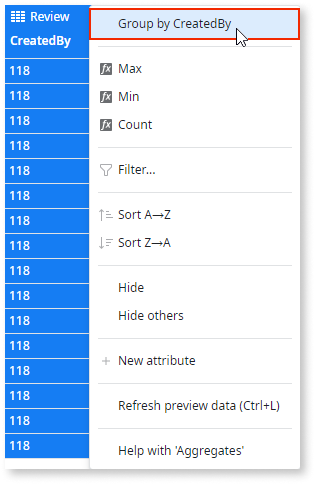
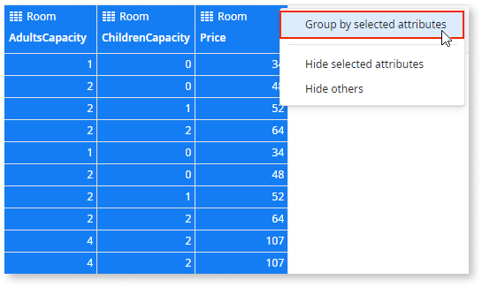

# Get distinct values from the database

Database tables can have columns that contain repeated values. When you only want the distinct values, instead of all the data including the repetitions, use an aggregate with grouped columns. You create the aggregate by describing the result to Mentor Studio and validating it, or manually in ODC Studio.

## Get distinct values with Mentor Studio

Get distinct values by describing the attribute or attributes in Mentor Studio, and validate that the aggregate returns each value once before you publish.

In your prompt, name the entity and the attribute, or the attributes, whose distinct values you need. For example, "Create an aggregate that returns the distinct values of the City attribute of the Employee entity."

For more prompt examples, refer to the logic section of [Prompts for Mentor Studio](../../../agentic-development/mentor-studio/prompts.md#logic).

For the requirements and the steps to prompt Mentor Studio and review the change, refer to [Modify an app with AI in ODC Studio](../../../agentic-development/mentor-studio/modify-app.md) and [Review and accept the plan](../../../agentic-development/mentor-studio/how-it-works.md#accept-plan).

### Validate the distinct values aggregate

The platform guarantees that the model is valid, and you decide whether the aggregate returns the correct data for your requirement. In ODC Studio, check the following:

* The aggregate has the entity that you described as its source.
* The aggregate groups by each attribute whose distinct values you need. For distinct values over several attributes, it groups by all of them.
* The aggregate only outputs the attribute values that are grouped. An extra attribute in the output indicates that the aggregate isn't grouping the way you described.
* The number of records returned equals the number of distinct values in the data, with no repeated value.

## Get distinct values manually in ODC Studio

To get distinct values of an entity attribute yourself, do the following in ODC Studio:

1. In an aggregate in the action flow, add the entity.

1. Right-click on the attribute for which you want to obtain distinct values, and choose to group by the attribute.

The aggregate only outputs the attribute values that are grouped.

To get distinct values using multiple entity attributes, select all the required attributes and choose to `Group by selected attributes`.

## Related resources

The following resource describes what the platform guarantees and what you check in a Mentor Studio proposal.

* For what the platform guarantees and what you validate, refer to [Platform guarantees and AI interpretation](../../../agentic-development/odc-ai-and-platform.md).
