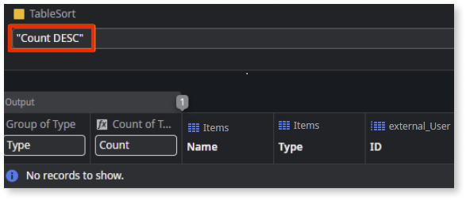
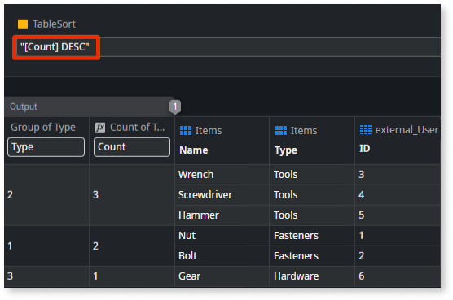
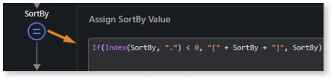

# Dynamic sort with external entities

When working with [external entities](../../../integration-with-systems/external-databases/intro.md) in an aggregate, the process of generating queries is slightly different from when using internal data only. To access this external data, specialized queries are generated to retrieve and manipulate the data before the results are incorporated back into your app. This ensures that external data can be processed alongside your internal data.

Additionally, when performing dynamic sorting based on [calculated attributes](calculated-attribute-create.md), you must format those attributes correctly. Calculated attributes (such as aggregates like counts or sums) must be enclosed in square brackets (for example `[Count]`). This formatting is necessary because it tells the system that you're working with a calculated attribute rather than an [entity](../../../building-apps/data/modeling/entity.md) attribute. If you don't use this format, it can result in runtime errors, or the query might return no results at all.

**Example**

* Without square brackets, the query doesn't work as expected, and no results are returned:

  

* After wrapping the calculated attribute in square brackets, the query works as expected, and results are returned:

  

Considering that a dynamic sort may change dynamically during runtime, whenever a value is assigned to a dynamic sort in logic, you must add an **Assign** node with the following code:

   `If(Index(SortBy, ".") < 0, "[" + SortBy + "]", SortBy)`

Assuming that the dynamic sort attribute is called `SortBy`, this code checks for the existence of a **.** (period) in its value. If there's no period, this means it is a calculated attribute (not an entity attribute), and it wraps it within square brackets.

**Note:** The ascending or descending order remains optional and doesn't have to be included within the brackets (for example, `[Count] ASC`).
