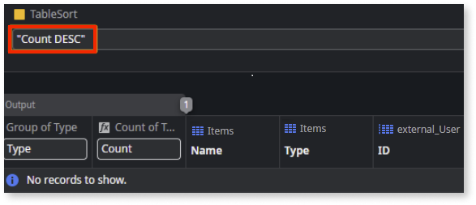
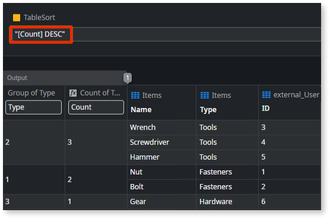
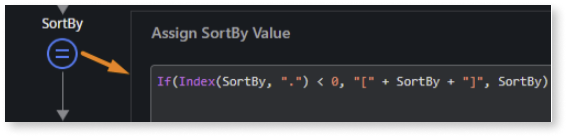

# Dynamic sort with external entities

A dynamic sort changes the order of the records that an aggregate with [external entities](../../../integration-with-systems/external-databases/intro.md) returns, based on a Text value at runtime. You set up the dynamic sort by describing it to Mentor Studio and validating the result, or manually in ODC Studio.

## Set up a dynamic sort with Mentor Studio

Set up a dynamic sort by describing it and the attributes users can sort by in Mentor Studio, and validate the sort values and the returned records before you publish.

In your prompt, name the aggregate, the Text variable that holds the sort value, and the attributes users can sort by. For example, "In the GetOrders aggregate, add a dynamic sort that uses a Text variable named SortBy. Users can sort by Order.OrderDate."

For more prompt examples, refer to the logic section of [Prompts for Mentor Studio](../../../agentic-development/mentor-studio/prompts.md#logic).

For the requirements and the steps to prompt Mentor Studio and review the change, refer to [Modify an app with AI in ODC Studio](../../../agentic-development/mentor-studio/modify-app.md) and [Review and accept the plan](../../../agentic-development/mentor-studio/how-it-works.md#accept-plan).

### Validate the dynamic sort

The platform guarantees that the model is valid, and you decide whether the aggregate returns the correct data for your requirement. In ODC Studio, check the following:

* The dynamic sort uses the Text variable that you described, such as `SortBy`.
* Each sort value is an attribute name followed by `ASC` or `DESC`. A group-by attribute uses its name, such as `IntakeStatus DESC`.
* In Test Query, each sort value that you described returns the records in the expected order.
* The published app returns the records in the same order. Test Query and runtime results can differ. For more information, refer to [understand Test Query results](test-query-runtime.md).

## Set up a dynamic sort manually in ODC Studio

To set up the dynamic sort yourself, use the following information.

When working with [external entities](../../../integration-with-systems/external-databases/intro.md) in an aggregate, the process of generating queries is slightly different from when using internal data only. To access this external data, specialized queries are generated to retrieve and manipulate the data before the results are incorporated back into your app. This ensures that external data can be processed alongside your internal data.

Additionally, when performing dynamic sorting based on [calculated attributes](calculated-attribute-create.md), you must format those attributes correctly. Calculated attributes (such as aggregates like counts or sums) must be enclosed in square brackets (for example `[Count]`). This formatting is necessary because it tells the system that you're working with a calculated attribute rather than an [entity](../../../building-apps/data/modeling/entity.md) attribute. If you don't use this format, it can result in runtime errors, or the query might return no results at all.

**Example**

* Without square brackets, the query doesn't work as expected, and no results are returned:

  

* After wrapping the calculated attribute in square brackets, the query works as expected, and results are returned:

  

Considering that a dynamic sort may change dynamically during runtime, whenever a value is assigned to a dynamic sort in logic, you must add an **Assign** node with the following code:

   `If(Index(SortBy, ".") < 0, "[" + SortBy + "]", SortBy)`

Assuming that the dynamic sort attribute is called `SortBy`, this code checks for the existence of a **.** (period) in its value. If there's no period, this means it is a calculated attribute (not an entity attribute), and it wraps it within square brackets.

**Note:** The ascending or descending order remains optional and doesn't have to be included within the brackets (for example, `[Count] ASC`).

## Related resources

The following resource describes what the platform guarantees and what you check in a Mentor Studio proposal.

* For what the platform guarantees and what you validate, refer to [Platform guarantees and AI interpretation](../../../agentic-development/odc-ai-and-platform.md).
