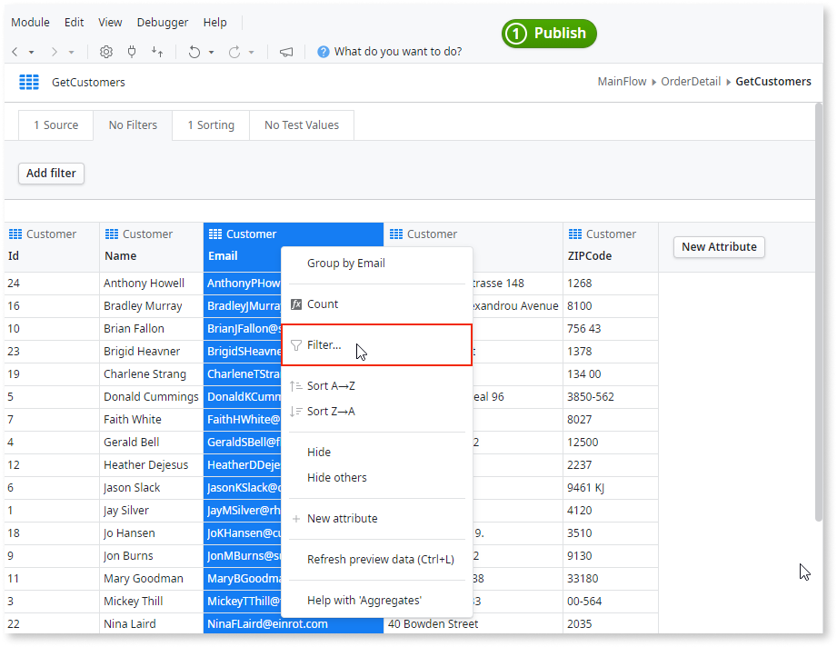

# Filter query results

When designing queries, it's common to add conditions to filter results and get exactly what you want from the database. You add Filters to Aggregates by describing the condition to Mentor Studio and validating the result, or manually in ODC Studio.

## Filter query results with Mentor Studio

Filter an aggregate by describing the condition in Mentor Studio, and validate the filter and the returned records before you publish.

In your prompt, name the aggregate, the attribute, the operator, and the value or variable to compare. For example, "In the GetEmployees aggregate, add a filter so that it returns only the employees whose City is London."

For more prompt examples, refer to the logic section of [Prompts for Mentor Studio](../../../agentic-development/mentor-studio/prompts.md#logic).

For the requirements and the steps to prompt Mentor Studio and review the change, refer to [Modify an app with AI in ODC Studio](../../../agentic-development/mentor-studio/modify-app.md) and [Review and accept the plan](../../../agentic-development/mentor-studio/how-it-works.md#accept-plan).

### Validate the filter

The platform guarantees that the model is valid, and you decide whether the aggregate returns the correct data for your requirement. In ODC Studio, check the following:

* The filter is on the aggregate and the attribute that you described, and it appears in the **Filters** option of the aggregate.
* Each condition has the operator and the value or variable that you described.
* The conditions combine the way your requirement describes. A requirement with several conditions has each condition in the filter.
* The aggregate returns the records that meet the condition and excludes the others. Test Query and runtime results can differ, so also confirm the result in the published app. For more information, refer to [understand Test Query results](test-query-runtime.md).

## Filter query results manually in ODC Studio

To add a Filter to an Aggregate yourself, do the following in ODC Studio:

1. Double-click to open the Aggregate.
1. Right-click the attribute you want to filter by and select **Filter...**.

    

1. Enter the condition.

To edit the conditions, go to the Filters option and change the ones you want to alter.

## Related resources

The following resource describes what the platform guarantees and what you check in a Mentor Studio proposal.

* For what the platform guarantees and what you validate, refer to [Platform guarantees and AI interpretation](../../../agentic-development/odc-ai-and-platform.md).
