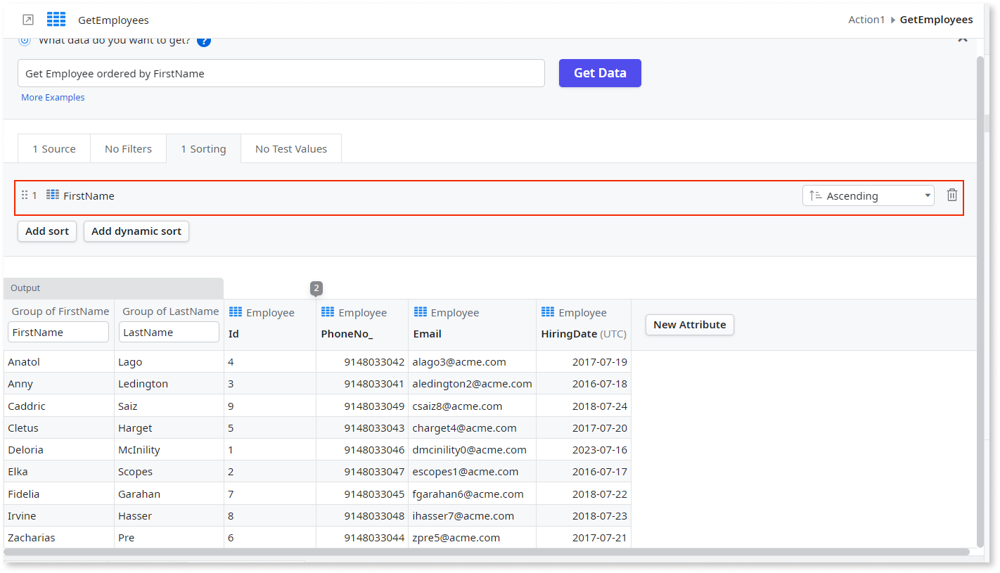
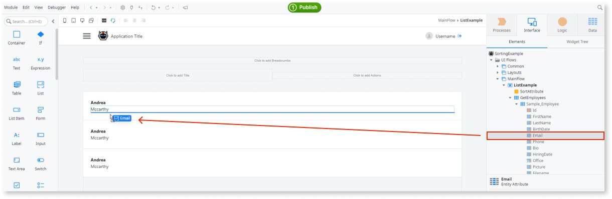
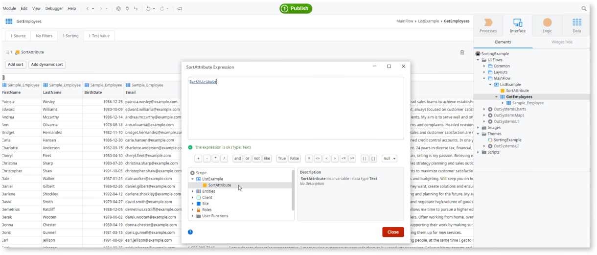
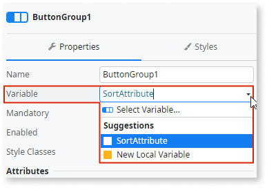
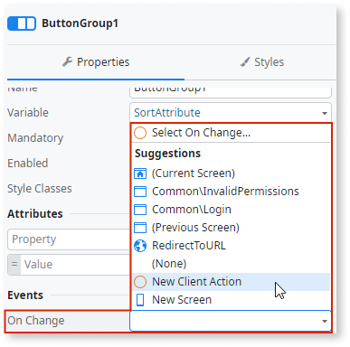
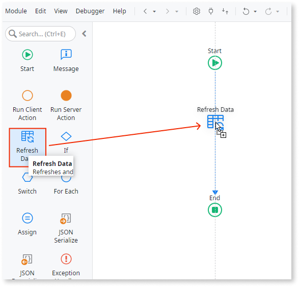

# Sort results in an aggregate

Most times, records display on screens following an order that facilitates reading or finding information.

In OutSystems, aggregates let you choose how the records sort when they return data. The sorting can be fixed or dynamic, meaning that it can change during runtime. You set the sorting by describing it to Mentor Studio and validating the result, or manually in ODC Studio.

## Sort results in an aggregate with Mentor Studio

Sort an aggregate by describing the order, fixed or dynamic, in Mentor Studio, and validate the order of the returned records before you publish.

In your prompt, name the aggregate and the attribute, and state whether the order is fixed or dynamic. For example, "In the GetEmployees aggregate, sort the results by FirstName in ascending order." For a dynamic sort, for example, "In the GetEmployees aggregate, add a dynamic sort that uses a Text variable named SortAttribute."

For more prompt examples, refer to the logic section of [Prompts for Mentor Studio](../../../agentic-development/mentor-studio/prompts.md#logic).

For the requirements and the steps to prompt Mentor Studio and review the change, refer to [Modify an app with AI in ODC Studio](../../../agentic-development/mentor-studio/modify-app.md) and [Review and accept the plan](../../../agentic-development/mentor-studio/how-it-works.md#accept-plan).

### Validate the sorting

The platform guarantees that the model is valid, and you decide whether the aggregate returns the correct data for your requirement. In ODC Studio, check the following:

* A fixed sort uses the attribute and the direction that you described, **A-Z** for ascending or **Z-A** for descending.
* A dynamic sort uses an expression of type Text, and the expression refers to a variable of type Text from the Scope tree.
* A dynamic sort refers to a group-by attribute by its name, such as `AttributeName DESC`.
* The aggregate returns the records in the order you described, and a dynamic sort changes the order when the variable value changes.

## Sort results manually in ODC Studio

To sort the results of an aggregate yourself, use the following procedures.

To display results in an aggregate with **fixed sorting**, follow these steps:

1. In the aggregate, select the column on which you want to sort and right-click the mouse.
1. To sort the results in ascending order, select **A-Z**,  or to sort the results in descending order, select **Z-A**.

To sort results in an aggregate with **dynamic sorting**, follow these steps:

1. In the aggregate,from the Sorting panel,  click **Add Dynamic Sort**. The expected input is an expression of type Text. This value can be the result of a condition or other logic implemented in the expression itself.
1. To refer to columns, select a **variable of type Text** previously defined from the Scope tree.

For dynamic sorting, you must use the name of the group by or calculated attribute.

While defining expressions as values for your variable, you can specify:

* **Calculated or grouped attributes**, using the pattern `AttributeName` for ascending order or `AttributeName DESC` for descending order.
* **Entity attributes**, using the pattern `Entity.Attribute` or `Entity.Attribute DESC` for ascending or descending order.

### Example

In the following Sorting Example, an application displays a list of employees, with details about each employee. Users should be able sort by the name of the employee in either ascending or descending order.

1. Open ODC Studio, create a new Web App named SortingExample.

1. Create an app with the default name.

1. Create an empty screen and name it.

1. Go to **Public Elements...** and search for the Sample_Employee entity of the **OutSystems Sample Data** app.

1. Fetch this entity to be used on the previous screen you created.

1. Drag and drop a list widget into the screen and define Sample_Employee as the source list for it.

1. Drag and drop the FirstName, LastName, and Email attributes into the list.

1. Create a local variable and name it **SortAttribute**, then set the Data Type property to **text**.

    

1. Double-click on the aggregate **GetEmployees**.

1. From the Sort tab, click **Add dynamic sort**, and then define the Local Variable as the value for the dynamic sort.

    

1. From the toolbox, drag a **Button Group** widget to the top of the employees list and bind the variable **SortAttribute** with the Button Group.

    

1. Remove one of the Button Group Items and rename the remaining Button Group Items to **Sort ASC** and **Sort DESC**.

1. Select the **Sort ASC Button Group Item** and set the Value property to the expression "Sample_Employee.FirstName". This sorts the results of the aggregate by ascending order using the attribute FirstName.

1. Repeat the operation on the **Sort DESC Button Group Item**, changing the expression to "Sample_Employee.FirstName DESC".

1. On the ButtonGroup, define an event **On Change** as a new client action.

    

1. In the new client action, drag Refresh Data and select the data source as **GetEmployees**.

    

1. Publish and test. Verify the list sorting changes after clicking the **Sort ASC** or **Sort DESC** buttons.  

    <iframe src="https://player.vimeo.com/video/973090257" width="750" height="454" frameborder="0" allow="autoplay; fullscreen" allowfullscreen="">Video demonstrating the sorting functionality.</iframe>

## Related resources

The following resource describes what the platform guarantees and what you check in a Mentor Studio proposal.

* For what the platform guarantees and what you validate, refer to [Platform guarantees and AI interpretation](../../../agentic-development/odc-ai-and-platform.md).
