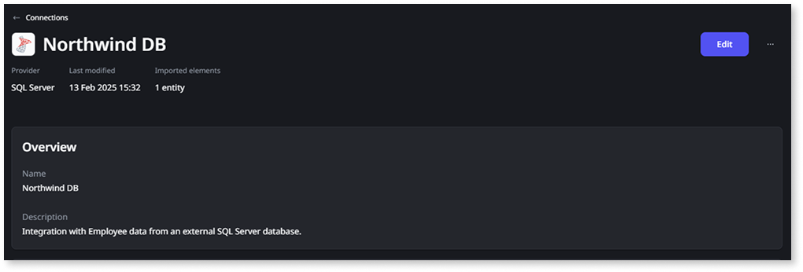
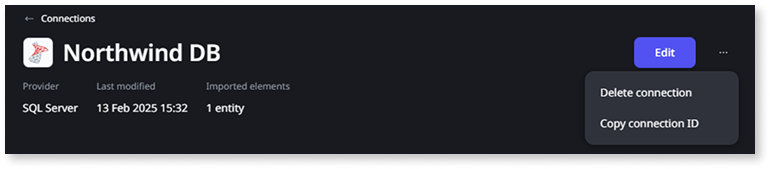

# CALL external stored procedures in ANSI-92 queries

You can use the [CALL](#using-call) statement of ANSI-92 syntax in SQL nodes to execute stored procedures. This is supported when you're using external entities from [connections](../../../../integration-with-systems/external-databases/create-connection-external-data.md)

* Microsoft SQL Server  
* Oracle  
* PostgreSQL

Stored procedures let you reuse logic defined in your external database. They're useful for encapsulating business rules, performing updates, or returning result sets that can be used in your OutSystems logic.

Stored procedures can’t be created or called for internal entities (the entities created in ODC Studio).

## Retrieve the connectionId { #retrieve-connectionid }

The `CALL` statement requires a `connectionId` that identifies the [connection to the data source done in Portal](../../../../integration-with-systems/external-databases/create-connection-external-data.md).

Follow these steps to retrieve the connectionId from the ODC Portal:

1. Under **Integrate** \> **Connections** click on the connection that you’ll use to call the stored procedure. You’ll reach the connection detail:

    

1. Click **More actions** and **Copy connection ID**. The connectionId is now copied to your clipboard.

    

1. Use the connectionId in your query to call stored procedures. See the next section for further details on the usage of the `CALL` statement.

<div class="info" markdown="1">

For existing connections, when stored procedures are changed or new ones are introduced, it's necessary to refresh the connection to fetch the new metadata. In the ODC Portal, click **Import** on the connection and then **Refresh list**.

</div>

## Using the CALL statement { #using-call }

```sql
CALL action ( [ assignment ] [, assignment ]* )

assignment:
        [ parameterName = ] @dynamic | literal
```

`CALL` executes an action on an external system.

The action must be specified using the `"connectionId"."actionName"` syntax. The `connectionId` identifies the connection to the data source in the ODC Portal. You can obtain the `connectionId` by following the [instructions here](#retrieve-connectionid).

Parameter values may be assigned with names (using the `"name" = value` or `[name] = value` syntax) or assigned positionally.

When using named assignments, the parameters may be specified in any order. The names must match the names used in the definition of the action in the external system.

When using positional assignments, values of the correct type must be provided in the same order as the parameters are declared in the definition of the action in the external system.

If the action has optional parameters (can be `NULL` or have a default value), then a combination of positional and named assignments may be used.
In this case, the positional assignments must be specified before the named assignments. If a parameter can be `NULL` and has a default value, then assigning the parameter to `NULL` will set the parameter to `NULL`. For the default value to be used, the parameter must not be assigned.

Values must be assigned for all mandatory parameters (`NOT NULL` and no default value). This applies to parameters of all types, including outputs.
The values can only be literals or dynamic parameters, expressions containing operators or functions aren't supported.

The result of `CALL` depends on the definition of the action in the external system. If the action returns a result using `SELECT`, then `CALL` will return that result.
If an action returns multiple results, then `CALL` will only return the result of the first statement that returns a result.
For all other actions, `CALL` will return a single record containing a value of `-1`.

<div class="info" markdown="1">

* The user configured on the connection must have permission to execute the action on the external system.
* Overloaded actions (with the same name but different parameter types) aren't supported and won't appear in the ODC Portal.
* All mandatory parameters must be of supported [data types](../../../../integration-with-systems/external-databases/external-data-type.md). Optional parameters of other types must not be included in the list of assignments
* If the action returns any attributes of an unsupported type, the attributes will be present in the result of `CALL` however the values for those attributes will always be `NULL`.
* ODC doesn't support the declaration of variables, so it isn't possible to retrieve the (mutated) value of an output parameter after the action has been executed.

</div>

## Known issues

* `CALL` can only be used in a multi-statement context with at least one other statement that uses an entity from the same connection.
* Named assignments can't be used with Microsoft SQL Server. This means that all optional parameters must be assigned values in `CALL`.
* For Microsoft SQL Server, using `SET NOCOUNT ON` inside actions will prevent the row count from being returned when executing `DDL` and `DML` statements.

## Examples

```sql
-- No parameters
SELECT 1 FROM {entity1} LIMIT 1;
CALL "connectionId"."actionName" ();

-- Named parameters
SELECT 1 FROM {entity1} LIMIT 1;
CALL "connectionId"."actionName" ("param1" = 'test', "param2" = 123, "param3" = @dynamic);

-- Positional parameters
SELECT 1 FROM {entity1} LIMIT 1;
CALL "connectionId"."actionName" ('test', 123, @dynamic);

-- Combination of positional and named parameters
SELECT 1 FROM {entity1} LIMIT 1;
CALL "connectionId"."actionName" ('test', 123, "param" = @dynamic);
```

## Compatibility { #compatibility }

| Data source          | Supported actions | Positional parameters | Named parameters |
| -------------------- | ----------------- | --------------------- | ---------------- |
| Microsoft SQL Server | Stored procedures | Yes                   | No               |
| MySQL                | Stored procedures | Yes                   | Yes              |
| Oracle               | Stored procedures | Yes                   | Yes              |
| PostgreSQL           | Stored procedures | Yes                   | Yes              |
| Salesforce           | None              | No                    | No               |
| SAP OData            | None              | No                    | No               |

## Microsoft SQL Server

* Stored procedures that use `EXEC` or `EXECUTE` may not return the expected result.
* Named assignment of parameters is not supported, please use the positional assignment syntax instead.

```sql
SELECT 1 FROM {entity1} LIMIT 1;
CALL "connectionId"."actionName" ('test', 123, @dynamic);
```

## MySQL

* `CALL` always returns a single record with a value of `-1`. It's not possible to receive results from a stored procedure.
* All arguments must be passed in the same order as specified in the stored procedure definition.
* Stored procedures with `INOUT` or `OUT` parameters are not supported.
* Stored procedures with `IN` parameters of unsupported types are not supported.

## Oracle

* `CALL` will always return a single record with a value of `-1`. It's not possible to receive results from a stored procedure.

## PostgreSQL

* Parameters defined without a name may be specified in `CALL` using the syntax `"$1" = value` where `$1` specifies the first parameter, `$2` the second, and so on.

```sql
SELECT 1 FROM {entity1} LIMIT 1;
-- Call a procedure with unnamed parameters using named assignments
CALL "connectionId"."actionName" ("$1" = 123, "$2" = 'test', "$3" = @dynamic);
```
