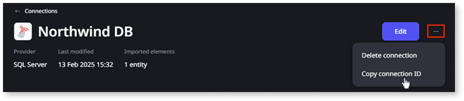

# Call stored procedures from external entities

You can use the [CALL](call.md) statement of ANSI-92 syntax in SQL nodes to execute stored procedures. This is supported when you're using external entities from [connections](../../../../integration-with-systems/external-databases/create-connection-external-data.md)

* Microsoft SQL Server  
* Oracle  
* PostgreSQL

Stored procedures let you reuse logic defined in your external database. They're useful for encapsulating business rules, performing updates, or returning result sets that can be used in your OutSystems logic.

Stored procedures can’t be created or called for internal entities (the entities created in ODC Studio).

The `CALL` statement requires a `connectionId` that identifies the [connection to the data source done in Portal](../../../../integration-with-systems/external-databases/create-connection-external-data.md). 

Follow these steps to retrieve  the connectionId from Portal:

1. Under **Integrate** \> **Connections** click on the connection that you’ll use to call the stored procedure. You’ll reach the connection detail:

    

1. Click **…** and **Copy connection ID**. The connectionId is now copied to your clipboard.

    

1. Use the connectionId in your query to call stored procedures. For more details see [CALL](call.md) and the examples below. 


## General rules for calling procedures

* Use the `CALL` statement followed by the connection and procedure name.  
* Procedures may return:  
  * A single return value  
  * A result set  
  * Nothing (in which case `-1` is returned)  

* You can assign parameters using:  
  * **Positional assignment:** arguments passed in order.  
  * **Named assignment:** `"param" = value`.  
  * **Mixed assignment:** positional arguments first, followed by named.  

* When mixing assignments:  
  * All positional arguments must come before any named ones.  
  * Optional parameters can be skipped.

* Only the data types that have a mapping at [External data type mapping](../../../../integration-with-systems/external-databases/external-data-type.md) are supported. 

## Microsoft SQL Server

* Stored procedures which have `OUT`/`OUTPUT` parameters that must be set with a value, i.e used as both input and output, aren't supported.
* Stored procedures that use `EXEC` or `EXECUTE` won't return a result.


```sql
-- All positional parameters (correct)
CALL "connectionId"."df_test_procedure_all_argument_types"(1, 'test', 0);

-- Skipping optional parameters (correct, only if previous ones are passed)
CALL "connectionId"."df_test_procedure_all_argument_types"(1, 'test');

-- Named parameters (not supported in SQL Server – will fail)
CALL "connectionId"."df_test_procedure_all_argument_types"("@ColId" = 1, "@ColName" = 'test', "@ColCount" = 0);
```

## Oracle

* Stored procedures with either `OUT` or `IN OUT` parameters aren't supported.
* If an `IN` parameter has a default value in Oracle and this is set to `NULL` in `CALL`, the default value in Oracle won't be used and the parameter will be set to `NULL` instead.
* Retrieving the result of a stored procedure call isn't supported, a value of `-1` is always returned.

```sql
-- Named parameters (sorted)
CALL "connectionId"."df_test_procedure_all_argument_types"(
  "p_id" = 1, "p_name" = 'test', "p_count" = 0
);

-- Named parameters (unsorted)
CALL "connectionId"."df_test_procedure_all_argument_types"(
  "p_name" = 'test', "p_id" = 1, "p_count" = 0
);

-- Positional only
CALL "connectionId"."df_test_procedure_all_argument_types"(1, 'test', 0);
```

## PostgreSQL

* All required `OUTPUT` parameters must be specified in `CALL` with a value
* Parameters defined without a name may be specified in `CALL` using the syntax `"$1" = value` where `$1` specifies the first parameter, `$2` the second, and so on.

```sql
-- Named parameters (sorted)
CALL "connectionId"."df_test_procedure_all_argument_types"(
  "p_id" = 1, "p_name" = 'test', "p_count" = 0
);

-- Named parameters (unsorted)
CALL "connectionId"."df_test_procedure_all_argument_types"(
  "p_name" = 'test', "p_id" = 1, "p_count" = 0
);

-- Positional only
CALL "connectionId"."df_test_procedure_all_argument_types"(1, 'test', 0);
```
