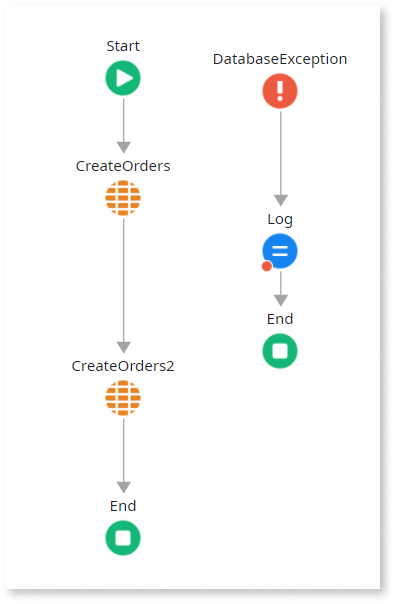
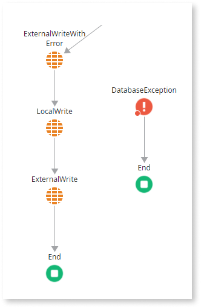
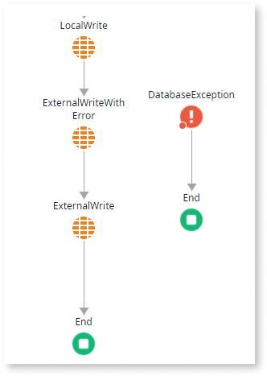
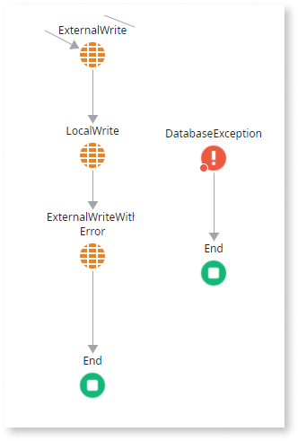
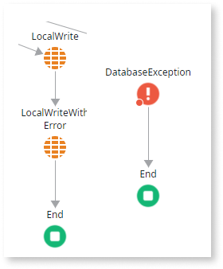
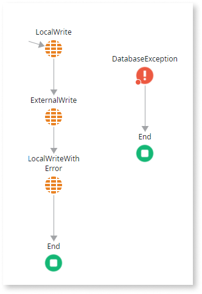

---
summary: Manage transactions in OutSystems Developer Cloud (ODC) by controlling OutSystems and External requests.
tags: 
guid: 05934d09-1852-40c7-8b4f-cafd0f93f2a3
locale: en-us
app_type: mobile apps, reactive web apps
platform-version: odc
figma: https://www.figma.com/design/6G4tyYswfWPn5uJPDlBpvp/Building-apps?m=auto&node-id=5793-56&t=8QR9a9sOWlPpPeDd-1
--- 

# Transactions in external entities

OutSystems Developer Cloud (ODC) creates separate connections and transactions for each external system. You control transactions for the OutSystems database but not for external systems. Each external entity request is either committed or rolled back.

You can use the Exception Handler to

- Catch all database errors using the Database Exception type.

- Rollback or commit transactions only to the OutSystems database.

If an exception is uncaught, ODC rolls back the main transaction. ODC creates a single transaction for the OutSystems database at the start of a request. This means:

- Multiple server calls with read and write operations share the same transaction throughout the flow.

- If the last write operation fails, you can commit or roll back all preceding server actions written to the OutSystems database.

Service actions have their own transactions and behave similarly to external systems. Once a service action ends, its transaction is committed and cannot be rolled back.

To learn more about transactions in data mashup, refer to [Data mashup transactions](transactions-data-mashup.md). 

## Scenarios when working with transactions

You can run into following scenarios when working with transactions in external entities,

### ExternalWrite error at Start

ODC aborts the request in the first node and writes nothing using ExternalWrite. You can use an Exception Handler to catch the database exception.

### LocalWrite followed by error during ExternalWrite

LocalWrite is successful, but ExternalWrite fails. You can use an Exception Handler to catch the exception and explicitly roll back the LocalWrite.

If you don't use an Exception Handler, LocalWrite is rolled back automatically.

### Error during second ExternalWrite

The first ExternalWrite is successful, but the second ExternalWrite fails. 

You only have control over the internal OutSystems database. You can’t roll back the ExternalWrite, as it was already committed. You can use an Exception Handler to catch the database exception.

### Error in last ExternalWrite

The first ExternalWrite and second LocalWrite are successful, but the last node fails. The local write is rolled back, but the external one is not. You can use an Exception Handler to catch the exception and explicitly roll back the LocalWrite. Regarding the ExternalWriteWithError, you can implement the desired logic in an error scenario on the Exception Handler, like log the error, revert the successful ExternalWrite, etc.

If you don't use an Exception Handler, LocalWrite is rolled back automatically.

### LocalWrite followed by error during second LocalWrite

The first LocalWrite is successful, but the second LocalWrite fails. You can use an Exception Handler to catch the exception and explicitly roll back the LocalWrite.

If you don't use an Exception Handler, LocalWrite is rolled back automatically.

### Error in Last LocalWrite

The first LocalWrite and second ExternalWrite are successful, but the last node fails. The local write is rolled back, but the external one is not. You can use an Exception Handler to catch the exception and explicitly roll back the LocalWrite.

If you don't use an Exception Handler, LocalWrite is rolled back automatically.

