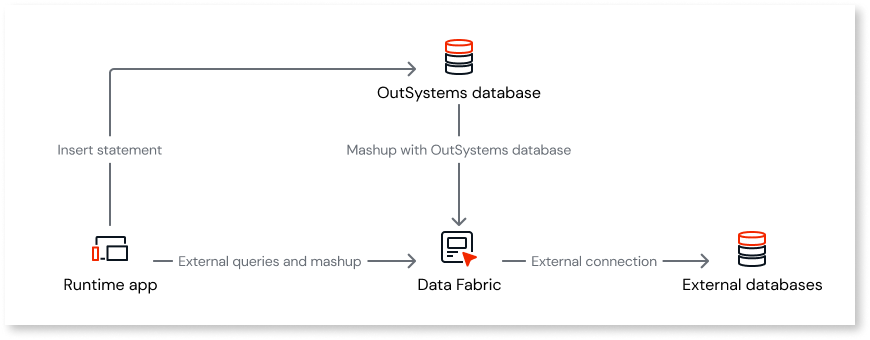
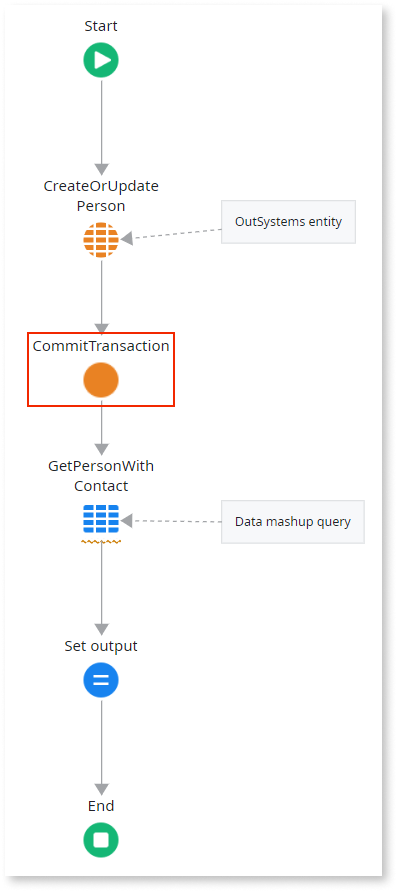
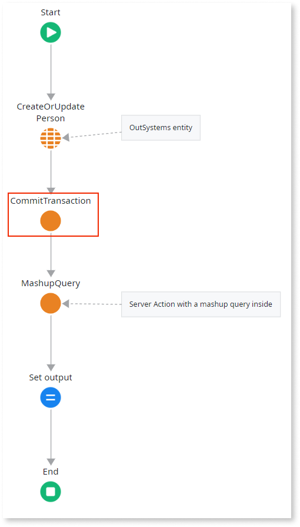
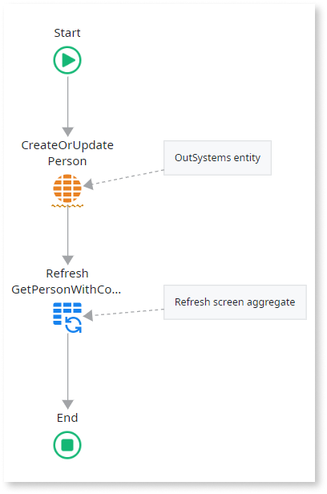

# Data mashup transactions

When you [combine data from different sources using data mashup](data-mash.md), the transaction behavior is different if you combine external data with OutSystems entities or not. When you combine data from external entities only, the fetched data is always up to date, as each external entity request is executed within its own dedicated transaction. However, the same doesn't happen if you combine data from external sources and OutSystems entities.

When you perform a write operation to an OutSystems entity, such as a create or update, and then use an aggregate in the same flow to combine data from that entity with an external entity, the aggregate doesn't return the changes because mashup queries are executed in different transactions.

In this scenario, use the **CommitTransaction** Server Action in your logic flow to commit the changes to the OutSystems entity before running the mashup query that includes the same entity. This ensures the aggregate retrieves the data changes. This applies to logic flows executed by the app runtime in your Server actions, Service Actions, and Data Actions, and the logic executed through Timers. **CommitTransaction** runs in server-side logic only.

The same situation occurs if the aggregate that combines data from an OutSystems entity and an external entity is inside a Server Action that follows a write operation to that OutSystems entity. The aggregate only returns the data changed in the previous action if you commit the transaction.

If you perform a write operation to an OutSystems entity within a Client Action, and the data is fetched using a screen aggregate, the refresh aggregate returns the changed data. In this scenario, you don't need to commit the transaction.

## Correct logic output with data mashup

The platform applies the transaction behavior described in this page, and you decide whether the flow returns the changed data. The following checks are examples, not a complete list.

* A server action, service action, data action, or timer logic that writes to an OutSystems entity and then runs a mashup aggregate with an external entity has a **CommitTransaction** Server Action between the write and the aggregate.
* A client action that writes to an OutSystems entity and refreshes a screen aggregate has no **CommitTransaction**, because the refresh returns the changed data.
* A mashup of external entities only has no **CommitTransaction**, because each external entity request runs in its own transaction.

## Related resources

* For what the platform guarantees and what you validate, refer to [Platform guarantees and AI interpretation](../../../agentic-development/odc-ai-and-platform.md).
* [Database transaction isolation level](../../../reference/isolation.md)

* [Transactions in external entities](transaction-external-entities.md)
