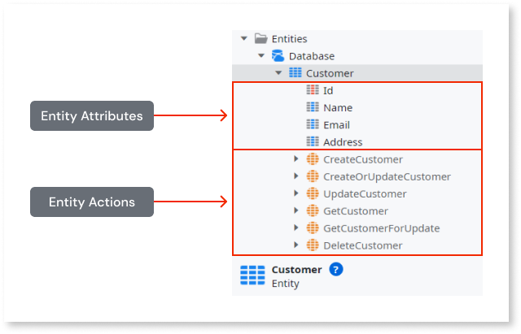

# Data management

This article introduces the concepts of entities and optimized tools for retrieving data.

OutSystems Developer Cloud (ODC) uses relational databases for business data. Each stage (Development, Test, Production) where your apps use data has an isolated database.

ODC Studio allows modeling and retrieving data in a visual interface that abstracts the relational databases. ODC lets you focus on development and business value, because the database management is automatic and happens in the background.

## Data modeling

An entity is a visual language tool for database operations. Each entity is a table. Attributes of an entity are columns. A record of an attribute is data in the table row.  

You model data in ODC Studio by creating new entities and adding attributes. For example, a name of your entity could be Customer, with attributes `Name`, `Email`, `Address`. ODC Studio helps you in modeling, by setting the correct data type based on the name. Each entity provides a CRUD interface as a set of actions you can use.

The graphic below shows an example of the structure of an entity.

Enumerations in OutSystems are static entities. A static entity stores a predefined list of values. An example of such data is a list of priorities with `Low`, `Medium`, and `High`.

Entities can have different relationships between other entities and static entities, like one-to-one, one-to-many, or many-to-many. Business concepts in an app are usually in separate but connected entities. A common example is when apps have information about customers, orders, and vendors as separate entities. Those entities link to each other with the key attributes and entity relationships.

To learn more about data modeling, refer to [data modeling](modeling.md).

## Retrieving data

Aggregate is a recommended tool for getting data from the database to your app. Aggregates can contain one or more entities and provide filtering and sorting. ODC optimizes Aggregates for fast and efficient retrieval of data.

Another tool for data fetching is the SQL tool. SQL provides an interface for the Structured Query Language, an industry standard. SQL is useful when you need full control over the SQL queries. However, the efficiency of the SQL tool often depends on the SQL queries that you provide.

The quickest way to get UI in the app is to add aggregates to screens. When fetching data from the server for more complex use cases, you can wrap one or more tools and CRUD actions in a server action.

To learn more about retrieving data, refer to [aggregate](./fetch-data/aggregate.md).
