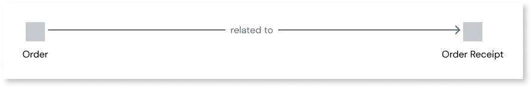
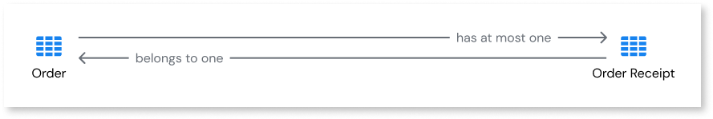
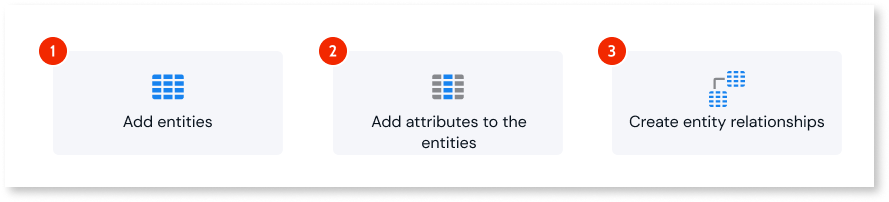
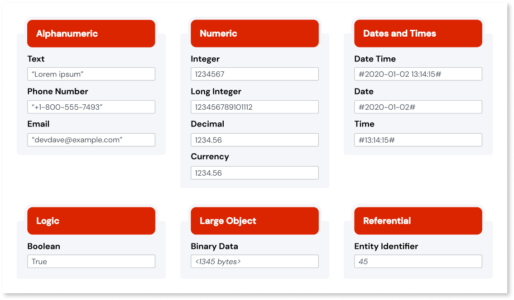

# Data modeling

This article introduces the concepts of designing a data model.

The data model is an important step for developers to think about when building an app that uses data.

Designing a good data model helps you build a high-quality app. Some main benefits of a good data model include:

* **A common understanding** - good isolation of business concepts allows for a common understanding between business stakeholders and developers. This streamlines communication of requirements and provides for easy data discovery by the business, for example, to build dashboards and use data lakes.
* **Enforcing business requirements** - important business requirements can be directly enforced in the data model. For example, there can only be one customer record for a given VAT number.
* **Accelerate development** - a clear relationship with business concepts makes it easier to build screens and use UI patterns that carry the relevant data to the business.
* **Lightweight apps** - good isolation of business concepts means developers can build targeted queries against smaller data sets. 
* **Data integrity** - creating data relationships instead of duplicating attributes ensures consistent data and simpler application logic.

## Data models

The data model design process starts with a high level of abstraction and, with each step, becomes more specific. The process begins with a conceptual data model, progresses to a logical data model, and concludes with a physical data model. The following diagram shows that process.

### Conceptual data model

The conceptual data model is the high-level view of the data in your app. You usually design a conceptual data model as part of the initial process of collecting your app requirements.

You identify and isolate business concepts, or business entities, and map the relationships between them. For example, for a retail business, an order app may include the `Order`, `Order Receipt`, `Customer`, and `Product` entities. An example of a relationship at the conceptual level is that `Order` is related to `Order Receipt`.

You should isolate business concepts to the greatest extent possible so developers can build targeted queries against small data sets. For example, `Employee` can be seperated to two entities: `Employee` and `Employee Photo`. This isolation is particularly important when one of the entities contains binary data. The entities are connected by establishing a relationship in the data model.

### Logical data model

The logical data model is less abstract than the conceptual data model. It provides a further level of detail about the entities and their relationships.

Entities can be complex and require many attributes. You add attributes, map each attribute to a data type and define relationships between entities. For example, an `Order` entity that has `Description`, `DueDate`, `CreatedOn`, and `ShippedOn` attributes. The `Description` attribute is data type text. An example of an entity relationship at the logical level is: an `Order Receipt` always belongs to one `Order`, an `Order` can have only one associated `Order Receipt`.

A logical data model is independent of a specific database.

OutSystems can accelerate app development when you use some data types. An example is email. To define an email address use the email data type in an attribute. If you then drop the entity with the email data type to UI flow, the resulting screens come with the built-in validation for email addresses.

### Physical data model

The physical data model is a schema for how the app data is stored in the database. 

It provides a final design for implementation as a relational database. It includes associative tables illustrating the relationships between entities and the primary and foreign keys to maintain those relationships.

OutSystems Developer Cloud (ODC) automatically converts the logical data model you design in ODC Studio to a physical data model for you. It makes this conversion based on data modeling design best practices.

If you update the logical data model, it updates the physical data model. 

## Data modeling in ODC Studio

ODC Studio provides tools to design a data model efficiently. By abstracting the need to manipulate the physical data model directly, ODC lets you get to the first usable version of your app quickly.

There are three steps to designing the data model for an app in ODC.

1. Add entities.
1. Add attributes to the entities.
1. Create entity relationships.

The following diagram illustrates those steps.

When you change the data model in ODC Studio, changes in the database are only reflected when you publish or deploy your app to another stage.

### Entities and attributes

Entities can contain multiple attributes of different basic data types. The following diagram shows the available basic data types.

You start to design your app data model by adding entities and attributes. ODC Studio provides a simple interface to add, modify, delete and rename entities and their attributes.

You can add static entities for entities with a predefined or constant set of values. For example, in an order app, you can create order priorities under a `Priorities` static entity: `Low`, `Medium`, and `High`. The app user can't modify data contained in static entities in the app. 

Another way to add entities and attributes is to import them from an Excel file using the **Import Entities from excel** developer accelerator in ODC Studio. In an Excel file, each tab is an entity and each column an attribute. If your data is available in an Excel file, this can speed up the data model design process.

### Entity relationships

Entities are often related. The relationships between entities are as important to your app data model as the entities themselves.

By default, ODC automatically creates an entity with the `Id` attribute. The `Id` attribute uniquely identifies each record in the entity. It's the primary key in the physical data model. Developers create an entity relationship by defining a reference attribute in the related entity. It's the foreign key in the physical data model.

You can enforce the referential integrity of your app data model by setting the delete rule property in reference attributes.

ODC Studio lets you visualize the relationships in your app data model in real-time using entity diagrams.

You can organize entities into folders. Although folders don't affect the app data model, it lets developers group entities by higher concepts.
