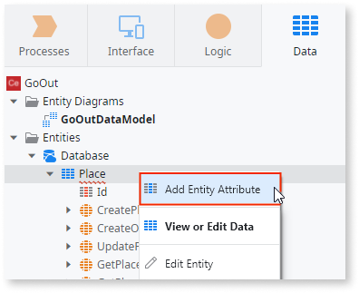

# Create an Entity to Persist Data
  
In OutSystems, a database table is an Entity, and the table columns are Entity Attributes. You create an Entity by describing it to Mentor Studio and validating the result, or by building it manually in ODC Studio.

## Create an Entity with Mentor Studio

Create an Entity by describing its Attributes in Mentor Studio, and validate each Attribute before you publish.

In your prompt, include its name, each Attribute with its data type and length, which Attributes are mandatory, and any relationship to an existing Entity. For example, "Create a Place entity with a mandatory Name attribute of type Text with 100 characters, a mandatory Address attribute of type Text with 200 characters, an optional PhoneNumber attribute of type Phone Number, and optional Latitude and Longitude attributes of type Decimal."

For more prompt examples, refer to the data section of [Prompts for Mentor Studio](../../../agentic-development/mentor-studio/prompts.md#data).

For the requirements and the steps to prompt Mentor Studio and review the change, refer to [Modify an app with AI in ODC Studio](../../../agentic-development/mentor-studio/modify-app.md) and [Review and accept the plan](../../../agentic-development/mentor-studio/how-it-works.md#accept-plan).

### Validate the Entity

The platform guarantees that the model is valid, and you decide whether it's the correct model for your requirement. In the **Data** tab of ODC Studio, check the following:

* The Entity has an `Id` Attribute set as the Entity Identifier and set as AutoNumber, unless your requirement calls for another identifier. After the first publish, you can't change the identifier Attribute or rename it.
* Each Attribute has the data type and length from your description. A Text Attribute has a length of 50 unless you specify another length.
* The Attributes you described as mandatory have the **Is Mandatory** property set to `Yes`.
* Each reference Attribute points to the intended Entity, and its **Delete Rule** matches the behavior you want. For more information, refer to [Relationships between entities](relationship/relationships.md#referential-integrity).

## Create an Entity manually in ODC Studio

To build the Entity yourself, add it in ODC Studio and then define its Attributes.

1. Double-click the Entity Diagram created by default in the **Data** tab.
1. Right-click anywhere on the canvas and select **Add Entity to Database**. By default, OutSystems names it `Entity1`. You can rename it.
1. Expand the **Entities** tree and check that the Entity has the `Id` Attribute created as Entity Identifier (primary key).
1. Right-click the Entity and select **Add Entity Attribute** to add the other Attributes.
1. To add indexes, right-click the Entity and select **Edit Entity**.

Alternatively, create Entities in the **Data** tab:

* Right-click the **Entities** folder and select **Add Entity**. This option gives you access to less information about the Entity.
* Right-click the **Entities** folder and select **Import New Entities from Excel...**. This option creates an Entity and bootstraps data for it.

In mobile apps, you can create Entities to store information in the device's local storage. This typically applies when end users need to use the app while offline.

### Example

The Go Out app lets users read and write reviews of places such as restaurants. The following steps create the table that stores the places manually in ODC Studio. The Mentor Studio prompt earlier on this page produces the same Entity.

1. In the **Data** tab, under **Entity Diagrams**, open the `GoOutDataModel` diagram.

1. Right-click and choose **Add Entity to Database**.

1. Set the name of the Entity to `Place`. OutSystems creates an `Id` Attribute with data type `Long Integer`, set as AutoNumber.

1. With the Entity selected, right-click and select **Add Entity Attribute** to create the following Attributes:

    

    1. Create the `Name` Attribute. By default the data type is `Text` and the length is `50`. Change the length to `100`.
    1. Make the Attribute mandatory by setting the **Is Mandatory** property to `Yes`.
    1. Create the `Address` Attribute as a mandatory Text Attribute with 200 characters of length.
    1. Create the `PhoneNumber` Attribute. The data type of the Attribute changes to `Phone Number`. Leave this Attribute optional.
    1. Create the `Latitude` and `Longitude` Attributes as optional Decimal Attributes. Use the default length (37) and decimals (8) to define the precision of the numbers stored in the database.

1. Publish your app.

When you publish your app, OutSystems creates the database table that corresponds to the Place Entity.

## Related resources

The following resource describes what the platform guarantees and what you check in a Mentor Studio proposal.

* For what the platform guarantees and what you validate, refer to [Platform guarantees and AI interpretation](../../../agentic-development/odc-ai-and-platform.md).
