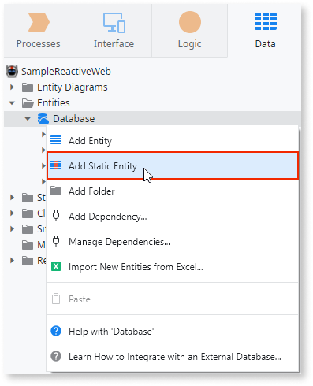
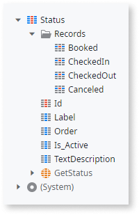
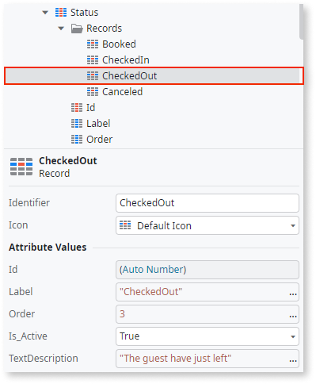

# Static Entities

A **Static Entity** consists of a set of named values. Think of Static Entities as literal values whose scope is always global. The **Records** folder of the Static Entity holds the data, and the Attributes define the structure of the data.

The only action available for Static Entities in an app is the **Get&lt;StaticEntity&gt;** action, because OutSystems manages the data persistence for you.

In an app, a Static Entity is backed by a database table, so it can only contain foreign keys to other Static Entities. In a library, a Static Entity has no database table and behaves as an enumerated constant, so this table-level rule doesn't apply. For more information, refer to [Entity Relationships](relationship/relationships.md).

OutSystems recommends using [entities](entity.md) to store dynamically changing information. For example, in a finance app, the user's address could change.

## Create a Static Entity with Mentor Studio

Create a Static Entity by describing its Attributes and Records in Mentor Studio, and validate the Records and the data type of each Attribute before you publish.

In your prompt, include its name, any Attributes beyond the [default Attributes](#default-attributes), and each Record with its values. For example, "Create a Status static entity with a TextDescription attribute of type Text. Add the records Booked, CheckedIn, CheckedOut, and Canceled, and give each a description."

For more prompt examples, refer to the data section of [Prompts for Mentor Studio](../../../agentic-development/mentor-studio/prompts.md#data).

For the requirements and the steps to prompt Mentor Studio and review the change, refer to [Modify an app with AI in ODC Studio](../../../agentic-development/mentor-studio/modify-app.md) and [Review and accept the plan](../../../agentic-development/mentor-studio/how-it-works.md#accept-plan).

### Validate the Static Entity

The platform guarantees that the model is valid, and you decide whether it's the correct model for your requirement. In the **Data** tab of ODC Studio, check the following:

* The data is constant at runtime. Data that end users change belongs in an [Entity](entity.md), because a Static Entity only supports read operations.
* The Static Entity has the default Attributes **Id**, **Label**, **Order**, and **Is_Active**, and any custom Attributes you described, with the correct data types.
* The **Records** folder contains every Record you described. Each Record has an identifier that you reference in logic, such as `Entities.Status.CheckedOut`, and a **Label**.
* The **Order** and **Is_Active** values of each Record match how the app displays and uses the Records.
* A Static Entity in an app references only other Static Entities through its reference Attributes. For more information, refer to [Entity Relationships](relationship/relationships.md).

## Create a Static Entity manually in ODC Studio

To add a Static Entity to your app manually, do the following in ODC Studio:

1. Navigate to the **Data** tab, right-click on the **Entities** folder, and select **Add Static Entity to Database**.

    

    Start typing to enter the name. Press **Enter** to confirm.

1. Each new Static Entity gets the [default set of Attributes](#default-attributes). To add a new Attribute, right-click on your Static Entity, and select **Add Entity Attribute**. Then, edit the Attribute name and data type.

1. Finally, add some data to your Static Entity. Right-click on the Static Entity, and select **Add Record**. Enter the properties of the Record.

## Default Attributes

ODC Studio creates the following Attributes automatically:

**Id**
:   Identifies a record and is always unique.

**Label**
:   Holds a value to display in an application.

**Order**
:   Defines the order for displaying the records to the end-user.

**Is_Active**
:   Defines whether a record is available during runtime. For example, the records with **Is_Active** set to false aren't used when scaffolding uses the Static Entity.

## Convert Static Entity to Entity

You can convert existing Static Entities to Entities. To convert a Static Entity to Entity, right-click on the Static Entity, navigate to the **Advanced** help menu and then select **Convert to Entity**.

After converting a Static Entity to an Entity:

* The records from the Static Entity become available through database queries, via Aggregate or SQL Query
* The **Records** folder is no longer available in ODC Studio

Note that it's also possible to convert an Entity to Static Entity.

## Example

Use Static Entities when you need a predefined, or constant, set of values. For example, in a hotel app, you probably need some reservation statuses: "booked", "checked in", "checked out", and "canceled". You also need the default descriptions for the statuses like "The guests have just left." for "checked out".

Your Static Entity Status may look like this:

The Records folder of your Static Entity contains all statuses you have created. If you select "CheckedOut", the Properties Editor shows the following details:

The Identifier for the checked out status is `CheckedOut` and the Label is `"Checked-Out"`. The field TextDescription is the custom field and has the string value `"The guests have just left."`.

You can access the record for checked out status by referencing its Identifier, like this: `Entities.Status.CheckedOut`.

## Related resources

The following resource describes what the platform guarantees and what you check in a Mentor Studio proposal.

* For what the platform guarantees and what you validate, refer to [Platform guarantees and AI interpretation](../../../agentic-development/odc-ai-and-platform.md).
