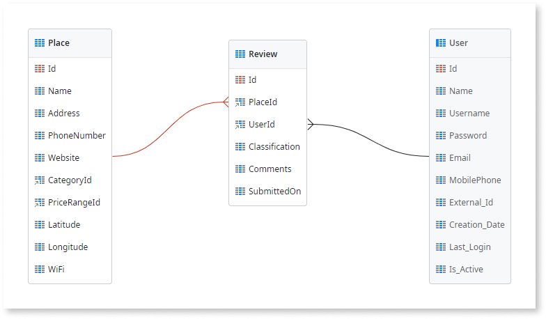

# Create a Many-to-Many Relationship

A many-to-many relationship happens when one entity has a one-to-many relationship with another entity, and vice versa. For example, an `Author` can write several `Books`, and a `Book` can be written by several `Authors`. This kind of relationship is also known as an **N to M** relationship.

You resolve this kind of relationship by adding a third entity, called a **junction entity**. The junction entity has at least two foreign keys, one to each entity in the relationship. You can add other attributes if needed. You create the relationship by describing it to Mentor Studio and validating the result, or by building it manually in ODC Studio.

## Create a many-to-many relationship with Mentor Studio

Create a many-to-many relationship by describing the two entities in Mentor Studio, and validate the junction entity and its foreign keys before you publish.

In your prompt, name the two entities, state that each can relate to many records of the other, and list any attributes that belong to the relationship itself. For example, "Create a Review entity as a junction between the User and Place entities in a many-to-many relationship. Add the attributes Classification (Integer), Comments (Text), and SubmittedOn (Date)."

For more prompt examples, refer to the data section of [Prompts for Mentor Studio](../../../../agentic-development/mentor-studio/prompts.md#data).

For the requirements and the steps to prompt Mentor Studio and review the change, refer to [Modify an app with AI in ODC Studio](../../../../agentic-development/mentor-studio/modify-app.md) and [Review and accept the plan](../../../../agentic-development/mentor-studio/how-it-works.md#accept-plan).

### Validate the relationship

The platform guarantees that the model is valid, and you decide whether the relationship is correct for your requirement. In the **Data** tab of ODC Studio, check the following:

* The junction entity has one foreign key attribute to each of the two entities. The foreign keys have the data type of each entity's identifier, such as `User Identifier` and `Place Identifier`.
* The attributes that belong to the relationship itself are on the junction entity.
* The entity diagram shows the junction entity connected to both entities.
* The **Delete Rule** of each foreign key matches the behavior you want when a record on either side is deleted. A foreign key to the `User` entity uses **Ignore**. For more information, refer to [Referential integrity](relationships.md#referential-integrity).

## Create a many-to-many relationship manually in ODC Studio

To create a many-to-many relationship manually, do the following in ODC Studio:

1. [Create a relationship entity](../entity-create.md).
1. Add an attribute and set the data type to the identifier of the first entity.
1. Add another attribute and set the data type to the identifier of the second entity.

Check here our [online training videos](https://learn.outsystems.com/training/journeys/modeling-data-relationships-642/many-to-many-relationship/odc/447) on this topic:

<iframe src="https://player.vimeo.com/video/874762411?badge=0&amp;autopause=0&amp;player_id=0&amp;app_id=58479" frameborder="0" allow="autoplay; fullscreen; picture-in-picture; clipboard-write" style="position:absolute;top:0;left:0;width:100%;height:100%;" title="Many-to-Many Relationship [en-US / 11]"></iframe>

### Example

The GoOut mobile app lets end users find and review places such as restaurants and hotels. An end user can review many places, and a place can have reviews from many end users. This is a many-to-many relationship between `User` and `Place`. The `Review` entity is the junction entity. Besides the two foreign keys, a review has other attributes: classification, comments, and submission date.

The following steps create the `Review` entity manually in ODC Studio.

1. In the Data tab, open the GoOutWebDataModel entity diagram.
1. Drag the User system entity and the `Place` entity to the diagram.
1. Right-click the diagram canvas and select 'Add Entity'.
1. Name the entity as `Review`.
1. Drag the `User.Id` attribute to the `Review`.
1. Drag the `Place.Id` attribute to the `Review`.
1. Add the remaining attributes:
    * `Classification`, Integer type
    * `Comments`, Text type
    * `SubmittedOn`, Date type

## Related resources

The following resource describes what the platform guarantees and what you check in a Mentor Studio proposal.

* For what the platform guarantees and what you validate, refer to [Platform guarantees and AI interpretation](../../../../agentic-development/odc-ai-and-platform.md).
