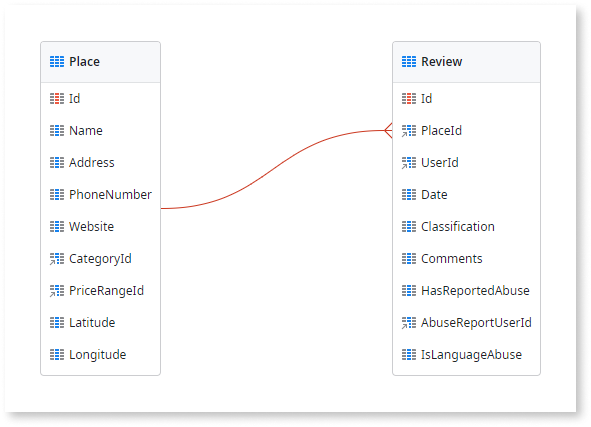

# Create a One-to-Many Relationship

When modeling data, you create one-to-many relationships between entities. For instance, a `Place` (parent entity) can have many `Reviews` (child entity). The relationship is implemented with a foreign key, which is the identifier of the parent record, in the child records. You create the relationship by describing it to Mentor Studio and validating the result, or by adding the foreign key manually in ODC Studio.

## Create a one-to-many relationship with Mentor Studio

Create a one-to-many relationship by describing the parent entity and the child entity in Mentor Studio, and validate which entity holds the foreign key before you publish.

In your prompt, name the parent entity and the child entity, and state that each parent record can have multiple child records. For example, "Create a Comment entity linked to the Ticket entity with attributes CommentText (Text), CreatedBy (User reference), and CreatedDate (DateTime). Set up a one-to-many relationship where each Ticket can have multiple Comments."

This prompt comes from [Prompts for Mentor Studio](../../../../agentic-development/mentor-studio/prompts.md#data), which has more data prompt examples.

For the requirements and the steps to prompt Mentor Studio and review the change, refer to [Modify an app with AI in ODC Studio](../../../../agentic-development/mentor-studio/modify-app.md) and [Review and accept the plan](../../../../agentic-development/mentor-studio/how-it-works.md#accept-plan).

### Validate the relationship

The platform guarantees that the model is valid, and you decide whether the relationship is correct for your requirement. In the **Data** tab of ODC Studio, check the following:

* The foreign key is on the child entity. The child entity has an attribute with the data type `<parent entity> Id`.
* The cardinality matches the requirement. Each child record has one parent record, and each parent record can have many child records. A requirement where each child can also belong to many parents is a [many-to-many relationship](relationship-many-to-many.md).
* The relationship appears in the entity diagram when both entities are in the same diagram.
* The **Delete Rule** of the foreign key attribute matches the behavior you want when a parent record is deleted. For entities in the same app, the default is **Protect**. A reference attribute to the `User` entity, such as `CreatedBy` in the example prompt, uses **Ignore**. For more information, refer to [Referential integrity](relationships.md#referential-integrity).

## Create a one-to-many relationship manually in ODC Studio

To create a one-to-many relationship between two entities manually, do the following in ODC Studio:

1. Select the entity with the child records, for example `Review`.
1. Add a new attribute that holds the identifier of the parent entity, for example the identifier of the `Place` entity. This attribute is the foreign key.

An identifier attribute that points to another entity creates a relationship automatically. You can see the relationships between entities if you have them in the same Entity Diagram.

When you create relationships between entities in your app, you must define the referential integrity you want to use when deleting records.

## Related resources

The following resource describes what the platform guarantees and what you check in a Mentor Studio proposal.

* For what the platform guarantees and what you validate, refer to [Platform guarantees and AI interpretation](../../../../agentic-development/odc-ai-and-platform.md).
