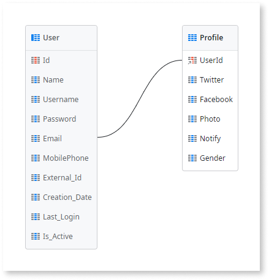

# Create a One-to-One Relationship

One-to-one relationships allow you to extend an existing entity with additional information that is not yet in the database model. You create the relationship by describing it to Mentor Studio and validating the result, or by building it manually in ODC Studio.

A common scenario is when you want to extend an entity with more attributes and it's not possible to add them to it. This happens when you are using a referenced entity from a different app, and adding more attributes doesn't make sense in the referenced app. In this case, you create an entity in your app to store the additional information.

## Create a one-to-one relationship with Mentor Studio

Create a one-to-one relationship by describing the entity to extend and the additional attributes in Mentor Studio, and validate the identifier of the new entity before you publish.

In your prompt, name the entity to extend, name the new entity, and state that the new entity uses the identifier of the entity it extends. List the additional attributes. For example, "Create a Profile entity that extends the User entity in a one-to-one relationship. Use the User identifier as the Profile identifier, and add the attributes Twitter (Text), Facebook (Text), and Photo (Binary Data)."

For more prompt examples, refer to the data section of [Prompts for Mentor Studio](../../../../agentic-development/mentor-studio/prompts.md#data).

For the requirements and the steps to prompt Mentor Studio and review the change, refer to [Modify an app with AI in ODC Studio](../../../../agentic-development/mentor-studio/modify-app.md) and [Review and accept the plan](../../../../agentic-development/mentor-studio/how-it-works.md#accept-plan).

### Validate the relationship

The platform guarantees that the model is valid, and you decide whether the relationship is correct for your requirement. In the **Data** tab of ODC Studio, check the following:

* The new entity's identifier attribute has the data type of the identifier of the entity you extend, such as `User Identifier`.
* The new entity has only the additional attributes. The attributes of the extended entity aren't copied.
* The entity diagram shows a connection between the new entity and the extended entity.
* Each record in the new entity corresponds to one record in the extended entity, because the identifier of the new record holds the identifier of the record it extends.
* When the extended entity is `User`, the **Delete Rule** of the new entity's identifier attribute is **Ignore**. TrueChange shows an error for **Protect** or **Delete**.

## Create a one-to-one relationship manually in ODC Studio

To create a one-to-one relationship to an existing entity manually, do the following in ODC Studio:

1. [Create an Entity](../entity-create.md).
1. Change the `Id` attribute to be the identifier of the entity you want to extend.
1. Add the attributes.

### Example

The GoOutWeb app lets users rate and review places such as restaurants and hotels. The app saves end-user information such as the email, the phone number, or a Twitter account.

The app stores end users in the `User` system entity, which doesn't accept additional attributes. To store more information about the user, create an additional entity manually in ODC Studio. The Mentor Studio prompt earlier on this page produces the same entity.

1. In the Data tab, open the GoOutWebDataModel entity diagram.

1. If not present yet, drag the `User` system entity to the diagram from the Data tab.

1. Right-click on the diagram canvas and select "Add Entity".

1. Name it `Profile`.

1. Rename the `Id` attribute to `UserId`.

    OutSystems sets the data type to `User Identifier` based on the name given. Since this data type is the identifier of the `User` entity, OutSystems creates a connection between the created entity `Profile` and the `User` entities.

1. Add the following attributes to the `Profile` entity:

    * `Twitter`, Text type
    * `Facebook`, Text type
    * `Photo`, Binary Data type

As a result, you have the `Profile` entity extending the `User` entity. Every time you create a `Profile` record, set its identifier to the identifier of the `User` record it belongs to.

## Related resources

The following resource describes what the platform guarantees and what you check in a Mentor Studio proposal.

* For what the platform guarantees and what you validate, refer to [Platform guarantees and AI interpretation](../../../../agentic-development/odc-ai-and-platform.md).
