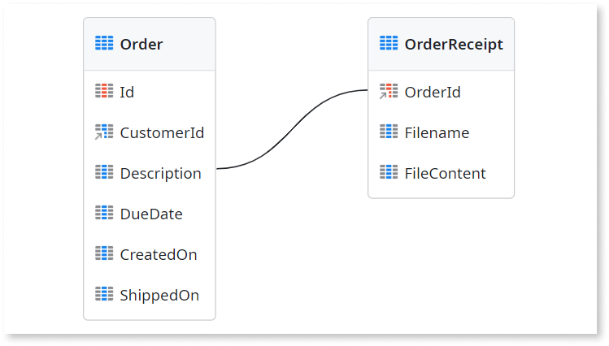
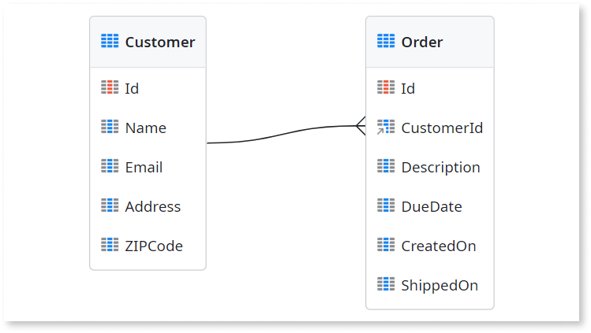
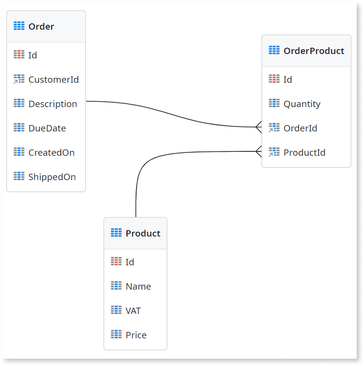

# Relationships between entities

This article introduces the concepts of relationships between entities.

When you move your data model design from the conceptual phase to the logical phase, you must define the type of relationship that exists between the entities. Go to [Data modeling](../../modeling.md) for more information on the different phases of data model design.

By default, OutSystems Developer Cloud (ODC) automatically creates an entity with the `Id` attribute. The `Id` attribute uniquely identifies each record in the entity. It's the primary key in the physical data model. 

Developers create an entity relationship between entity A and entity B by changing the **Data Type** of an attribute in entity B to `<entity A> Id`. In OutSystems this attribute in entity B is called the reference attribute. It's the foreign key in the physical data model. When a developer defines a reference attribute, OutSystems automatically creates:

1. Entity relationship.
1. Relationship index to improve the performance of your app.

A relationship between two entities can be:

* One-to-one
* One-to-many
* Many-to-many

## One-to-one relationships

A **one-to-one** relationship between two entities indicates that one record in entity A corresponds to one record in entity B and one record in entity B has only one associated record in entity A.

For example, consider the relationship between `Order` and `OrderReceipt` entities:

* An `Order` always belongs to one `OrderReceipt`
* An `OrderReceipt` can have only one associated `Order`

The following entity diagram shows a one-to-one relationship.

To learn more about one-to-one relationships, refer to [one-to-one relationship](relationship-one-to-one.md).

## One-to-many relationships

A **one-to-many** relationship between two entities indicates that one record in entity A corresponds to multiple records in entity B, but one record in entity B has only one associated record in entity A.

For example, consider the relationship between `Customer` and `Order` entities:

* A `Customer` has one or more associated `Order`
* An `Order` belongs to one `Customer`

The following entity diagram shows a one-to-many relationship.

To learn more about one-to-many relationship, refer to [one-to-many relationship](relationship-one-to-many.md).

## Many-to-many relationships

A **many-to-many** relationship between two entities indicates that one record in entity A corresponds to multiple records in entity B and a record in entity B can have more than one associated record in entity A. In this situation, you must create a third entity with one reference attribute for entity A and one reference attribute for entity B. A many-to-many relationship is, in fact, two one-to-many relationships with this third entity.

For example, consider the relationship between `Order` and `Product` entities:

* An `Order` can have multiple `Product`
* A `Product` can have more than one associated `Order`

The following entity diagram shows a many-to-many relationship.

To learn more about many-to-many relationships, refer to [many-to-many relationship](relationship-many-to-many.md).

## Referential integrity

Referential integrity refers to the consistency of the relationships between entities. It's important that you maintain referential integrity to prevent database errors.

When you create a relationship between entity A and entity B, you must specify the referential integrity that you want to apply in your data model. You define what must happen in entity B if the corresponding record in entity A is deleted. In ODC, this behavior is defined by the value of the **Delete Rule** property of the reference attribute. By default, the **Delete Rule** is set to **Protect** for entities in the same app but you can change it according to the desired behavior.

Relationships between entities in different apps works differently. The **Delete rule** is always set to **Ignore**.

### Protect  

When you set the delete rule of the reference attribute to protect, it prevents deletion of records in entity A while there are associated records in entity B.

The **Protect** value is commonly used when the user can delete entity data directly from an app screen.

For example, when you set the delete rule of the reference attribute to protect between `Customer` and `Order` entities, a user can't delete customer records that have associated orders.

### Delete

When you set the delete rule of the reference attribute to delete it guarantees that when a record of entity A is deleted, all the associated records in entity B are also deleted. This mechanism is commonly known as cascade delete.

You can use the **Delete** value when you implement a [data purging](../../data-best-practices/data-purging.md) mechanism, where you need to automatically cascade a delete across the whole data model.

For example, when you set the delete rule of the reference attribute to delete between `Order` and `OrderItems` entities, when an order is deleted, all related order items are automatically deleted.

### Ignore

When you set the delete rule of the reference attribute to ignore it enables you to delete records in entity A but keep the associated records in entity B.

You can use the **Ignore** value when implementing a historical [data archiving](../../data-best-practices/data-archiving.md) mechanism.

For example, suppose every operation performed on `Order` is audited to `OrderHistory`. Setting the the delete rule of the reference attribute to ignore between `Order` and `OrderHistory` entities allows you to delete an order and retain the associated audit record.

## Related resources

* [Modeling Data Relationships](https://learn.outsystems.com/training/journeys/modeling-data-relationships-642) online course

* [Data Model Integrity](https://learn.outsystems.com/training/journeys/data-model-integrity-638) online course
