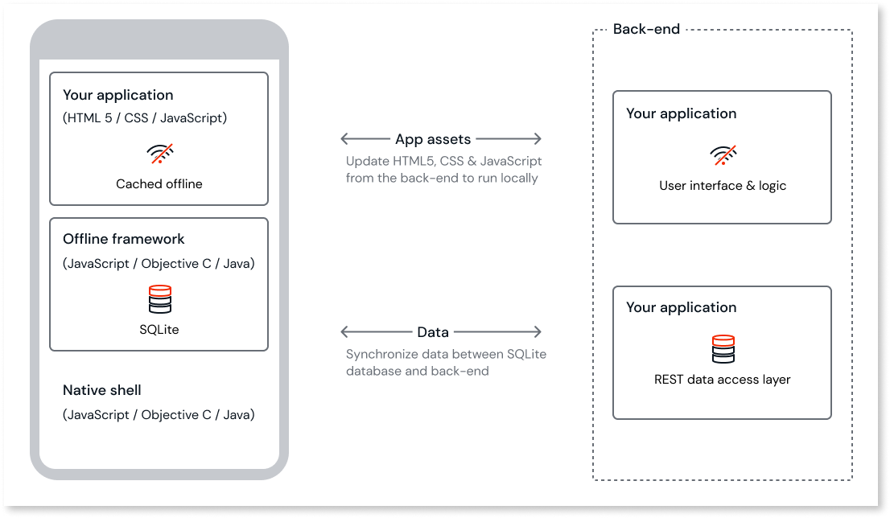
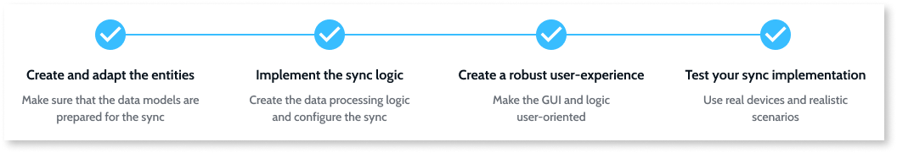
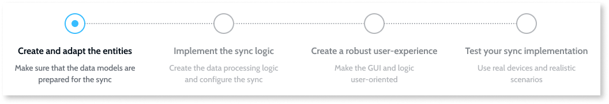
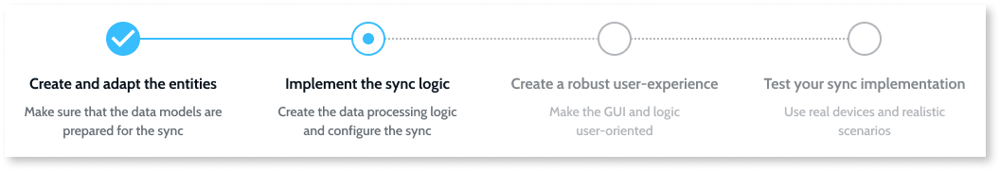
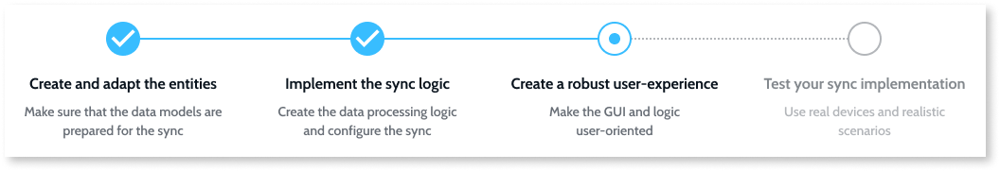
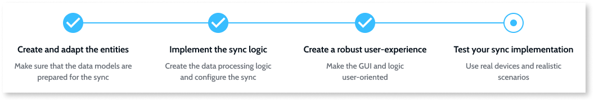

# Offline data synchronization in mobile apps

ODC provides a robust framework for implementing offline data synchronization in mobile apps. This lets you work with data even when disconnected from the internet and synchronize changes with the server when connectivity is restored. Offline capabilities are available for apps running on mobile devices and in the browser (if you use PWAs - [Progressive Web Apps](https://success.outsystems.com/documentation/outsystems_developer_cloud/building_apps/mobile_apps/distribute_as_progressive_web_app/)). For example, a field service mobile app can support remote workers who may not always have an internet connection.

When you install a mobile app, it includes all resources such as UI elements and client-side logic necessary for the app to run without server connectivity. Data is stored locally in an SQLite database. Your mobile app only needs network connectivity to access server data and logic.

When you install a PWA, the service worker caches all resources such as UI elements and client-side logic necessary for the app to run without server connectivity. Data is stored locally in an IndexedDB database. Like a mobile app, your PWA only needs network connectivity to access server data and logic.

The following diagram shows the runtime architecture of a typical OutSystems mobile app. For PWAs, the architecture is similar but uses IndexedDB for browser local storage and an offline framework composed of JavaScript.

To prepare your apps for intermittent network access, define your local data model and implement a synchronization mechanism to exchange data between the device and the server when network access is available.

To enable offline capabilities, select the mobile (Tablet or Phone) app type in ODC Studio. You can also use the same code base to run your app in a browser by choosing [Distribute as a progressive web app](https://success.outsystems.com/documentation/outsystems_developer_cloud/building_apps/mobile_apps/distribute_as_progressive_web_app/).

## Using local storage

In OutSystems, you define the data model and manipulate persistent data the same way on the server database and on the local storage of a mobile device.

Modeling the local storage can be accelerated by copying just the necessary server entities and attributes with a right-click. When you create a new local storage entity, OutSystems automatically provides entity actions that let you handle the entity records, just like for server entities.

If you plan to store sensitive data in local storage, follow best practices to secure the data of your mobile apps.

## Implementing offline data sync

Here are the recommended steps for implementing an offline data sync mechanism.

Before starting the sync implementation, analyze your business needs and define your end users. Define the conditions under which the app should work. This helps you create the connectivity and data capacity requirements your apps should meet.

Also, decide who modifies the records and how. The sync implementation depends on the number of users accessing a database record simultaneously and whether the mobile app allows record editing.

If the server holds the main data and clients download updates, implement the [Read-Only Data Optimized](patterns/read-only-data-optimized.md) sync pattern. For scenarios where many clients access and modify data, use a more complex sync pattern like [Read/Write Data with Conflict Detection](patterns/read-write-data-with-conflict-detection.md).

### Step 1: Create and adapt the entities

Simplify local storage entities compared to complex server entities. Denormalize database relations to [design a lightweight local storage](<https://success.outsystems.com/Documentation/Best_Practices/OutSystems_Mobile_Best_Practices#Design_a_Lightweight_Local_Storage>) in your mobile app. Use simple relations for attributes based on your data requirements. Map the attributes of the simpler local entities to the server entities.

Analyze and select the sync patterns. On the local storage and server, create data structures for metadata and conflicting data. If you plan to support binary files, compare the performance impact of storing them in local entities versus storing them as local files.

### Step 2: Implement the sync logic

OutSystems provides a [sync framework](<sync-implement.md>) that lets you synchronize data between mobile apps and the server. Follow these main steps to implement a sync mechanism with this framework:

#### Implement data processing logic

Create the logic for handling and storing business data. Organize actions in single or multiple flows to make them efficient and maintainable. Define the input and output values of the actions that update data, and place the actions on the server or client side of the logic. Create logic for detecting and resolving conflicts.

OutSystems provides a collection of [sample data sync patterns](<patterns/intro.md>) to help you get started and adapt to your specific requirements.

#### Sync configuration

Once you have actions for receiving, sending, processing data, and resolving conflicts, embed them into the sync framework. Define network detection and app behavior. If end users can start the sync manually, ensure the sync starts as an asynchronous call using the `OnSync` action.

### Step 3: Create a robust user experience

At this point, most of your sync logic should be in place. Next, create a user experience around the sync. The user interface and app behavior should provide a robust experience for end users. Ensure users are aware of the network status, whether the data they are working with is up to date, and the sync outcomes. Design the initial sync to be intuitive and make conflict resolution clear.

### Step 4: Test your sync implementation

Test your sync implementation against defined business goals, use cases, and user experience. The browser simulator works well for basic debugging, but install your app on several devices to test how the sync and app perform in realistic scenarios. Ensure your app can update even in poor connectivity. Conduct usability tests to verify that end users have a responsive and intuitive app.

Finally, check the items in the [Offline Sync Checklist](sync-checklist.md) to ensure your application meets all expectations for performance and user experience.

## Related resources

* [Implement offline sync](sync-implement.md)
  
* [Offline data sync patterns](patterns/intro.md)
  
* [Offline sync checklist](sync-checklist.md)
  
* [Sync framework reference](sync-reference.md)

