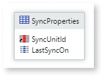

# Handling optimized complex synchronization on mobile devices

This article describes best practices for handling demanding synchronization scenarios and explains how to optimize resources.

When syncing information from the server to the device, synchronize only relevant data. For each use case, consider which records (rows) and attributes (columns) should be synchronized, and when to sync.

**Sync only when required**

* At session start, sync summary data to local storage.
* At process start, sync process details to local storage.
* At process/transaction end, sync to the server.

**Sync only what is required**

* Both in terms of records (rows) and attributes (columns).
* On login, sync account summaries.
* On account selection, sync its details.

**Ensure sync granularity**

* Incremental by entity.
* Sync only deltas.
* Use control timestamps.
* Use entity bulk operations (built-in).

## Key strategies

Here are some key strategies to optimize complex synchronization processes in mobile apps. These strategies focus on efficient data handling, minimizing server requests, and improving app performance.

To illustrate these strategies, consider a mobile app designed to support appointment scheduling in a hospital back-office.

### Design a lightweight local database

* Since the main use cases are **presenting appointment information** and providing **available doctor data**, denormalize the server-side relational data model.
* In the **LocalAppointment** table, include all necessary columns to support the use case without requiring extra table joins.
* In the **LocalDoctor** table, add all necessary information for the use case, even if it duplicates information already in local storage.

### Control the amount of synchronized data

**Context**

The text input of the OnSync action defines the various synchronization flows. Use this input to fine-tune the amount of data to sync for each flow or moment in your application.

**Local SyncProperties per context**

Create a local entity to track the last synchronization moment per `Context`. This allows you to communicate with the server and retrieve only updated information using time deltas. Compare the **LastSyncOn** from that sync unit with the **CreatedOn**, **UpdatedOn**, and **DeletedOn** attributes from the server database to determine which records to fetch.

### Synchronization moments

* Define the sync moments of the application and use contexts. A context defines the type of data to synchronize; **it can be all, a single entity, or a set of entities**. Define a context as an instant or moment in the app.

    1. **Context = "Splash"** — Get information to display on the homepage, not detailed.
    2. **Context = "Login"** — Get detailed information related to the user or homepage items.
    3. **Context = "SendAppointments"** — Send locally stored appointments to the server.
    4. **Context = "Online"** — Trigger a complete sync for new and updated data.

* Use the context parameter of the OnSync action — Manage different synchronization moments by passing the context as a parameter.
* Static entity to create contexts — Create a static entity to define all contexts clearly and make them easier to maintain.

Context = "Login"
:   To support all offline use cases, **synchronously** sync all doctors and appointments immediately after login. This sync only retrieves information from the server; no data is sent.

Context = "SendAppointments"
:   Trigger OnSync in the Create Appointment action to send the new appointment to the server **asynchronously**.

Context = "Online"
:   When the app regains connectivity, trigger a complete sync to send new data to the server and retrieve updated data. Since this sync is complete and bidirectional, discard all other pending sync requests by setting the DiscardPendingSync input to true.

### Minimize the number of server requests

* **Avoid multiple server requests in client actions**

    * Encapsulate all server actions into one action to reduce server requests and improve application performance.

* **Synchronization process with only one server request**

    * For each branch of the synchronization call, use just one server action to minimize server requests and improve performance.

* **Handling large data volumes**

    * **Device performance issues** — Different devices have varying processing capabilities. Find an optimal value for a set of records to bulk-create in the local database.
    * **Synchronization time** — Minimize server requests. Transfer only the data needed to complete synchronization successfully. Understand the app's operating conditions.
    * **Thousands of records to pull** — Retrieve data from the server and break it into chunks to bulk-create in the local database. Use TriggerOnSync to avoid blocking the UI.

## Benefits of this approach

* Non-blocking screens.
* Alignment between synchronization and use cases.
* Error-tolerant synchronization (network, memory, device crash).
* Better use of local storage space.

## Scenarios to avoid

* Long synchronous synchronizations.
* Delete-all/create-all scenarios where deltas are not used.
* Synchronization processes that cannot be controlled by the sync unit parameter.
