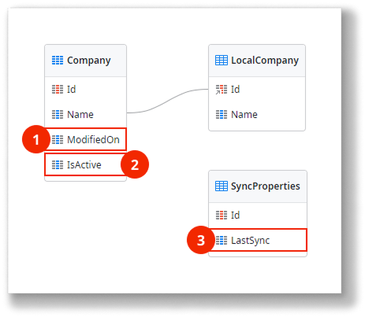
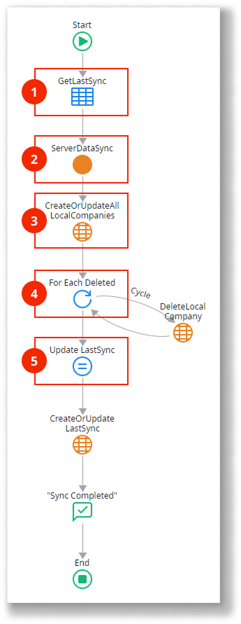
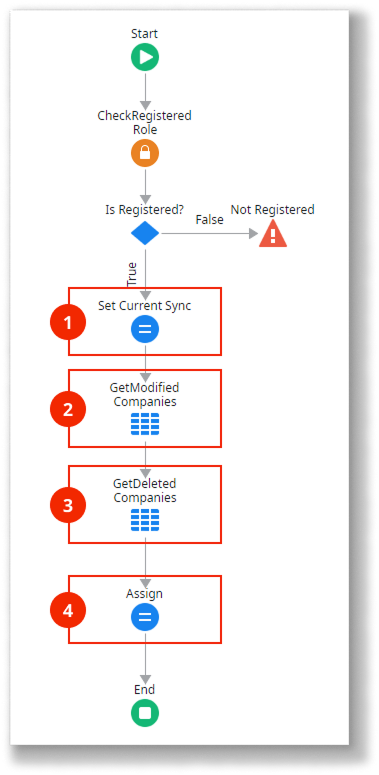

# Read-Only data optimized synchronization pattern

<div class="info" markdown="1">

This pattern applies only to mobile apps.

</div>

Use this data synchronization pattern for mobile apps where users only need to read data offline, especially when handling large amounts of data. Here’s how it works:

* The server database stores the master data, which can change over time.
* Synchronization transfers only the data that needs updating in the device's local storage.
* Data changes made on the device are not sent back to the server.

The following is an overview of the Read-Only data optimized pattern logic:

1.  Invokes server to get data.

1.  Returns database data.

1.  Deletes and recreates data in the local storage with the data received from the server.

Download the [sample module for the Read-Only Data Optimized pattern](https://www.outsystems.com/forge/component-overview/16956/offline-data-sync-patterns-read-only-optimized-odc), which uses companies as an example for data synchronization. The following sections explain the data model and logic used in the sample module.

## Data model

The sample defines a database entity `Company` and its local storage counterpart `LocalCompany`. Additionally, the `SyncProperties` local storage entity keeps track of the last synchronization date and time.



1. Tracks changed records by storing the timestamp when the record was last updated or created.
1. Tracks deleted records.
1. Timestamp of the last synchronization. Note that this timestamp is established by the server to avoid problems due to clock differences between client and server.

The application logic must keep the entity attributes `ModifiedOn` and `IsActive` updated.

## OnSync logic

Here’s how the `OnSync` client action works:



1. Retrieve the last synchronization timestamp.
1. Call the `ServerDataSync` server action to get data from the database that changed since the last synchronization. The server returns a list of changed or added `Company` records, a list of deleted (inactive) `Company` records, and the synchronization timestamp.
1. Update the `Company` records in the local storage using the list of changed or added records from the server.
1. Iterate through the list of deleted (inactive) `Company` records from the server and delete the corresponding records in the local storage.
1. Update the `SyncProperties.LastSync` attribute with the synchronization timestamp from the server.

## ServerDataSync logic

Here’s how the `ServerDataSync` server action works:



1. Assign the synchronization timestamp to an output parameter.
1. Get the list of changed or added `Company` records since the last synchronization. Use this filter in the aggregate:

```javascript
Company.IsActive = True and
(Company.ModifiedOn = NullDate() or Company.ModifiedOn >= LastSync)
```

1. Get the list of all deleted (inactive) `Company` records since the last synchronization. Use this filter in the aggregate:

```javascript
Company.IsActive = False and
(Company.ModifiedOn = NullDate() or Company.ModifiedOn >= LastSync)
```

1. Assign the timestamp and the two lists of `Company` records to the action’s output parameters.

## Related resources

* [Implementing offline sync](../sync-implement.md)
  
* [Sync framework reference](../sync-reference.md)
  
* [Offline sync checklist](../sync-checklist.md)

### Different data synchronization patterns

* [Read-Only data synchronization pattern](read-only-data.md)
  
* [Read/Write data last write wins synchronization pattern](read-write-data-last-write-wins.md)
  
* [Read/Write data One-to-Many synchronization pattern](read-write-data-one-to-many.md)
  
* [Read/Write data with conflict detection synchronization pattern](read-write-data-with-conflict-detection.md)
  