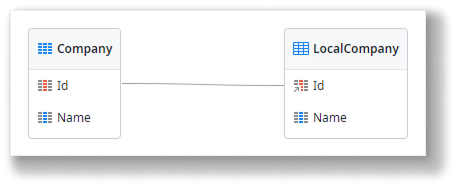
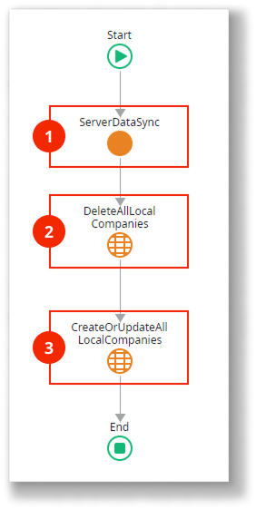
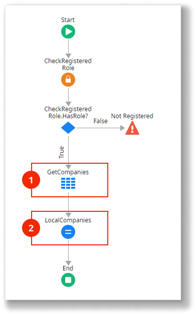

# Read-Only data synchronization pattern

This pattern applies only to mobile apps.

Use this data synchronization pattern for mobile apps where users only need to read data offline, especially when handling small amounts of data. Here’s how it works:

* The server database holds the master data which can change over time.
* Synchronization downloads all data from the server database and stores it in the local storage of the device.
* Data modifications performed on the device are not propagated to the server.

Here’s an overview of the Read-Only Data pattern logic:

1.  Invokes server to get data.

1.  Returns database data.

1.  Deletes and recreates data in the local storage with the data received from the server.

Download and store locally only the minimum subset of data relevant to the user to reduce the amount of data synchronized.

Download the [sample module for the Read-Only Data pattern](https://www.outsystems.com/forge/component-overview/16957/offline-data-sync-patterns-read-only-simple-odc), which uses companies as an example for data synchronization. The following sections explain how to automatically generate this synchronization pattern and provide detailed descriptions of the data model and logic used in the sample module.

## Automatically generate the pattern for an entity

To automatically generate the logic needed to implement this pattern for an entity:

1. In ODC Studio, open the **Data** tab.
1. Under Local Storage, select the local entity of the entity you want to synchronize in the database.
1. Right-click on the local entity and choose **Create Action to Sync Data (Read-Only)**.

    This option is only available if the local entity is linked to the database entity (with the ID as a foreign key to the database entity). This happens if you create local entities by right-clicking on **Local Storage** and choosing **Add Entity from Database...**

    ")

This creates the actions needed to implement the Read-Only synchronization pattern:

SyncLocal&lt;Entity&gt;
: A client action that starts the synchronization between the local entity and the entity in the server database.

Sync&lt;Entity&gt;
: A server action called by the SyncLocal&lt;Entity&gt; action, which retrieves the current records of the entity in the database to be stored in the client local storage.

If you want this pattern to run in the [synchronization template mechanism](<../sync-implement.md>), add a call to the SyncLocal&lt;Entity&gt; in the OnSync client action.

## Data model

The sample defines a database entity `Company` and its local storage counterpart `LocalCompany`.

## OnSync logic

Here’s how the `OnSync` client action works:

1. Call the `ServerDataSync` server action to retrieve data from the database. The server returns a list of `Company` records.
1. Delete all `Company` records in the local storage.
1. Recreate the `Company` records in the local storage using the list of records returned by the server.

`DeleteAllLocalCompanies` and `CreateOrUpdateAllLocalCompanies` are entity actions created automatically for the `LocalCompany` local storage entity. This is a local storage feature to help you handle records.

## ServerDataSync logic

Here’s how the `ServerDataSync` server action works:

1. The aggregate `GetCompanies` fetches all the `Company` records from the database.
1. Assign the records returned by the aggregate to the action’s output parameter.

## Related resources

* [Implementing offline sync](../sync-implement.md)
  
* [Sync framework reference](../sync-reference.md)
  
* [Offline sync checklist](../sync-checklist.md)

### Different data synchronization patterns

* [Read-Only data optimzied synchronization pattern](read-only-data-optimized.md)
  
* [Read/Write data last Write wins synchronization pattern](read-write-data-last-write-wins.md)
  
* [Read/Write data One-to-Many synchronization pattern](read-write-data-one-to-many.md)
  
* [Read/Write data with conflict detection synchronization pattern](read-write-data-with-conflict-detection.md)
