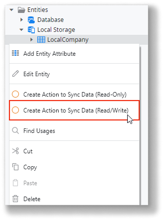
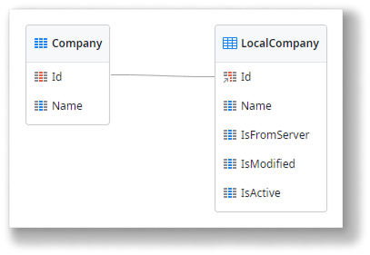
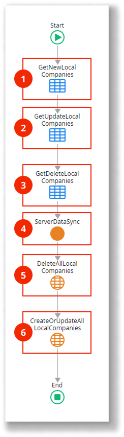
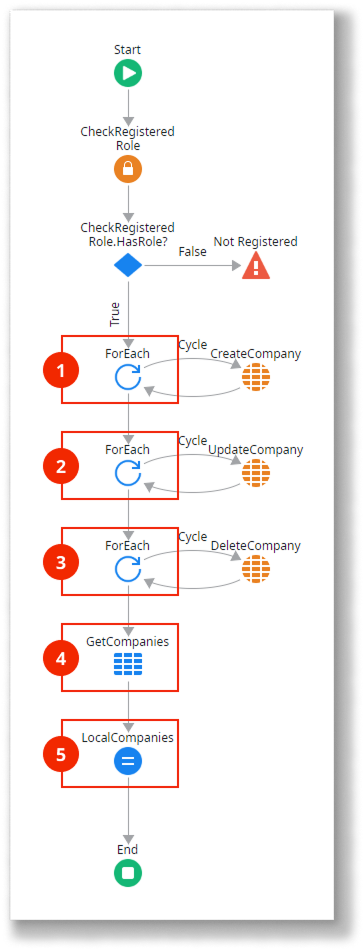

# Read-Write data last Write wins synchronization pattern

<div class="info" markdown="1">

This pattern applies only to mobile apps.

</div>

Use this data synchronization pattern for mobile apps where it is unlikely for multiple users to change the same data while offline. Here’s how it works:

* The server database stores the master data, which can change over time.
* The local storage database holds a subset of the master data and can be modified.
* Synchronization sends the modified data from the local storage to the server database and vice versa.
* On the server, data is updated using a "last write wins" strategy, where the latest update overrides earlier ones.

Here’s an overview of the Read/Write Data Last Write Wins pattern:

1.  Sends local storage data modified by the app back to the server.

1.  Updates database data with the one sent from local storage.

1.  Sends updated database data.

1.  Deletes and recreates data in the local storage with the data received from the server.

Download the [sample module for the Read/Write Data Last Write Wins pattern](https://www.outsystems.com/forge/component-overview/16954/offline-data-sync-patterns-r-w-last-wins-odc), which uses companies as an example for data synchronization. The following sections explain how to automatically generate this synchronization pattern and provide detailed descriptions of the data model and logic used in the sample module.

## Automatically generate the pattern for an entity

To automatically generate the logic needed to implement this pattern for an entity:

1. In ODC Studio, open the **Data** tab.
1. Under Local Storage, select the local entity you want to synchronize with the server.
1. Right-click on the local entity and choose **Create Action to Sync Data (Read/Write)**.

    This option is only available if the local entity is linked to the database entity (with the ID as a foreign key to the database entity). This happens if you create local entities by right-clicking on **Local Storage** and choosing **Add Entity from Database...**



This creates the actions needed to implement the Read/Write synchronization pattern:

SyncLocal&lt;Entity&gt;
: A client action that starts the synchronization between the local entity and the entity in the server database. It sends the added, changed, and deleted local records to the Sync&lt;Entity&gt; server action, which handles the synchronization on the server side.

Sync&lt;Entity&gt;
: A server action called by the SyncLocal&lt;Entity&gt; action, which synchronizes the received local entity records with the server database records. It returns the current records of the entity in the database to be updated in the client local storage.

Along with these actions, new attributes **IsFromServer**, **IsModified** and **IsActive** are added to the local entity to track changes and store meta-information needed by the synchronization process. To keep these new attributes updated and coherent for the synchronization process, the accelerator creates new client actions that must replace the use of the default local entity actions of the local entity:

CreateOrUpdateLocal&lt;entity&gt;ForSync
: Replaces the CreateOrUpdateLocal&lt;entity&gt; client action.

DeleteLocal&lt;entity&gt;ForSync
: Replaces the DeleteLocal&lt;entity&gt; client action.

UpdateLocal&lt;entity&gt;ForSync
: Replaces the UpdateLocal&lt;entity&gt; client action.

These client actions are created in the **Logic** tab under **Client Actions**, in the **SyncActions_Local&lt;Entity&gt;** folder.

To guarantee the success of the synchronization process when using this accelerator, you must replace the use of all entity actions of the local entity by the corresponding new actions created by the accelerator.

If you want this pattern to run in the [synchronization template mechanism](<../sync-implement.md>), add a call to the SyncLocal&lt;entity&gt; client action in the OnSync client action.

## Data model

This sample defines a database entity `Company` and its local storage counterpart `LocalCompany`. Additionally, the `LocalCompany` entity defines three metadata attributes to track the synchronization status of the records.



The application logic must update the metadata attributes `IsFromServer`, `IsModified`, and `IsActive` of the local entity as follows:

* `IsFromServer`: If True, the record exists on the server.
* `IsModified`: If True, the record has been modified locally.
* `IsActive`: If False, the record was deleted locally but may not yet have been removed from the server.

## OnSync logic

Here’s how the `OnSync` client action works:



1. Obtains the list of locally added Company records. The aggregate uses the following filter:

```
LocalCompany.IsFromServer = False and
LocalCompany.IsActive = True
```

1. Obtains the list of locally updated Company records. The aggregate uses the following filter:

```
LocalCompany.IsModified = True and
LocalCompany.IsFromServer = True and
LocalCompany.IsActive = True
```

1. Obtains the list of locally deleted (inactive) Company records. The aggregate uses the following filter:

```
LocalCompany.IsActive = False and
LocalCompany.IsFromServer = True
```

1. Call the `ServerDataSync` server action with the lists of locally added, updated, and deleted `Company` records as inputs. The server updates the database and returns the list of updated `Company` records.
1. Delete all `Company` records in the local storage.
1. Recreate the `Company` records in the local storage using the list of records returned by the server.

## ServerDataSync logic

Here’s how the `ServerDataSync` server action works:



1. Iterate through the list of locally added `Company` records and create new records in the database. To avoid collisions, set `Company.Id` to `NullIdentifier()` so that the records are created with new identifiers.
1. Iterate through the list of locally modified `Company` records and update the records in the database.
1. Iterate through the list of locally deleted (inactive) `Company` records and delete the records in the database.
1. Retrieve all the `Company` records from the database.
1. Assign the list of `Company` records to the action’s output parameter, while setting appropriate values for the synchronization metadata attributes:

```javascript
IsFromServer = True  
IsModified = False  
IsActive = True
```

## Related resources

* [Implementing offline sync](../sync-implement.md)
  
* [Sync framework reference](../sync-reference.md)
  
* [Offline sync checklist](../sync-checklist.md)

### Different data synchronization patterns

* [Read-Only data optimzied synchronization pattern](read-only-data-optimized.md)
  
* [Read-Only data synchronization patters](read-only-data.md)
  
* [Read/Write data One-to-Many synchronization pattern](read-write-data-one-to-many.md)
  
* [Read/Write data with conflict detection synchronization pattern](read-write-data-with-conflict-detection.md)
