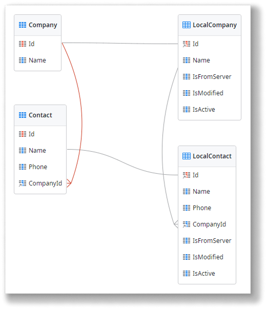
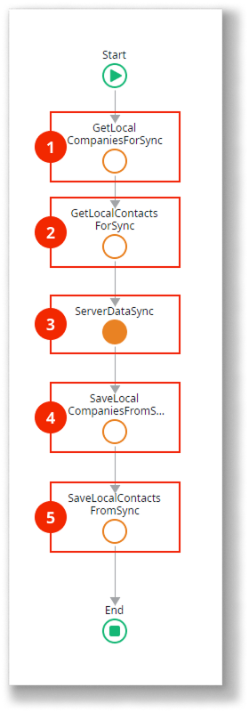
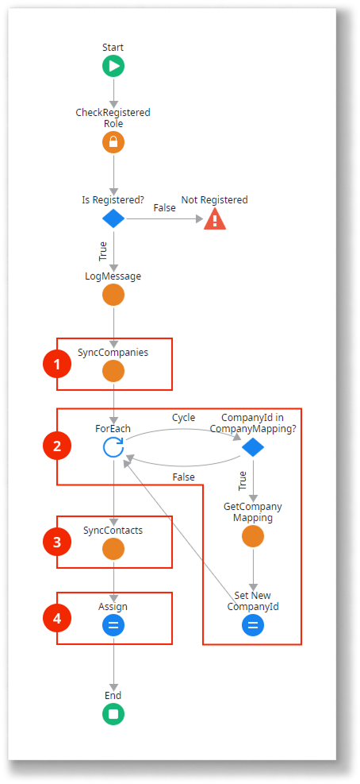
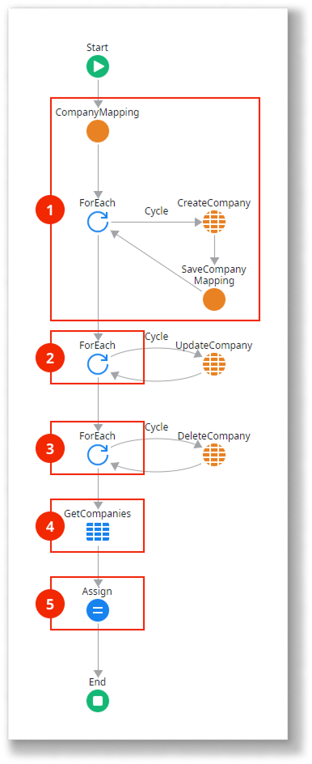
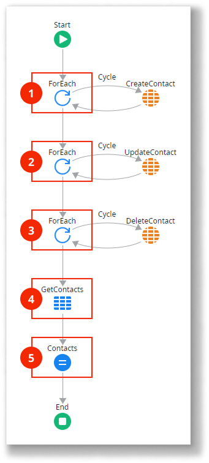

# Read-Write data one-to-many synchronization pattern

<div class="info" markdown="1">

This pattern applies only to mobile apps.

</div>

Use this data synchronization pattern for mobile apps with entities that follow a one-to-many relationship, where it is unlikely for multiple users to change the same data while offline. Here’s how it works:

* The server database stores the master data, which can change over time.
* The local storage database holds a subset of the master data and can be modified.
* Synchronization sends the modified data from the local storage to the server database and vice versa.
* On the server, data is updated using a "last write wins" strategy while maintaining the relationship between the records of the master and detail entities. This strategy ensures the latest data update overrides earlier ones.

Here’s an overview of the Read/Write Data One-to-Many pattern:

1.  The client sends modified local storage data to the server.
2.  The server updates the database with the data from local storage, ensuring the relationship between the master and detail entities is maintained. For example, a dictionary can track the IDs of local records and their corresponding server records.
3.  The server sends updated database data to the client.
4.  The client deletes and recreates local storage data with the server data.

**About the mapping**

In this sample pattern, a dictionary maintains the relationship between the parent and child entity records. When syncing new parent entity records with the server, the dictionary tracks the correspondence between the original ID in local storage and the new ID in the server database. This mapping is necessary because parent and child records are not created on the server simultaneously. The dictionary updates unsynced child records with the foreign keys generated on the server database.

Key: local record ID | Value: server record ID
---------------------|------------------------
5                    | 135
6                    | 136
7                    | 150

You can download the [sample module for the Read/Write Data One-to-Many pattern](http://www.outsystems.com/forge/component/1638/Offline+Data+Sync+Patterns/) and examine the logic in your environment.

## Data model

This sample defines two related database entities `Company` and `Contact` and their local storage counterparts `LocalCompany` and `LocalContact`. Additionally, the `LocalCompany` and `LocalContact` entities define three metadata attributes to track the synchronization status of the records.



The application logic must update the metadata attributes `IsFromServer`, `IsModified`, and `IsActive` of the local entities as follows:

* `IsFromServer`: If true, the record exists on the server.
* `IsModified`: If true, the record has been modified locally.
* `IsActive`: If false, the record was deleted locally but may not yet have been removed from the server.

## OnSync logic

Here’s how the `OnSync` client action works:



1. Obtain the list of locally added, updated, and deleted `Company` records.
2. Obtain the list of locally added, updated, and deleted `Contact` records.
3. Call the `ServerDataSync` server action with the lists of locally added, updated, and deleted `Company` and `Contact` records as inputs. The server updates the database and returns the list of updated `Company` and `Contact` records.
4. Delete all `Company` records in the local storage and recreate them using the list of records returned by the server.
5. Delete all `Contact` records in the local storage and recreate them using the list of records returned by the server.

## ServerDataSync logic

Here’s how the `ServerDataSync` server action works:



1. Call the `SyncCompanies` server action with the lists of locally added, updated, and deleted `Company` records as inputs. The action updates the database and returns the list of updated `Company` records, along with a dictionary mapping local record IDs to server record IDs.
2. Iterate through the list of locally added `Contact` records and use the dictionary to update the `LocalContact.CompanyId` attribute with the ID of the corresponding `Company` record created in the database. This ensures the one-to-many relationship is maintained on the server.
3. Call the `SyncContacts` server action with the lists of locally added, updated, and deleted `Contact` records as inputs. The action updates the database and returns the list of updated `Contact` records.
4. Assign the lists of updated `Company` and `Contact` records to the action’s output parameters.

## SyncCompanies logic

Here’s how the `SyncCompanies` server action works:



1. Iterate through the list of locally added `Company` records. Create new database records on the server and create dictionary mappings between the local record IDs and the newly created database record IDs.
2. Iterate through the list of locally modified `Company` records and update the records in the server database.
3. Iterate through the list of locally deleted (inactive) `Company` records and delete the records in the server database.
4. Retrieve all `Company` records from the server database.
5. Assign the dictionary mapping local and database IDs of the `Company` records and the list of `Company` records to the action’s output parameters. Also, set the values for the synchronization metadata attributes:

```javascript
IsFromServer = True  
IsModified = False  
IsActive = True
```

## SyncContacts logic

Here’s how the `SyncContacts` server action works:



1. Iterate through the list of locally added `Contact` records and create new records in the database.
2. Iterate through the list of locally modified `Contact` records and update the records in the database.
3. Iterate through the list of locally deleted (inactive) `Contact` records and delete the records in the database.
4. Retrieve all `Contact` records from the database.
5. Assign the list of `Contact` records to the action’s output parameter, while setting appropriate values for the synchronization metadata attributes:

```javascript
IsFromServer = True  
IsModified = False  
IsActive = True
```
## Related resources

* [Implementing offline sync](../sync-implement.md)
  
* [Sync framework reference](../sync-reference.md)
  
* [Offline sync checklist](../sync-checklist.md)

### Different data synchronization patterns

* [Read-Only data optimzied synchronization pattern](read-only-data-optimized.md)
  
* [Read-Only data synchronization patters](read-only-data.md)
  
* [Read/Write data last Write wins synchronization pattern](read-write-data-last-write-wins.md)
  
* [Read/Write data with conflict detection synchronization pattern](read-write-data-with-conflict-detection.md)
