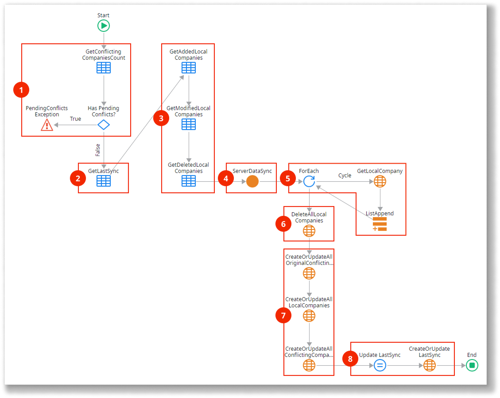

# Read-Write data with conflict detection synchronization pattern

<div class="info" markdown="1">

This pattern applies only to mobile apps.

</div>

Use this data synchronization pattern for advanced scenarios where multiple users change the same data while offline. Here’s how it works:

* The server database stores the master data, which can change over time.
* The local storage database holds a subset of the master data and can be modified.
* Synchronization sends the modified data from the local storage to the server database and vice versa.
* On the server, data is updated, and any conflicting changes are registered for later resolution.

Here’s an overview of the Read/Write Data with Conflict Detection pattern:

1.  Checks if there are unsolved conflicts. If conflicts exist, the client aborts the synchronization and reports the conflicts pending resolution.

2.  Sends local storage data modified by the app back to the server.

3.  Checks for conflicting changes performed in the database.

4.  Adds the records to the list of conflicts if it conflicts with client data.

5.  Updates database records in the absence of conflicts.

6.  Sends updated database data and the list of conflicting changes.

7.  Checks for conflicts. If conflicts exist, registers conflicts and updates local storage with the non-conflicting records. If no conflicts exist, deletes and recreates data in the local storage with the data received from the server.

8.  Updates last sync timestamp in local storage.

9.  Reports pending conflicts to the end user if applicable.

You must implement a mechanism, either automatic or manual, to resolve detected conflicts. For example, you can present the client and server versions of the records side by side and allow the user to select which version to keep.

Download the [sample module for the Read/Write Data with Conflict Detection pattern](http://www.outsystems.com/forge/component/1638/Offline+Data+Sync+Patterns/), which uses companies as an example for data synchronization. The following sections provide detailed descriptions of the data model and logic used in the sample module.

## Data model

This sample defines a database entity `Company` and its local storage counterpart `LocalCompany`. Additionally, the `LocalCompany` entity defines three metadata attributes to track the synchronization status of the records. The `SyncProperties` local storage entity keeps the date and time of the last synchronization, and the `ConflictingCompany` local storage entity holds the conflicting records.


1. Tracks changed records by storing the timestamp when the record was last updated or created.
1. Tracks deleted records.
1. Metadata attributes that track the synchronization status of the records.
1. Holds conflicting records.
1. Timestamp of the last synchronization. Note that this timestamp is established by the server to avoid problems due to clock differences between client and server.

The application logic must update the metadata attributes `IsFromServer`, `IsModified`, and `IsActive` of the local entity as follows:

* `IsFromServer`: If True, the record exists on the server.
* `IsModified`: If True, the record has been modified locally.
* `IsActive`: If False, the record was deleted locally but may not yet have been removed from the server.

## OnSync logic

Here’s how the `OnSync` client action works:



1. Obtain the number of `ConflictingCompany` records and trigger an exception if there are unresolved conflicts from a previous synchronization.
2. Obtain the timestamp of the last synchronization.
3. Obtain the lists of locally added, modified, and deleted `Company` records. Use these filters in the aggregates:

1. Obtains the timestamp of the last synchronization.

1. Obtains the lists of locally added, modified, and deleted Company records.  
  The aggregate that obtains the added records uses the following filter:

```javascript
LocalCompany.IsFromServer = False and
LocalCompany.IsActive = True
```

  The aggregate that obtains the modified records uses the following filter:

```javascript
LocalCompany.IsModified = True and
LocalCompany.IsFromServer = True and
LocalCompany.IsActive = True
```

The aggregate that obtains the deleted records uses the following filter:

```javascript
LocalCompany.IsActive = False and
LocalCompany.IsFromServer = True
```

4. Call the `ServerDataSync` server action with the lists of locally added, updated, and deleted `Company` records as inputs. The server updates the database and returns the list of updated `Company` records, the list of `Company` records with conflicts, and the list of IDs of the `Company` records with conflicts.
5. Obtain the list of original `Company` records corresponding to the `Company` records with conflicts returned by the server.
6. Delete all `Company` records in the local storage.
7. Recreate the `Company` records in the local storage and add the records with conflicts returned by the server to the `ConflictingCompany` entity.
8. Update the `SyncProperties.LastSync` attribute with the synchronization timestamp returned by the server.

## ServerDataSync logic

Here’s how the `ServerDataSync` server action works:


1. Assign the synchronization timestamp to an output parameter.
2. Iterate through the list of locally added `Company` records and create the records in the database with the `ModifiedOn` attribute set to the current timestamp.
3. Iterate through the list of locally modified `Company` records. For each record, obtain the corresponding `Company` record in the database and check if it was modified since the last synchronization:

   * If it was not changed, update the `Company` record in the database.
   * If it was changed, add the `Company` record to a list of conflicting companies.

1. Iterates the list of locally deleted Company records. For each record in the list, obtains the corresponding Company record in the database and checks if it was modified since the last synchronization.

   * If it was not changed, delete the `Company` record in the database.
   * If it was changed, add the `Company` record to a list of conflicting companies.

1. If there were no Company records with conflicts, retrieves all the Company records from the database and returns them to the client.

1. If there were Company records with conflicts, obtains the Company records that had no conflicts from the database and returns them to the client, together with the list of Company records with conflicts.

## Related resources

* [Implementing offline sync](../sync-implement.md)
  
* [Sync framework reference](../sync-reference.md)
  
* [Offline sync checklist](../sync-checklist.md)

### Different data synchronization patterns

* [Read-Only data optimzied synchronization pattern](read-only-data-optimized.md)
  
* [Read-Only data synchronization patters](read-only-data.md)
  
* [Read/Write data last Write wins synchronization pattern](read-write-data-last-write-wins.md)
  
* [Read/Write data One-to-Many synchronization pattern](read-write-data-one-to-many.md)
