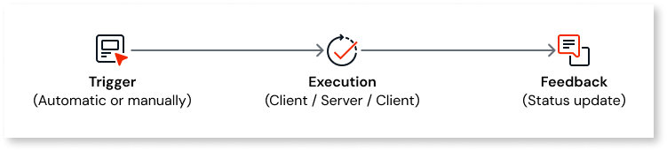
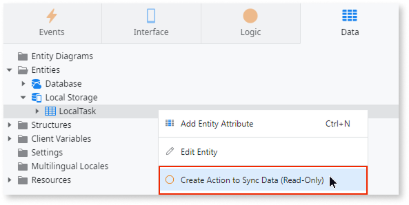
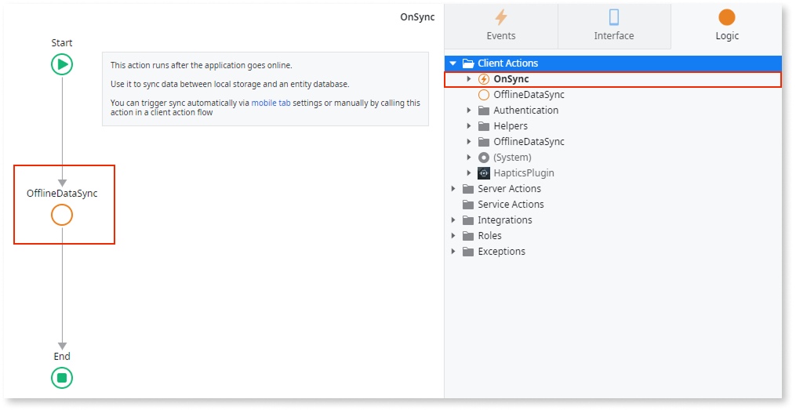
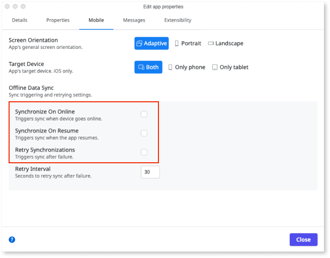

# Implement offline data synchronization

Applies only to mobile apps.

Mobile apps frequently need to work in environments with poor or no internet connectivity. To ensure users can access and modify data without interruption, you need a mechanism to synchronize local data with the server.

OutSystems provides an [offline data synchronization framework](sync-reference.md) that handles the complexity of tracking changes, updating local storage, and syncing with the server in the background.

## The synchronization lifecycle

The synchronization lifecycle ensures the user has access to up-to-date information and that any changes made offline are safely sent to the server.

For a conceptual overview, check the [Data synchronization overview](https://www.outsystems.com/tk/redirect?g=122e47e2-7035-4919-9d14-217ebb9ce1d6) training.

The synchronization process typically follows these stages:

1. **Trigger**: The sync process starts. This can happen **automatically** (for example, when the device comes online, when the app resumes) or **manually** (for example, a user taps a **Sync** button).
1. **Execution**: The app runs the synchronization logic in the background to avoid blocking the user interface.
    * **Client actions**: Collect local changes and send them to the server.
    * **Server actions**: Process the changes, update the server database, and return the latest data.
    * **Client actions**: Update the local storage with the new data from the server.
1. **Feedback**: The app notifies the user of the sync status (for example, **Syncing...**, **Sync complete**, or **Sync failed**) so the user knows their data is safe.

## Accelerate implementation

The fastest way to implement data synchronization is to use the **Create Action to Sync Data** accelerators in ODC Studio. These commands automatically generate the necessary logic to synchronize your local entities with the server entities.

To use an accelerator, follow these steps:

1. In the **Data** tab, expand **Local Storage**.
1. Select the local storage entities you want to synchronize.
1. Right-click the selection and select **Create Action to Sync Data (Read-Only)**. This generates logic to fetch data from the server and update the local storage. Use this when the mobile app only reads data (for example, a [product catalog](patterns/read-only-data.md)).

ODC Studio creates the synchronization actions in the **Logic** tab under **Client Actions** > **SyncTask**. You can then call these actions in your sync logic.

## Implement sync logic manually

If the accelerators don't meet your needs (for example, if you have complex business rules or multiple data sources), you can implement the synchronization logic manually. For guidance on logic structure, refer to the [offline data sync patterns](patterns/intro.md).

The goal is to create a client action that updates local storage and connect it to the app's **OnSync** system event.

### Step 1: Create server logic

First, create a server action to handle the data exchange on the backend.

1. Add a **server action**. For example, `ServerDataSync`.
1. Implement the logic to:
    * Fetch the required data from the database (using aggregates or SQL).
    * Process any input data sent from the client.
    * Return the updated data as output parameters.

### Step 2: Create client logic

Next, create a client action to handle the synchronization on the device.

1. In the **Logic** tab, navigate to **Client Actions**.
1. Right-click the **OnSync** folder (if it exists) or **Client Actions** and add a new action called, for example, `SyncTask`.
1. Implement the logic to:
    * Call the `ServerDataSync` action you created in step 1.
    * Use the output from the server to update the **local storage** entities (using **CreateOrUpdate** actions).

### Step 3: Connect to the OnSync system event

Finally, configure the app to run your sync logic in the background.

1. In the **Logic** tab, right-click **Client Actions** and select **Add System Event** > **OnSync**.
1. In the **OnSync** action flow, drag your `SyncTask` client action (created in step 2) onto the flow.

This ensures that whenever the synchronization triggers, the app carries out your custom logic in the background.

## Configure synchronization triggers

You can configure the app to synchronize data automatically based on system events, or let the user trigger it manually. For a complete list of properties, refer to [Sync configurations](sync-reference.md#sync-configurations).

### Automatic synchronization

To configure automatic triggers, follow these steps:

1. Click the app name in the **Interface** tab.
1. In the **Properties** pane, select the **Mobile** tab.
1. Configure the following properties:

    

    * **Synchronize On Online**: Enable to trigger the sync automatically when the device network status changes to online.
    * **Synchronize On Resume**: Enable to trigger the sync automatically when the app resumes from the background.
    * **Synchronize On Login**: Enable to trigger the sync automatically after the user logs in.

### Manual synchronization

To let the user start the synchronization manually (for example, by tapping a **Sync** button):

1. In your screen logic or client action, drag the **OnSync** system event onto the flow.
1. This action triggers the background synchronization process defined in the **OnSync** handler.

## Handle sync feedback

Since synchronization runs in the background, you must provide visual feedback to the user. The app should communicate when a sync starts, completes, or encounters an error.

To implement feedback, add the following system events in your **layout** block or specific **screens**:

* **OnSyncStart**: Use this event to show feedback (for example, display a **Syncing** message or a loading spinner).
* **OnSyncComplete**: Use this event to hide the feedback message or notify the user of success.
* **OnSyncError**: Use this event to handle errors gracefully (for example, display a **Sync failed** message or log the error).

This approach ensures users are always aware of the apps data status, improving the overall user experience.

## Related resources

For related resources about implementing offline data synchronization refer to:

* [Offline sync checklist](sync-checklist.md)
