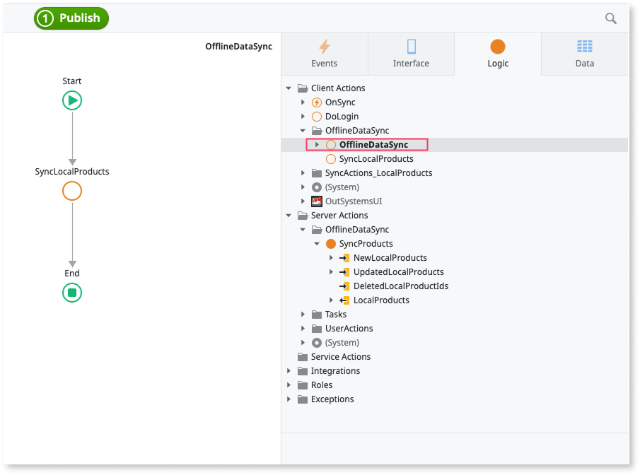
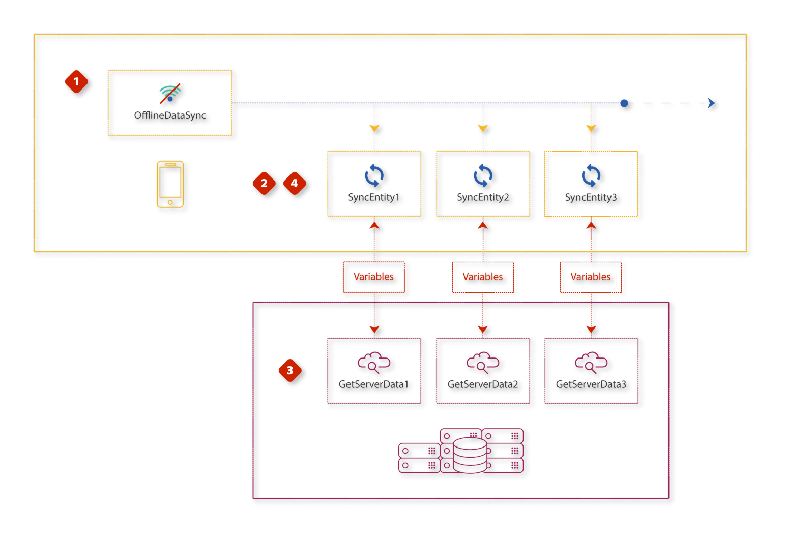

# Implement offline sync

Applies only to Mobile Apps.

OutSystems provides a [framework for syncing data](<sync-reference.md>) between your mobile app and server. The framework includes actions and events available in **Screens**, enabling you to create business logic, trigger syncs, and respond to sync outcomes and network status changes. Use this framework to sync only the data you need, keeping the process lightweight.

This article uses the read-only sync mechanism as an example, but you can apply the process to other sync patterns. In this example, the product catalog is stored on the server, and during the sync, the app updates the local product list.

For local entities created with the **Add Entity from Database** command, you can use accelerators. Some parts of the logic can be generated automatically by right-clicking these local entities and selecting one of the **Create Action to Sync Data** commands.

## Step 1: Create client and server logic

Create the business logic for updating records for individual entities in the client OnSync folder. The complexity of the client and server logic for data sync depends on your business needs and implementation. Here are the common implementation parts:

* Create actions to update local entities during the sync in **Logic** > **Client Actions** > **OnSync** folder.
* Create actions to fetch data from the server and perform updates on the server in **Logic** > **Server Actions** > **OnSync** folder.
* Pass the sync data between the server and client actions.

In this example, the client `SyncProducts` action updates the local data through the local entities with new data from the server. Place this logic into the framework to prepare it for running in the background.

## Step 2: Place the local entity action in the OnSync system event

Place the actions for updating local and remote storage in the flow of the `OnSync` system event. To create the system event, open **Logic**, right-click the **Client Actions** node in the tree, and select **Add System Event** > **On Sync**. This allows you to run the sync in the background without affecting other app processes.

In this example, there is only one action (`SyncProducts`), which is placed in the `OnSync` flow. You are now ready to configure the manual start of the sync.

## Step 3: Configure manual start of the sync

Start the manual sync using `OnSync` from **Logic** > **Client Actions** > **OnSync**. Place the `OnSync` in the flow where the sync should start.

In this example, a button calls the action named `SyncOnClick`, and within the action's flow, the `OnSync` is dragged and dropped. After ensuring the updating logic works as expected, configure the automatic start of the sync.

## Step 4: Configure automatic start of the sync

Click the app name, select the **Mobile** tab, and choose the automatic synchronization settings that best suit your app.

In this example, the sync does not start automatically under any conditions, so all values are unchecked.

## Sync Logic Flow

This is the flow of the sync execution stages. Note that they do not map to the steps used to create the sync logic.

Stage 1
: `OnSync` runs the actions for updating local storage in the background. You can start this system event manually by placing it directly in a flow or automatically through an event configured in the **Mobile** tab.

Stage 2
: The actions initiated by `OnSync` collect locally changed records and send them to the server.

Stage 3
: The server processes the requests and returns the updated data.

Stage 4
: The actions in `OnSync` update the local storage with the data received from the server.

Now that you know how to implement offline synchronization, check the [Offline sync checklist](sync-checklist.md) to avoid common issues in your solution.

## Related resources

* [Offline sync checklist](sync-checklist.md)

* [Sync framework reference](sync-reference.md)
  
* [Offline data sync patterns](patterns/intro.md)

* [Offline data synchronization mobile apps](intro.md)
