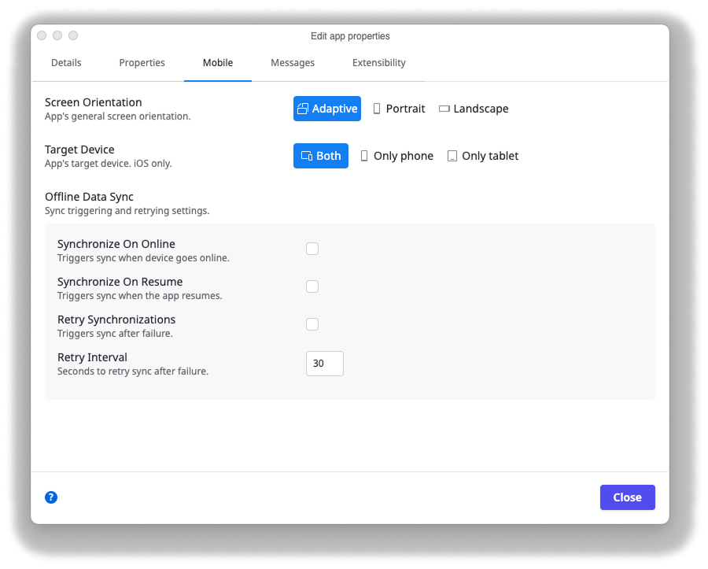
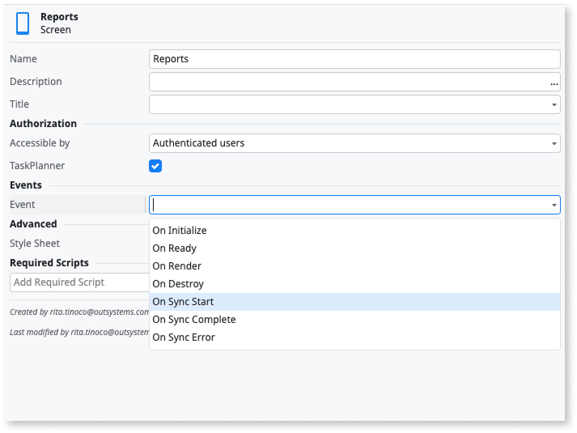

# Sync framework reference

Applies only to Mobile Apps.

These are the elements belonging to the framework for syncing data between the server and the application. For an implementation overview you can check [Implementing Offline Synchronization](<sync-implement.md>).

## Sync configurations

Contains multiple assignments to configure automatic start and retry of the sync:

* **Synchronize On Online**: Check to trigger the sync when the device comes online
* **Synchronize On Resume**: Check to trigger the sync once the application resumes from the background
* **Retry Synchronizations**: Check to attempt a new sync in case of an error
* **Retry Interval**: Set the interval to retry sync in seconds

## OnSync system event

Use `OnSync` to start the sync. `OnSync` is optimized for asynchronous sync that runs in the background and for triggering the sync events. To block the flow execution call any sync events available on the block or screen.

Context
: String input parameter that can be passed from business logic to the sync actions. Useful for deciding which entity to sync.

## Screens and Blocks sync events

The `OnSyncStart`, `OnSyncComplete` and `OnSyncError` events support the `OnSync` System Event. If you call `OnSync` event in a client action and you want to wait for the sync to finish you can perform that logic on `OnSyncComplete`.

### OnSyncStart

Event triggered when the sync starts.

Context
: String input parameter that can be passed from business logic to the sync actions. Useful for deciding which entity to sync.

### OnSyncComplete

Event triggered once the sync is successfully executed.

Context
: String input parameter that can be passed from business logic to the sync actions. Useful for deciding which entity to sync.

### OnSyncError

Event triggered if the sync fails.

Context
: String input parameter that can be passed from business logic to the sync actions. Useful for deciding which entity to sync.

ErrorMessage
: A string identifying the error.

## Related resources

* [Implementing offline sync](sync-implement.md)

* [Offline sync checklist](sync-checklist.md)
  
* [Offline data sync patterns](patterns/intro.md)
