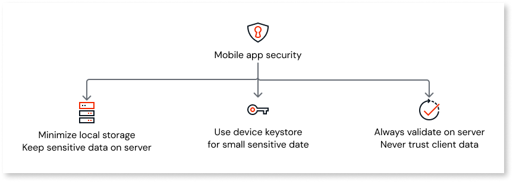
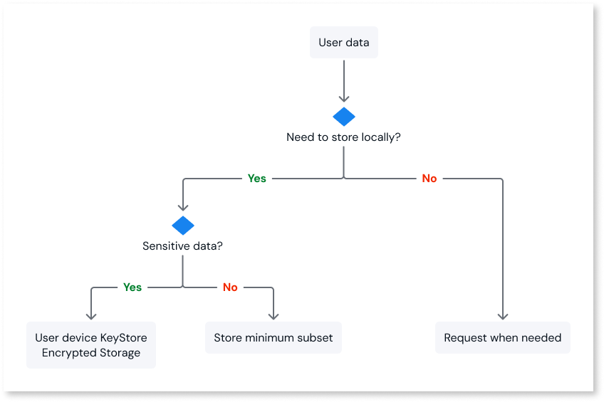

# Secure your mobile app's data

Applies only to mobile apps.

This document presents a set of best practices and solutions for securing data in your mobile apps built with ODC.

## Avoid storing sensitive data on the device

Theft or a malicious app that's inadvertently installed can easily compromise mobile data security. Keeping sensitive data on the server and requesting it from the device only when needed prevents third parties from accessing it by compromising your device's storage. Ensure all connections from the device to the server use authentication and run over HTTPS to keep your sensitive data safe during transit.

If you need your app to work offline, make an informed decision on what data to store locally. Store sensitive data on the server database. Only use local storage for non-sensitive data required for offline app use.

To minimize data exposure, identify the minimum subset of data users need to accomplish their tasks while offline. This helps you reduce the amount of local data and allows you to filter out sensitive information.

## Store small snippets of sensitive information

In scenarios where you need to store small amounts of information, such as authentication tokens or your user’s social security number, you can use the device's keystore.

The keystore is a security mechanism that stores small bits of sensitive information. The keystore secures data by encrypting it before storage, and the platform itself carefully controls access to stored items.

To safely store information in the keystore, you can use the [KeyStore Plugin](https://www.outsystems.com/forge/component-overview/15897/keystore-plugin-odc) available in the Forge.

## Re-validate data in the server

Mandatory server-side validation ensures your logic processes trusted data and executes operations as expected.

If a malicious user manipulates a request from your app to the server, they can bypass app-level validations and send incorrect requests. Failing to perform the required server-side validations may lead to data corruption where malicious data replaces real data. It can also result in data leakage by exposing information not intended for a specific user.
