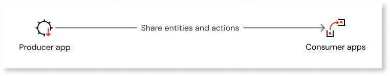
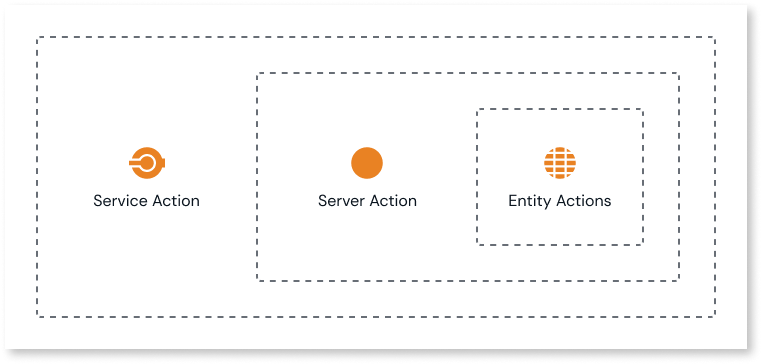

# Sharing data defined in OutSystems

This article introduces the concepts of sharing data defined in OutSystems.

You typically want to share the data stored in the database of your app:

* within the same app
* with another OutSystems app
* with an external system
  
You may want to share it so the app or external system can read and manipulate the data, or both.

## Server action

A server action is a logic flow that runs on the server. As the apps store data in a database on the server, you use a server action to read or manipulate that data.

To manipulate data you use a server action to wrap entity actions: the CRUD interface for your entities. A server action can wrap entity actions from one or more entities. To define logic flows to meet business needs, you combine entity actions with other elements, such as the If statement and Send Email action.

An example of a server action to meet a business need is an audit trail for data in your app. When a user creates, deletes or updates a customer record in an app, an audit record is inserted into a dedicated audit entity. An e-mail could also be sent to the administrator.

ODC Studio lets you define the logic flow of a server action in a visual and intuitive way. 

## Producer app

An architectural best practice is to define the [data model](modeling.md) (entities and their relationships) along with associated actions for your app in a dedicated app. This is the producer app. You then share the entities and actions with consumer apps. The following diagram shows the relationship.

This best practice promotes code maintainability. If you want to update your app's logic model, you only have to do it once. This lets you avoid duplicating the changes across apps. For example, if you centralize audit logic in the producer app, after updating the logic all consumer apps receive the update.

The exception to this best practice is for an app that has a small data model. You may wish to develop such an app to be self-contained. You don't typically share entities or actions from self-contained apps.

## Sharing data within an OutSystems app

For a self-contained app, you can use the entities you create for read-only purposes directly. You can write code to read the data through a UI component on a screen or use an aggregate or SQL element to select data.

To manipulate entity data, you create a server action. You can use a server action as an element in a client action that executes when user interacts with a UI widget. You can also call a server action using a timer, an OutSystems tool that runs logic periodically at a scheduled time.
## Sharing data between OutSystems apps

You share an entity from your producer app by setting its public flag to **Yes**. You can then use entities for read-only purposes in consumer apps.

To manipulate entity data in a consumer app, you create a server action in the producer app. You then wrap the server action in a service action to share it. Developers can then use the service action in a client action or timer in a consumer app. The following diagram shows the action wrap hierarchy.

## Sharing data with external systems

You share data with external systems by creating and exposing REST services. ODC Studio provides a simple interface to create and define REST methods in your app. The result is a lightweight, fast, and secure JSON-based REST API that follows the industry-standard Swagger specification. You configure an external system to consume these methods directly.
