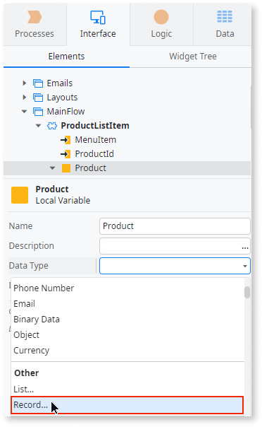
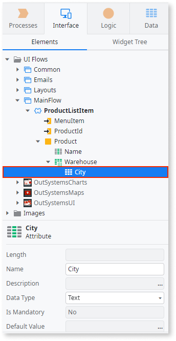
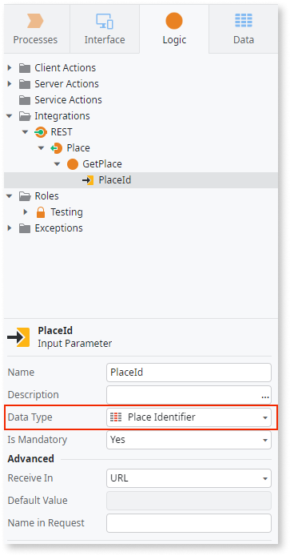
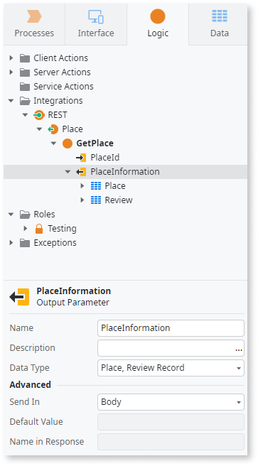
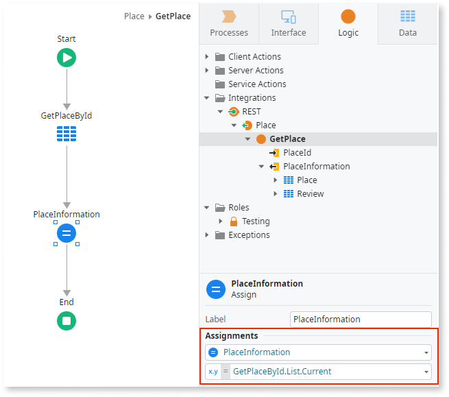
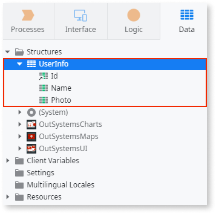

# Use structures and records to create compound data types

During app development, consider using a variable to hold a collection of variables with various data types, grouped for logic efficiency. This approach is useful, for instance, when you assign values returned by an action without needing separate outputs for each value.

In OutSystems, you can create structured values using structures or records. A structure is a reusable custom data type within your module, while a record is specific to a single variable that you can't use elsewhere.

In ODC, to declare and use a structure:

1. On the Data tab, right-click the folder structures and select **Add Structure** to add a new structure.
1. To add an attribute, right-click the new structure, select **Add Structure Attribute**, and change the properties of the attribute such as the name and the data type.
1. Create a new variable.
1. Set the variable's data type to the structure you've created.

In the cross-platform ODC Studio, to create a record for a variable, you need to:

1. Create a new variable in the element where you want to use the record.
1. Select the variable and change its **Data Type** to **Record...**.

    A Text attribute is added to the variable.

   

1. (Optional) change the **Data Type** and the **Name** of the attribute.
1. In the variable context menu you can add more attributes to the record.

    

In the cross-platform ODC Studio, to create a record for a variable, you need to:

1. Create a new variable in the element where you want to use the record.
1. Select the variable and change its **Data Type** to **Record...**.
1. In the pop-up window, add attributes to the record and define the data types of the attributes.

## Example using a record

For an app focused on discovering and evaluating places of interest, used for mapping and navigating, you can utilize a REST API method to retrieve fundamental details about each place. This includes the place's Id, name, and average rating, which are stored in the Place and Review entities.

Since the data type that you assign to the output parameter is used here, you can use a record:

1. Expose a REST API, name it Place and create the method GetPlace.
1. Add an input parameter to the GetPlace method named  `PlaceId`. Ensure the **Data Type** is **Place Identifier**.

    

1. To define the logic of the GetPlace method, in the element tree, double-click **GetPlace**.
1. Drag an aggregate from the toolbox into the action flow.
1. Add the Place and Review entities to the aggregate.
1. Filter the aggregate ensuring the Place.Id attribute matches the PlaceId parameter.
1. Add a filter condition with `Place.Id = PlaceId`.

   

1. In the GetPlace method, add an output parameter called `PlaceInformation`.
1. Set the PlaceInformation **Data Type** to **Record...**. A Text attribute is added to the variable.
1. Change the **Data Type** of the Text attribute to the **Place** entity and its **Name** to `Place`.
1. Add a new attribute from the **PlaceInformation** context menu.
1. Change the **Data Type** of the attribute to the **Review** entity and its **Name** to `Review`.

    

    

    You can also use the suggested Data Type **GetPlaceById Record Type** to set the PlaceInformation data type as a compound data as covered by steps 6 to 9.

    

1. In the GetPlace method flow, assign the result of the aggregate to the output parameter.
    1. From the toolbox, drag an assign after the aggregate.
    1. Add an assignment by setting the **Variable** to `PlaceInformation` and the **Value** to `GetPlaceById.List.Current`.

   

## Example using a structure

In an app for discovering and reviewing places of interest, you can create a REST API method to provide basic details about a registered end user. This includes their Id, name, and profile picture.

To reuse user information in another action, create a structure to hold this data, enabling data type reuse.

1. On the Data tab, right-click the folder structures and add a new structure named `UserInfo`.

1. Add the following attributes to the new structure:

    * `Id` of type User Identifier
    * `Name` of type Text
    * `Photo` of type Binary Data

      

1. Expose a REST API named User and create the method GetUser.

1. Add an input parameter with the User Id for which to return information.

1. In the action flow, add an aggregate with the User and Profile entities and filter using the User Id input parameter.

1. Add an output parameter called UserInformation and assign the UserInfo structure as its the data type.

1. To assign the values to the output variable, add an Assign element to the action and assign the first element returned from the aggregate.

1. Since the data type returned by the aggregate is different from the output variable, map the attributes from the aggregate output to the output parameter attributes.
