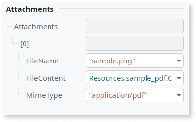
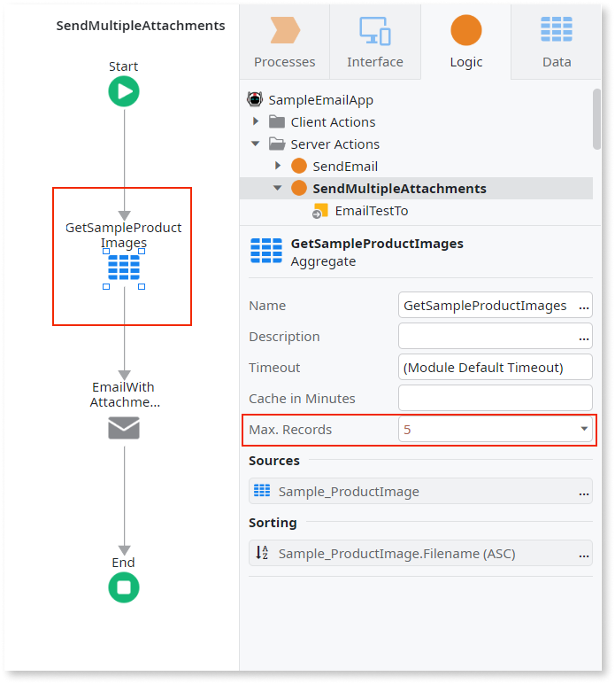
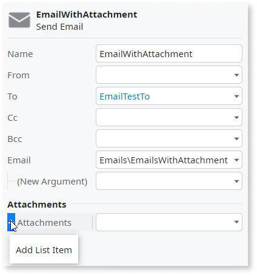

# Adding email attachments

An email attachment is a file users can open and save to their devices. For example, you can send a PDF file in the email for users to view and print the content.

You can send email attachments by providing the list of files in the **Attachments** section of the **Send Email** node. Define the file name, content, and media type of an attachment as the [Attachment data structure](#attachment-data-structure).

In the **Attachments** section of the **Send Email**, you can add:

* One or more inline attachments. Do this to attach a static file that changes rarely, like a PDF embedded in the app resources. See: [Attaching a single file](#attaching-a-file).

* A list of attachments. Do this when, for example, you want to send multiple files from a database, such as images from a product catalog. See: [Attaching multiple files](#attaching-multiple-files)

## Attaching a file

To attach a file to an email, complete the following steps in ODC Studio:

1. On the **Logic** tab, open the action that sends the email and select the **Send Email** node. 

    

    To learn more about creating emails, see [Working with emails](working.md). To create logic that sends emails, see [Sending emails](sending.md).

    

1. In the **Send Email** properties, locate the **Attachments** section and move your pointer over the **Attachments** list. 

    ODC Studio shows a plus icon with the "add list item" tooltip.

    

1. Click the plus icon next to the **Attachments** list to add a new item.

    ODC Studio adds a new Attachment item and labels it with zero.

1. Move your mouse over the item you added in the **Attachment** list and click the plus icon to expand.

    

1. Enter the information to define the file name, content, and media type of the email attachment.

    For more information about the Attachment properties, see [Attachment data structure](#attachment-data-structure).
    
    

    The following are example properties to attach a PDF file from the resources:

    * **FileName**: `"sample.pdf"`.
    * **FileContent**: `Resource.sample_pdf.Content`.
    * **MimeType**: `"application/pdf"`

    

    To add a file to the app resources, go to the **Data** tab, right-click **Resources**, and select **Import Resources**. 

    

## Attaching multiple files

To attach several files to an email, create a List with the Attachment data structure and then pass the list to the **Attachments** property of the **Send Email** action.

The following example references the **Sample_ProductImage** Entity from **OutSystemsSampleData**, a standard sample data app in the OutSystems cloud. The text attribute **FileName** is the file name of the image attachment. The binary attribute **FileContent** is the content of the image.   

In the following example, ODC Studio fetches images from a database with an Aggregate and then sends it in an email:

1. On the **Logic** tab, open the action that sends the email and drag an Entity before the **Send Email** node.

    ODC Studio places an Aggregate in the logic flow.

    

    

    Enter a value in the **Max. Records** property. For example, enter `5` to get five records for five attachments in the email. Leave the field empty to get all the records.

    

1. In the properties of the **Send Email** node, double-click the **Attachments** list.

    The expression editor opens.

    

1. In the expression editor, select the output List from your Aggregate, for example, `GetSampleProductImages.List`. ODC Studio shows an error with a message that you need to use the Attachment List data type. Click **Done** to close the editor and move on to the next step to map the values and resolve the error.

1. In the Attachment section of Send Email, map the attributes so ODC Studio knows which values pass to the attachments. You must specify binary content and the file name. The MIME type is optional, but providing it lets more email clients handle the attachment.

    

## Reference

More information related to attachments.

## Attachment data structure

Use the Attachment data structure to pass information about files between the logic elements that handle emails.

| Name        | Data type   | Notes                                                                                                    |
| ----------- | ----------- | -------------------------------------------------------------------------------------------------------- |
| FileContent | Binary Data | Content that the platform embeds as the attachment.                                                      |
| FileName    | Text        | The file name of the attachment to show in the email. For example, `"image.png"`.                        |
| MimeType    | Text        | Media type identifier. For example, `"image/png"`. Enter to tell the email readers how to handle the content, as this can help prevent errors in some clients. Leave empty to let the email clients handle the detection. |
