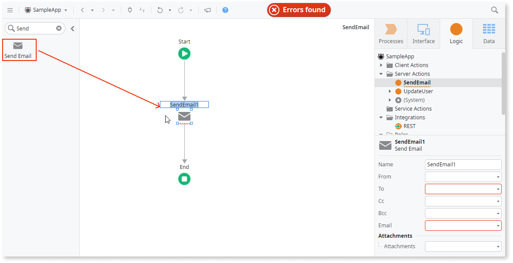
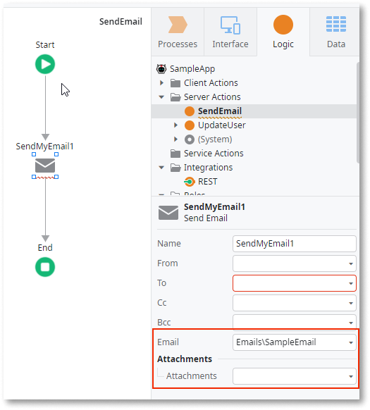
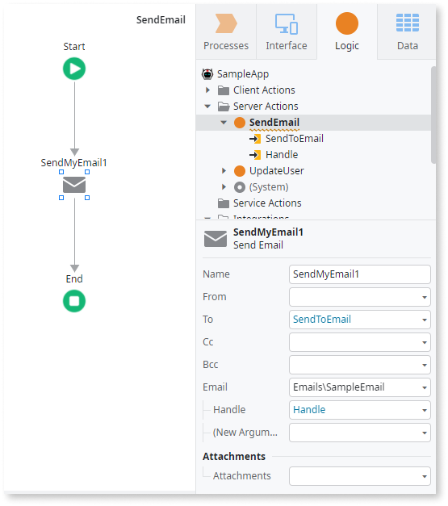
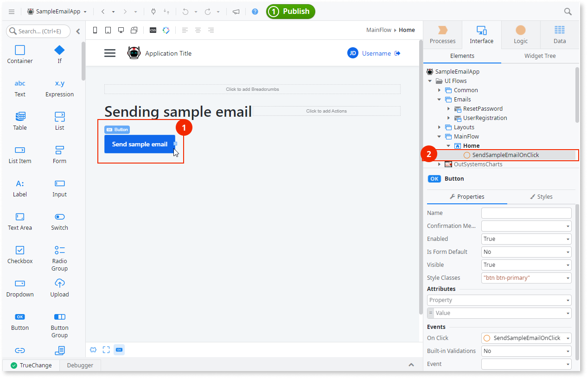
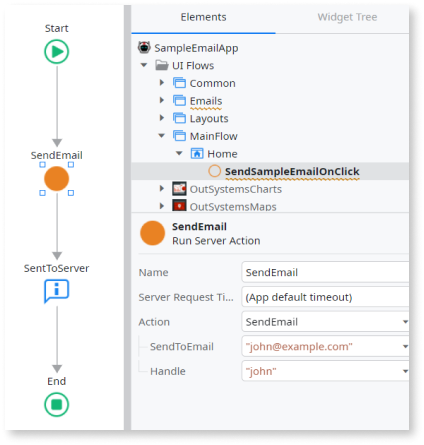

# Sending emails

When designing an app to send emails to your users, consider the following types of actions:

* **Sending emails** - This is a generic action. ODC takes the Email you create in OutSystems Developer Cloud (ODC) Studio, renders it as an email, and then sends it to the users inbox.
* **Triggering emails** -  This event initiates sending an email. It's usually an automated action, but you can trigger sending an email manually in the Portal.

## Creating logic for sending emails

To create logic that sends an email, go to ODC Studio an follow these steps:

1. To create a server action, go to the **Logic** tab and right-click **Server Actions** and from the menu, select  **Add Server Action**.  A new server action opens for editing. (The logic for sending emails runs on server.)
1. To add  the **Send Email** to the flow, drag the **Send Email** action to the flow. ODC Studio adds **Send Email** to the flow and shows an error to let you know some parameters are missing.

    

1. To display  the list of input parameters required for your email, go to the **Send Email** properties action and select your Email in the **Email** list. The list of input parameters displays.

    

1. To complete the parameters in the server action to pass the values to the Email, right-click the **Server Action** and select **Add Input Parameter**. Repeat as needed to add the following:

    * All parameters that the Email requires
    * The input parameter for the **To** field of the **Send Email** action

1. To set the **To** property and the required values for the selected Email go to the **Send Email** action properties in the flow.

    

    

    Be careful when editing the **From** property in the **Send Email** action. Most spam algorithms reject emails with a mis-configured **from** field.

    

Your app is now ready to send the email. Next create logic to trigger sending the email.

## Triggering emails

Depending on your use case, you might use different mechanisms to tell the ODC to render and send the email. Your app might have a Send button that enables users to send email to each other. Another use case could require sending emails  automatically, such as generating onboarding emails.

### Trigger emails manually

You can manually trigger the sending of an email when you test the app or when you have use cases that requires it. For example, you might have a **Button** widget (1) that has  an **On Click** event to call a client action (2).

In the client action, you can call the server action that sends the email (3). For this to work, you must provide the input parameters required by the action. In the feedback message from the UI (4) you can notify users that the app called the logic to send the message.

### Trigger emails automatically

There are many use cases where you might want to send emails automatically, such as when you send an email to users after a registration. Consider an event registration, where users who want to attend the event, need to fill in the registration details in a form.

The logic for new registrations checks if the user entered valid information (1). If the information is valid, the logic handles the registration request (2) and then triggers sending the confirmation email (3).

