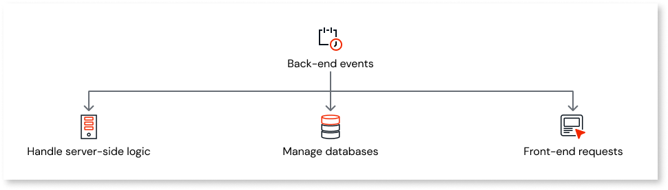
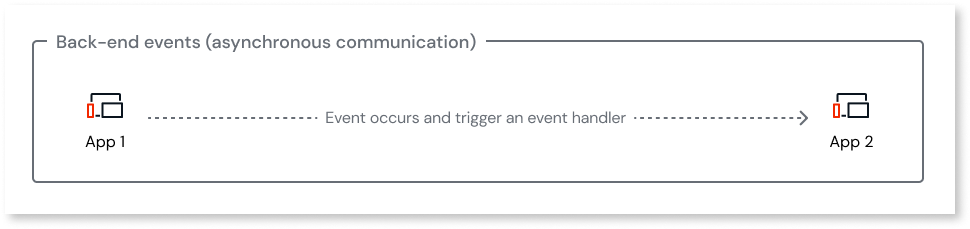
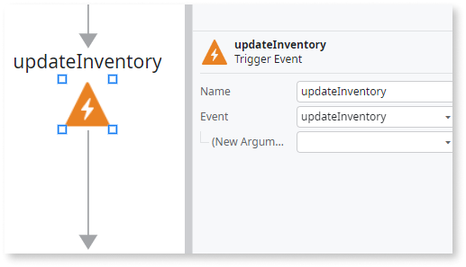
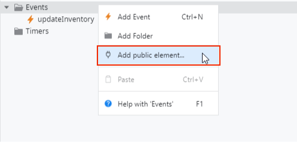

# Back-end events

Back-end events act as internal triggers, defining conditions to execute a response to specific events. This promotes asynchronous communication between apps, where an event occurring in one app can trigger an event handler in another.

Back-end events allow the automation of repetitive tasks that involve high volumes of data, such as orchestrating data between apps or initiating batch processing. For example, you can use them to automate monthly billing for subscribers in a streaming app.

Back-end events follow a publisher/subscriber model (pub/sub).

* Event publisher: Generates an event when a change occurs and publishes it to an event subscriber
* Event subscriber: Subscribes to a specific event producer(s) to receive and react to the event

Back-end events are delivered precisely once to subscribers to prevent duplicate events, although the order in which subscribers receive elements is not guaranteed.

Event publishers are unburdened by subscribers, as these events represent a state change, allowing subscribers to listen and process events of interest independently. This decoupling of publishers and subscribers allows for flexibility and scalability in apps.

ODC apps can handle a maximum of one hundred back-end events simultaneously per app. Additionally, back-end event supports payloads with sizes smaller than 10 KB.

You can add input parameters to a back-end event to pass additional information from the event publisher to subscribers(s).  For example, a new account event in a finance app can have input parameters such as the user's address and phone number.

Back-end events support basic input parameters like Text, Decimals, Date, Time, and Email, with a maximum of 2000 characters for Text parameters. However, complex data types such as records, binaries, or lists are not supported.

Back-end events are scoped to a specific stage. For example, a back-end event in an app within a development environment can only be handled by the same or another app within the same environment.

## Create an event

To create an event, go to ODC Studio and follow these steps:

1. On the **Processes** tab, right-click **Events**, and select **Add Event**.
1. Set the relevant properties for the new event in the properties panel.

    

    To allow other apps to access the event, you must set the **Public** property to Yes.

    

1. Right-click the newly created event, select **Add Input Parameter**, and enter the relevant information.

## Publish an event

To publish an event, you must define a trigger for an event. Go to ODC Studio and follow these steps:

1. On the  **Logic** tab, right-click **Server Actions**, and select **Add server action**.
1. Drag the **Trigger Event** element to the server action flow. The Select Event popup displays.
1. Select the event from the popup.
1. Click the **Trigger Event** element, and enter the relevant input parameters in the element’s properties panel.

To make the event accessible in other apps, click 1-Click Publish to publish the event as a [public element](../use-public-elements.md). Once an event is published, multiple subscribers can handle it.

## Subscribe to an event

You can subscribe to an event in the same producer or another app. To subscribe to an event, go to ODC Studio and follow these steps:

1. On the **Processes** tab, right-click **Events**, and select **Add public element**. The public element popup displays.

    

1. Select the public element(s) you want to add to your app and click **Add**.

    

    To subscribe to an event from the same app, right-click on the event you want to select.

    

1. Click **Handler** in the properties panel, and select **Select Handler**. The **Select handler** popup displays.
1. Select a server action containing the event to subscribe to.

## Handling errors

If a back-end event fails, it raises an exception, and you must handle it. For example, if back-end event handlers exceed the two-minute timeout, ODC raises an exception. Refer to [handling exceptions](../handling_exceptions/handling-mechanism.md) to learn more.

ODC automatically retries back-end events when an unhandled exception or timeout occurs in the event handler, preventing the loss of back-end events due to transient issues. ODC can attempt up to ten retries in case of a failed event.

You can use traces for both producer and subscriber apps to troubleshoot back-end events. Refer to [traces](../../monitor-apps.md) to learn more.
