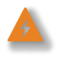
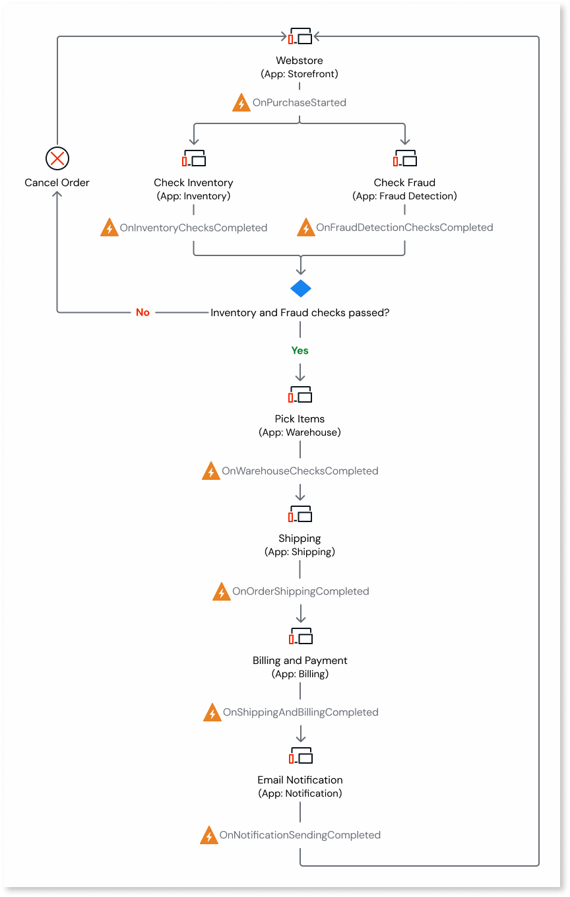
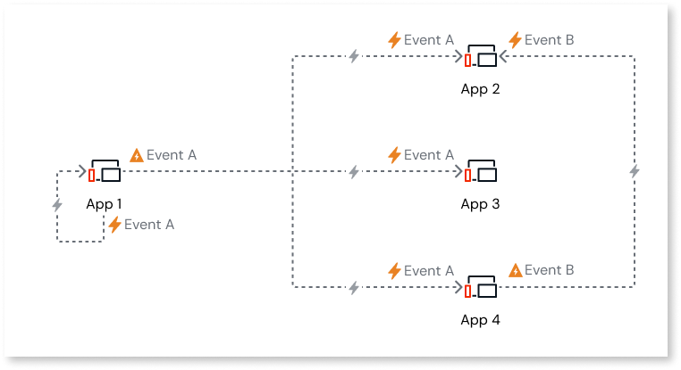
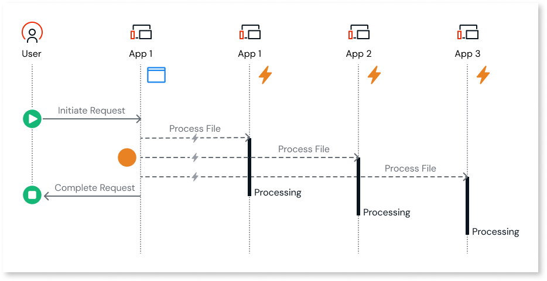

# Event-driven architecture in ODC

In a cloud-native environment, apps are designed as a collection of loosely coupled, independently deployable components or services. To enable efficient communication between these components, event-driven architecture enables asynchronous messaging. This approach ensures that apps can react to changes in real-time without creating tight dependencies, improving scalability, resilience, and flexibility.

In ODC, apps are loosely coupled, and the dependencies between apps are always weak, following a [micro-services architecture pattern.](../../app-architecture/intro.md) To implement event-driven ODC apps, you can define events to trigger a sequence of actions or handle specific scenarios within an app.

To build event-driven ODC apps, you can use the following low-code constructs in ODC Studio.

 

This construct is used to define events in your apps and specify any input parameters to be passed in an event. It’s also used to handle or process an event in the same app or a different app using an event handler.

This construct triggers the event at any point of execution. It can be used in either the server action or the service action.

Here's an example of a webstore app that demonstrates how different apps can trigger and consume events.

When a customer adds a product to the cart and completes the purchase, the **Storefront** app triggers the **OnPurchaseStarted** event. The **Inventory** and **FraudDetection** apps then process this event asynchronously and in parallel. These apps trigger their own events, which other downstream apps handle. This event-driven process continues until the purchase is finalized and the customer receives an email notification.

## Publisher/Subscriber model

In ODC, events follow the publisher/subscriber (pub/sub) model.

**Publisher app (Producer app):** When a change occurs, the publisher app defines and triggers the event.

**Subscriber app (Consumer app):** The subscriber app subscribes to events generated by the publisher app and handles or processes the events using an event handler.

Here are some key points regarding ODC events:

* Events are only available in apps and not in libraries.

* An event can only be triggered by the app where it is defined.

* The events are executed asynchronously in the background.

* An event can be triggered and consumed in the same app.

* One app can subscribe to multiple events, and multiple apps can subscribe to one event.

Here’s an example of pub/sub model. In this diagram:

* App1 creates and handles event A. The app acts as a publisher and a subscriber of the same event.

* App2 handles event A, produced by App 1, and handles event B, produced by App 4. The app subscribes to events A and B.

* App3  handles event A produced by App 1. The app subscribes to event A.

* App 4 creates event B and handles event A produced by App 1. The app acts as both a publisher and a subscriber.

For detailed information about the properties of events, refer to [Properties of ODC events](events-properties.md).

## Using ODC events for asynchronous parallel processing

In asynchronous processing, tasks are executed concurrently as opposed to synchronous processing, where tasks are executed one after the other.

ODC events enable asynchronous processing in your app. When an event is triggered, it is handled independently as a separate task, either within the same app or a different one.

If an app triggers multiple events of the same type, they can be handled asynchronously and in parallel by one or more apps, with each event running independently in the background. For example, in an eCommerce app, during a flash sale, when multiple users place orders simultaneously, the app triggers multiple events of type **OnPurchaseStarted**. The **Inventory app** and **Fraud Detection app** handle these events independently, processing them in parallel. This ensures that stock is updated and fraud checks are performed asynchronously, allowing the system to handle high traffic efficiently.

For detailed information about properties of ODC events, refer to [Properties of ODC events](events-properties.md).

If the producer app generates events faster than the consumer app can handle them, the events are queued up to a limit of **10000**. Once this limit is reached, the producer app receives an error when attempting to generate further events. Events can also get queued if the consumer app is slow to handle them while the producer app continues to generate new ones or if the consumer app event handling times out after 2 minutes. These timed-out events are retried according to the retry and backoff policy.

## Related resources

* [One Conference presentation on event-driven architecture with ODC](https://www.youtube.com/watch?v=gLfUocukA4Q)

* [Implements events in ODC](implement-events.md)
